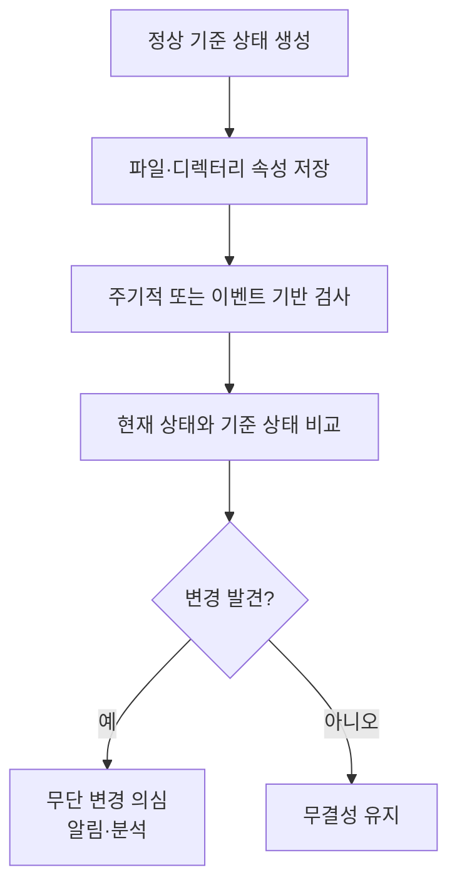

# 099 tripwire

작성 기준일: 2026-06-01
검색/보강일: 2026-06-01
PDF 확인 위치: 15페이지, 2과목 소프트웨어 개발, 099 tripwire

## 한 줄 요약

- Tripwire는 기준 상태와 현재 파일·디렉터리 상태를 비교해 백도어 설치나 설정 파일 변경 같은 무단 변경을 탐지하는 데이터 무결성 검사 도구이다.

## 한눈에 보는 구조

| 항목 | 내용 |
|---|---|
| 분류 | 데이터 무결성 검사 도구, 파일 무결성 모니터링 도구 |
| 핵심 기능 | 파일·디렉터리 변경 감지 |
| 탐지 대상 | 백도어, 설정 파일 변경, 중요 파일 변조 |
| 동작 방식 | 기준값 생성 후 현재 상태와 비교 |
| 시험 단서 | `cracker`, `backdoor`, `configuration file`, `integrity check` |

## PDF 기준 핵심

- PDF는 `tripwire`를 데이터 무결성 검사 도구 중 하나로 제시한다.
- 크래커가 침입해 백도어를 만들거나 설정 파일을 변경했을 때 이를 분석하는 도구로 설명한다.
- 핵심은 `무결성 검사`와 `변경 탐지`이다.
- 시험에서는 보안 도구 이름과 역할을 연결하는 문제가 나올 수 있다.

## 개념 설명

### Tripwire의 의미

- Tripwire는 시스템의 중요한 파일과 디렉터리가 변경되었는지 확인하는 도구이다.
- 공식 Tripwire 제품 설명은 파일 무결성 모니터링이 의심스럽거나 승인되지 않은 변경을 감시한다고 설명한다.
- Open Source Tripwire 저장소도 파일과 디렉터리 변경을 모니터링하고 알림을 제공하는 보안·데이터 무결성 도구로 설명한다.
- 시험에서는 특정 제품 세부 기능보다 `무결성 검사 도구`라는 분류가 중요하다.

### 동작 흐름

- 정상 상태의 파일 속성, 해시, 권한, 크기, 수정 시간 등을 기준값으로 저장한다.
- 이후 검사 시점의 상태와 기준값을 비교한다.
- 차이가 있으면 변경 사실을 보고한다.
- 관리자는 변경이 정상 배포인지, 침입이나 악성 변경인지 분석한다.

### 왜 보안 도구인가

- 공격자가 침입한 뒤 백도어 파일을 심거나 설정 파일을 바꾸면 시스템 동작이 달라질 수 있다.
- Tripwire는 이런 변경 흔적을 찾는 데 쓰인다.
- 단, Tripwire가 모든 침입을 실시간으로 차단하는 방화벽은 아니다.
- 이미 변경된 파일의 흔적을 발견하고 분석하는 무결성 점검 성격이 강하다.

## 시험 포인트

- `tripwire = 데이터 무결성 검사 도구`로 바로 연결한다.
- `백도어 생성`, `설정 파일 변경`, `크래커 침입 후 분석`이 나오면 tripwire를 떠올린다.
- 바이러스 치료 도구, 방화벽, 포트 스캐너와 구분한다.
- Tripwire는 파일 변경 여부를 기준 상태와 비교해 탐지한다.
- 무결성은 `변경되지 않았는가`, `변조되지 않았는가`를 확인하는 보안 속성이다.

## 헷갈리는 비교

| 도구/개념 | 핵심 역할 | Tripwire와의 차이 |
|---|---|---|
| Tripwire | 파일·디렉터리 무결성 검사 | 기준 상태 대비 변경 탐지 |
| 방화벽 | 네트워크 접근 제어 | 파일 변경 자체를 검사하지 않음 |
| 백신 | 악성코드 탐지·치료 | 시그니처·행위 탐지가 중심 |
| IDS | 침입 탐지 | 네트워크·호스트 이벤트 탐지가 중심 |
| 로그 분석 도구 | 로그 수집·상관 분석 | 파일 무결성 기준 비교가 중심은 아님 |

## 예시 또는 암기 포인트

### 상황 예

- 공격자가 `/etc/passwd`와 웹 서버 설정 파일을 변경했다.
- 공격자가 웹 루트에 백도어 스크립트를 추가했다.
- 관리자가 Tripwire 기준값과 현재 상태를 비교했다.
- 변경된 파일 목록이 보고되어 침해 분석의 단서가 되었다.

### 암기 문장

- Tripwire = `파일 변경 감지선`
- Tripwire = `백도어·설정 파일 변경을 잡는 무결성 검사`
- 무결성 검사 = `기준값과 현재값 비교`

## 빠른 복습

- Tripwire는 데이터 무결성 검사 도구이다.
- PDF는 크래커 침입, 백도어 생성, 설정 파일 변경 분석과 연결한다.
- 기준 상태를 저장한 뒤 현재 상태와 비교한다.
- 파일·디렉터리 변경 탐지가 핵심이다.
- 방화벽처럼 접근을 막는 도구가 아니라 변경 사실을 찾아내는 도구로 이해한다.

## 참고 링크

- [Tripwire - File Integrity Monitoring](https://www.tripwire.com/products/tripwire-enterprise/tripwire-file-integrity-manager)
- [Tripwire Enterprise](https://www.tripwire.com/products/tripwire-enterprise)
- [Open Source Tripwire GitHub Repository](https://github.com/Tripwire/tripwire-open-source)

<!-- study-links:start -->
## 관련 문서

- `분석 도구`: [[정보처리기사/2과목 소프트웨어 개발/094 소스 코드 품질 분석 도구 - 정적 분석 도구/094 소스 코드 품질 분석 도구 - 정적 분석 도구|094 소스 코드 품질 분석 도구 - 정적 분석 도구]]
- `무결성`: [[정보처리기사/3과목 데이터베이스 구축/115 무결성/115 무결성|115 무결성]]
- `백도어`: [[정보처리기사/5과목 정보시스템 구축 관리/318 백도어(Back Door, Trap Door)/318 백도어(Back Door, Trap Door)|318 백도어(Back Door, Trap Door)]]
- `해시`: [[정보처리기사/5과목 정보시스템 구축 관리/304 해시(Hash)/304 해시(Hash)|304 해시(Hash)]]
<!-- study-links:end -->
