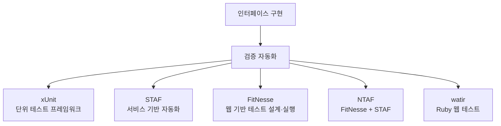

# 100 인터페이스 구현 검증 도구

작성 기준일: 2026-06-01
검색/보강일: 2026-06-01
PDF 확인 위치: 15페이지, 2과목 소프트웨어 개발, 100 인터페이스 구현 검증 도구

## 한 줄 요약

- 인터페이스 구현 검증 도구는 구현된 인터페이스가 요구한 대로 동작하는지 테스트·자동화·실행·결과 확인을 지원하는 도구이며, PDF 기준 핵심 예시는 xUnit, STAF, FitNesse, NTAF, watir이다.

## 한눈에 보는 구조

| 도구 | PDF 기준 핵심 | 시험 단서 |
|---|---|---|
| xUnit | 다양한 언어에 적용되는 단위 테스트 프레임워크 | JUnit, CppUnit, NUnit, HttpUnit |
| STAF | 서비스 호출, 컴포넌트 재사용 등 다양한 환경 지원 | 서비스, 재사용, 자동화 프레임워크 |
| FitNesse | 웹 기반 테스트 케이스 설계·실행·결과 확인 지원 | 웹 기반, 테스트 케이스, 위키 |
| NTAF | FitNesse와 STAF의 장점을 통합한 NHN 테스트 자동화 프레임워크 | FitNesse + STAF, NHN |
| watir | Ruby를 사용하는 애플리케이션 테스트 프레임워크 | Ruby, Web Application Testing |

## PDF 기준 핵심

- PDF는 인터페이스 구현 검증 도구로 다음을 제시한다.
- `xUnit`
  - JUnit, CppUnit, NUnit, HttpUnit 등 다양한 언어에 적용되는 단위 테스트 프레임워크이다.
- `STAF`
  - 서비스 호출 및 컴포넌트 재사용 등 다양한 환경을 지원하는 테스트 프레임워크이다.
- `FitNesse`
  - 웹 기반 테스트 케이스 설계, 실행, 결과 확인 등을 지원하는 테스트 프레임워크이다.
- `NTAF`
  - FitNesse와 STAF의 장점을 통합한 NHN(Naver)의 테스트 자동화 프레임워크이다.
- `watir`
  - Ruby를 사용하는 애플리케이션 테스트 프레임워크이다.

## 개념 설명

### 인터페이스 구현 검증의 의미

- 인터페이스 구현 검증은 시스템 간 연동이 명세대로 동작하는지 확인하는 작업이다.
- 입력 데이터, 호출 방식, 응답 구조, 오류 처리, 연동 흐름이 요구사항과 맞는지 검사한다.
- 수동 확인만으로는 반복 검증이 어렵기 때문에 테스트 프레임워크와 자동화 도구가 사용된다.

### xUnit

- xUnit은 여러 언어별 단위 테스트 프레임워크 계열을 묶어 부르는 말이다.
- PDF 예시는 다음과 같다.
  - JUnit: Java
  - CppUnit: C++
  - NUnit: .NET
  - HttpUnit: 웹 HTTP 테스트
- JUnit 공식 문서는 JUnit Platform이 JVM에서 테스트 프레임워크를 실행하기 위한 기반을 제공한다고 설명한다.
- xUnit.net은 C#, F#, Visual Basic용 오픈 소스 단위 테스트 도구로 설명된다.

### STAF

- STAF는 `Software Testing Automation Framework`이다.
- 공식 사이트는 STAF를 재사용 가능한 서비스 중심의 오픈 소스, 멀티 플랫폼, 멀티 언어 테스트 자동화 프레임워크로 설명한다.
- 시험에서는 `서비스 호출`, `컴포넌트 재사용`, `다양한 환경 지원`이 핵심 단서이다.

### FitNesse

- FitNesse는 웹 기반 테스트 프레임워크이다.
- 공식 문서는 FitNesse가 FIT 테스트를 쉽게 만들고, 실행하고, 구성하고, 공유하도록 돕는 HTML·위키 프런트엔드라고 설명한다.
- 시험에서는 `웹 기반`, `테스트 케이스 설계`, `실행`, `결과 확인`과 연결한다.
- 인수 테스트나 비즈니스 규칙 테스트와 함께 언급될 수 있다.

### NTAF

- NTAF는 NHN Test Automation Framework로 소개되는 테스트 자동화 프레임워크이다.
- PDF 기준으로 FitNesse와 STAF의 장점을 통합한 도구라는 점이 가장 중요하다.
- 시험에서는 `NHN`, `Naver`, `FitNesse + STAF`를 함께 기억한다.

### watir

- watir는 `Web Application Testing in Ruby`로 알려진 Ruby 기반 웹 애플리케이션 테스트 자동화 도구이다.
- 공식 Watir 사이트는 Watir가 브라우저에서 링크 클릭, 폼 입력, 텍스트 검증처럼 사람이 하는 방식과 유사하게 테스트를 자동화한다고 설명한다.
- 시험에서는 `Ruby` 단서가 가장 강하다.

## 시험 포인트

- xUnit은 언어별 단위 테스트 프레임워크 묶음이다.
- STAF는 서비스 호출과 컴포넌트 재사용 단서로 구분한다.
- FitNesse는 웹 기반 테스트 케이스 설계·실행·결과 확인 도구이다.
- NTAF는 FitNesse와 STAF의 장점을 통합한 NHN 테스트 자동화 프레임워크이다.
- watir는 Ruby 기반 애플리케이션 테스트 프레임워크이다.
- 도구 이름과 핵심 단서를 1:1로 연결하는 문제가 많이 나온다.

## 헷갈리는 비교

| 헷갈리는 쌍 | 구분 기준 |
|---|---|
| xUnit vs FitNesse | xUnit은 단위 테스트 계열, FitNesse는 웹 기반 테스트 케이스 설계·실행 |
| STAF vs NTAF | STAF는 서비스 기반 자동화 프레임워크, NTAF는 FitNesse와 STAF 통합 |
| FitNesse vs watir | FitNesse는 웹 기반 테스트 케이스 관리, watir는 Ruby 기반 브라우저 자동화 |
| JUnit vs xUnit | JUnit은 Java용 xUnit 계열 중 하나, xUnit은 묶음 이름 |

## 예시 또는 암기 포인트

### 도구별 한 줄 암기

| 도구 | 암기 문장 |
|---|---|
| xUnit | 여러 언어의 단위 테스트 프레임워크 묶음 |
| STAF | 서비스 호출·컴포넌트 재사용 자동화 |
| FitNesse | 웹에서 테스트 케이스 설계·실행·결과 확인 |
| NTAF | NHN의 FitNesse + STAF 통합 프레임워크 |
| watir | Ruby로 웹 애플리케이션 테스트 |

### 문제 풀이 단서

| 문제 표현 | 정답 방향 |
|---|---|
| JUnit, CppUnit, NUnit, HttpUnit | xUnit |
| 서비스 호출 및 컴포넌트 재사용 | STAF |
| 웹 기반 테스트 케이스 설계·실행·결과 확인 | FitNesse |
| FitNesse와 STAF 장점 통합, NHN | NTAF |
| Ruby 사용하는 애플리케이션 테스트 | watir |

## 빠른 복습

- 인터페이스 구현 검증 도구는 연동 구현이 명세대로 동작하는지 확인한다.
- PDF 기준 도구는 xUnit, STAF, FitNesse, NTAF, watir이다.
- xUnit은 JUnit, CppUnit, NUnit, HttpUnit 같은 단위 테스트 계열이다.
- STAF는 서비스 호출과 컴포넌트 재사용이다.
- FitNesse는 웹 기반 테스트 케이스 설계·실행·결과 확인이다.
- NTAF는 FitNesse와 STAF 통합, NHN 단서이다.
- watir는 Ruby 단서로 판별한다.

## 참고 링크

- [JUnit 5 User Guide](https://junit.org/junit5/docs/current/user-guide/)
- [xUnit.net](https://xunit.net/)
- [STAF - Software Testing Automation Framework](https://staf.sourceforge.net/)
- [FitNesse](https://fitnesse.org/FitNesse.html)
- [Watir Project](https://watir.com/)
- [NHN Test Automation Framework artifact listing](https://jarcasting.com/artifacts/com.nhncorp.ntaf/)

<!-- study-links:start -->
## 관련 문서

- `단위 테스트`: [[정보처리기사/2과목 소프트웨어 개발/084 단위 테스트(Unit Test)/084 단위 테스트(Unit Test)|084 단위 테스트(Unit Test)]]
<!-- study-links:end -->
