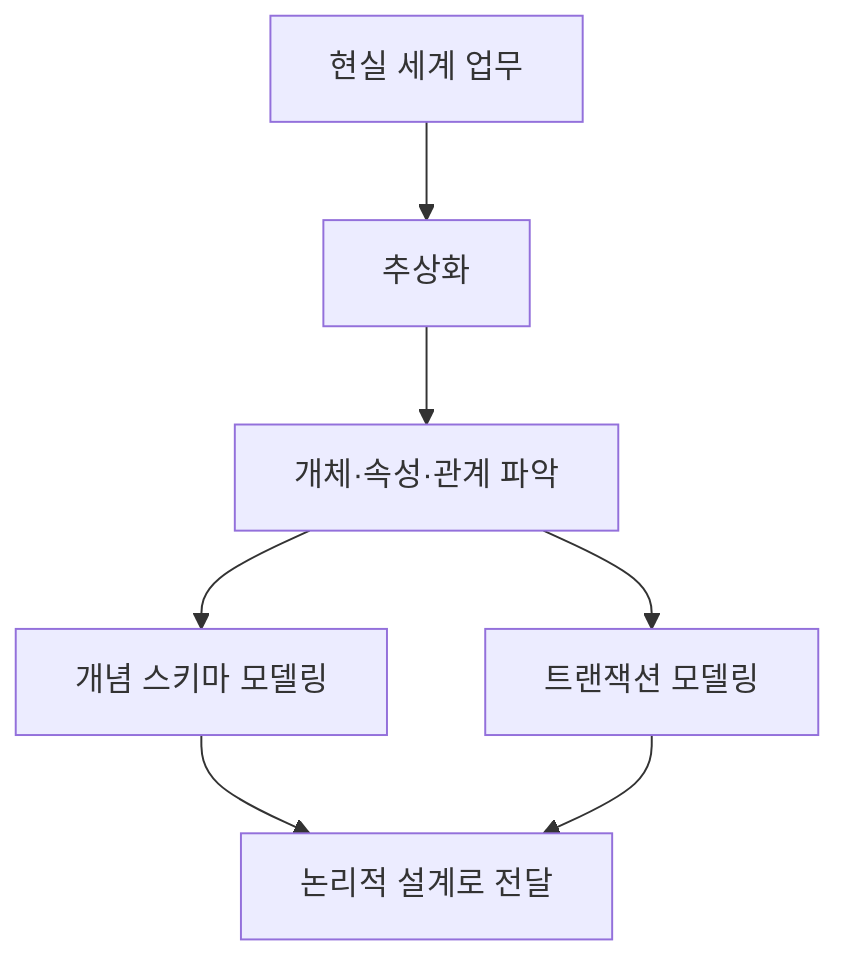

# 101 개념적 설계(정보 모델링, 개념화)

작성 기준일: 2026-06-01
검색/보강일: 2026-06-01
PDF 확인 위치: 16페이지, 3과목 데이터베이스 구축, 101 개념적 설계(정보 모델링, 개념화)

## 한 줄 요약

- 개념적 설계는 현실 세계의 업무와 정보를 DBMS 세부 구현 전에 추상적 개념으로 표현해 개념 스키마와 트랜잭션 요구를 함께 잡는 단계이다.

## 한눈에 보는 구조

| 구분 | 내용 |
|---|---|
| 설계 수준 | 가장 추상적인 데이터베이스 설계 단계 |
| 주요 산출물 | 개념 스키마, E-R 모델, 주요 트랜잭션 요구 |
| 핵심 작업 | 현실 세계 정보 구조를 개념으로 표현 |
| 병행 작업 | 개념 스키마 모델링과 트랜잭션 모델링 |
| 다음 단계 | 논리적 설계 |

## PDF 기준 핵심

- 정보의 구조를 얻기 위하여 현실 세계에 대한 인식을 추상적 개념으로 표현하는 과정이다.
- 개념 스키마 모델링과 트랜잭션 모델링을 병행 수행한다.
- PDF는 개념적 설계를 `정보 모델링`, `개념화`와 함께 묶어 제시한다.

## 개념 설명

### 개념적 설계의 역할

- 사용자가 실제로 다루는 업무 대상과 규칙을 데이터 관점에서 정리한다.
- 특정 DBMS, 저장 구조, 인덱스 같은 구현 세부 사항은 아직 중심이 아니다.
- IBM의 데이터 모델링 설명도 데이터 모델링이 개념 모델에서 시작해 논리 모델, 물리 모델로 진행된다고 설명한다.
- 개념적 설계에서는 다음을 파악한다.
  - 어떤 개체가 있는가
  - 각 개체는 어떤 속성을 가지는가
  - 개체 사이에 어떤 관계가 있는가
  - 업무에서 어떤 주요 처리가 필요한가

### 개념 스키마 모델링

- 데이터베이스 전체의 논리적 뼈대를 사용자 관점에서 잡는 작업이다.
- 보통 E-R 다이어그램으로 개체, 속성, 관계를 표현한다.
- 예:
  - `학생`, `과목`, `수강` 같은 개체와 관계를 정의
  - 학생은 학번, 이름, 학과 속성을 가진다고 표현

### 트랜잭션 모델링

- 데이터 구조만 설계하면 실제 업무 처리를 놓칠 수 있다.
- 따라서 조회, 등록, 수정, 삭제 같은 주요 트랜잭션 요구도 함께 분석한다.
- 예:
  - 학생 등록
  - 수강 신청
  - 성적 입력
  - 수강 내역 조회

## 시험 포인트

- `현실 세계`, `추상적 개념`, `정보 구조`가 나오면 개념적 설계이다.
- `개념 스키마 모델링`과 `트랜잭션 모델링`을 병행한다는 문장을 그대로 기억한다.
- 개념적 설계는 논리적 설계보다 앞선다.
- 물리적 저장 구조나 접근 경로를 결정하는 단계가 아니다.
- E-R 모델과 강하게 연결된다.

## 헷갈리는 비교

| 비교 | 개념적 설계 | 논리적 설계 | 물리적 설계 |
|---|---|---|---|
| 초점 | 현실 세계를 추상화 | 논리적 자료 구조로 변환 | 저장 구조와 접근 경로 결정 |
| 산출물 | 개념 스키마, E-R 모델 | 논리 스키마, 테이블 구조 | 파일 구조, 인덱스, 저장 레코드 |
| DBMS 의존도 | 낮음 | 중간 | 높음 |
| 시험 단서 | 정보 모델링, 개념화 | mapping, 트랜잭션 인터페이스 | 저장 구조, 액세스 경로 |

## 예시 또는 암기 포인트

- `현실 세계 → 추상적 개념`이면 개념적 설계이다.
- `개념 스키마 + 트랜잭션 모델링`을 한 세트로 외운다.
- 개념적 설계의 대표 그림은 E-R 다이어그램이다.
- 업무 담당자와 데이터 설계자가 공통으로 이해할 수 있는 수준의 모델을 만든다고 생각하면 된다.

## 빠른 복습

- 개념적 설계는 정보 모델링, 개념화라고도 한다.
- 현실 세계의 인식을 추상적 개념으로 표현한다.
- 개념 스키마 모델링과 트랜잭션 모델링을 병행한다.
- 구현 세부보다 개체·속성·관계 파악이 중요하다.
- 다음 단계는 논리적 설계이다.

## 참고 링크

- [IBM - What Is Data Modeling?](https://www.ibm.com/think/topics/data-modeling)
- [IBM Db2 - Database objects and relationships](https://www.ibm.com/docs/en/db2-for-zos/13?topic=databases-database-objects-relationships)

<!-- study-links:start -->
## 관련 문서

- `e r 다이어그램`: [[정보처리기사/3과목 데이터베이스 구축/105 E-R 다이어그램/105 E-R 다이어그램|105 E-R 다이어그램]]
- `논리적 설계`: [[정보처리기사/3과목 데이터베이스 구축/102 논리적 설계(데이터 모델링)/102 논리적 설계(데이터 모델링)|102 논리적 설계(데이터 모델링)]]
- `물리적 설계`: [[정보처리기사/3과목 데이터베이스 구축/103 물리적 설계/103 물리적 설계|103 물리적 설계]]
- `트랜잭션`: [[ACID-트랜잭션/ACID-트랜잭션|ACID 트랜잭션 상세 정리]]
- `물리적`: [[정보처리기사/5과목 정보시스템 구축 관리/320 관리적 물리적 기술적 보안/320 관리적 물리적 기술적 보안|320 관리적/물리적/기술적 보안]]
<!-- study-links:end -->
