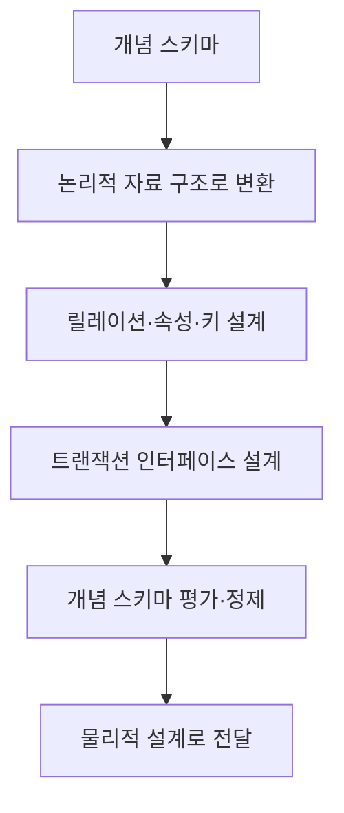

# 102 논리적 설계(데이터 모델링)

작성 기준일: 2026-06-01
검색/보강일: 2026-06-01
PDF 확인 위치: 16페이지, 3과목 데이터베이스 구축, 102 논리적 설계(데이터 모델링)

## 한 줄 요약

- 논리적 설계는 개념적 설계 결과를 DBMS가 지원하는 논리적 자료 구조로 변환하고, 트랜잭션 인터페이스와 개념 스키마를 정제하는 단계이다.

## 한눈에 보는 구조

| 구분 | 내용 |
|---|---|
| 위치 | 개념적 설계 다음, 물리적 설계 전 |
| 핵심 작업 | 자료를 논리적 자료 구조로 변환 |
| 대표 산출물 | 릴레이션 스키마, 속성, 키, 제약 조건 |
| 추가 작업 | 트랜잭션 인터페이스 설계 |
| 검토 작업 | 개념 스키마 평가 및 정제 |

## PDF 기준 핵심

- 자료를 특정 DBMS가 지원하는 논리적 자료 구조로 변환, 즉 mapping시키는 과정이다.
- 트랜잭션의 인터페이스를 설계한다.
- 개념 스키마를 평가 및 정제한다.
- PDF는 논리적 설계를 `데이터 모델링`과 함께 제시한다.

## 개념 설명

### 논리적 설계의 의미

- 개념적 설계가 업무 개념을 잡는 단계라면, 논리적 설계는 이를 데이터베이스 구조로 더 구체화하는 단계이다.
- 관계형 데이터베이스 기준으로는 개체와 관계를 릴레이션, 속성, 기본키, 외래키 등으로 변환한다.
- IBM의 데이터 모델링 자료는 논리 모델이 기술 시스템 요구사항을 직접 지정하지 않지만, 데이터 중심 프로젝트에서 설계 기반으로 유용하다고 설명한다.
- IBM Db2 문서도 데이터베이스 설계의 일반 작업으로 논리 데이터 모델링과 물리 데이터 모델링을 제시한다.

### Mapping의 의미

- mapping은 개념 모델의 구성 요소를 논리 데이터 모델 요소로 대응시키는 것이다.
- 예:
  - 개체 `학생` → 릴레이션 `학생`
  - 속성 `학번`, `이름` → 컬럼
  - 관계 `수강` → 외래키 또는 별도 릴레이션

### 트랜잭션 인터페이스 설계

- 사용자가 수행할 데이터 처리 흐름과 데이터 구조의 접점을 설계한다.
- 예:
  - 학생 등록 화면이 어떤 속성을 입력받을지
  - 수강 신청 처리에서 어떤 릴레이션을 참조할지
  - 조회 조건과 반환 항목을 어떻게 정의할지

## 시험 포인트

- `논리적 설계 = mapping` 단서를 반드시 기억한다.
- 트랜잭션 인터페이스 설계가 논리적 설계의 PDF 핵심 항목이다.
- 개념 스키마를 평가 및 정제한다는 표현도 자주 오답 선택지와 섞일 수 있다.
- 저장 레코드 형식이나 접근 경로 결정은 물리적 설계이다.
- 현실 세계 추상화는 개념적 설계이다.

## 헷갈리는 비교

| 비교 | 논리적 설계 | 물리적 설계 |
|---|---|---|
| 핵심 동사 | 변환, mapping, 정제 | 저장, 액세스 경로, 파일 구조 결정 |
| 관심 대상 | 릴레이션, 속성, 키, 제약 조건 | 저장 레코드 형식, 인덱스, 접근 경로 |
| 트랜잭션 | 인터페이스 설계 | 성능과 저장 접근 방식 고려 |
| 시험 단서 | 개념 스키마 평가·정제 | 물리적 구조의 데이터로 변환 |

## 예시 또는 암기 포인트

- 개념적 설계에서 `학생`이라는 개체를 찾았다.
- 논리적 설계에서는 `학생(학번, 이름, 학과코드)` 같은 릴레이션 스키마로 바꾼다.
- `학번`을 후보키 또는 기본키로 검토하고, `학과코드`를 외래키로 둘지 판단한다.
- 즉, 논리적 설계는 `개념을 테이블 구조로 번역하는 단계`라고 기억한다.

## 빠른 복습

- 논리적 설계는 데이터 모델링이라고도 한다.
- 자료를 DBMS가 지원하는 논리적 자료 구조로 mapping한다.
- 트랜잭션 인터페이스를 설계한다.
- 개념 스키마를 평가하고 정제한다.
- 물리적 저장 구조 결정은 다음 단계인 물리적 설계이다.

## 참고 링크

- [IBM - What Is Data Modeling?](https://www.ibm.com/think/topics/data-modeling)
- [IBM Db2 - Database objects and relationships](https://www.ibm.com/docs/en/db2-for-zos/13?topic=databases-database-objects-relationships)

<!-- study-links:start -->
## 관련 문서

- `개념적 설계`: [[정보처리기사/3과목 데이터베이스 구축/101 개념적 설계(정보 모델링, 개념화)/101 개념적 설계(정보 모델링, 개념화)|101 개념적 설계(정보 모델링, 개념화)]]
- `물리적 설계`: [[정보처리기사/3과목 데이터베이스 구축/103 물리적 설계/103 물리적 설계|103 물리적 설계]]
- `트랜잭션`: [[ACID-트랜잭션/ACID-트랜잭션|ACID 트랜잭션 상세 정리]]
- `후보키`: [[정보처리기사/3과목 데이터베이스 구축/110 후보키(Candidate Key)/110 후보키(Candidate Key)|110 후보키(Candidate Key)]]
- `기본키`: [[정보처리기사/3과목 데이터베이스 구축/111 기본키(Primary Key)/111 기본키(Primary Key)|111 기본키(Primary Key)]]
- `외래키`: [[정보처리기사/3과목 데이터베이스 구축/114 외래키(Foreign Key)/114 외래키(Foreign Key)|114 외래키(Foreign Key)]]
- `물리적`: [[정보처리기사/5과목 정보시스템 구축 관리/320 관리적 물리적 기술적 보안/320 관리적 물리적 기술적 보안|320 관리적/물리적/기술적 보안]]
<!-- study-links:end -->
