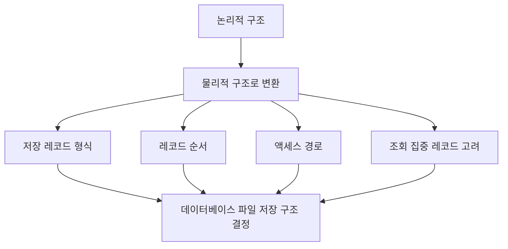

# 103 물리적 설계

작성 기준일: 2026-06-01
검색/보강일: 2026-06-01
PDF 확인 위치: 16페이지, 3과목 데이터베이스 구축, 103 물리적 설계

## 한 줄 요약

- 물리적 설계는 논리적으로 표현된 데이터를 실제 저장 장치와 DBMS 환경에서 효율적으로 저장·접근할 수 있도록 저장 구조와 액세스 경로를 결정하는 단계이다.

## 한눈에 보는 구조

| 구분 | 내용 |
|---|---|
| 입력 | 논리적 설계 결과 |
| 핵심 작업 | 물리적 저장 구조와 액세스 경로 결정 |
| 고려 정보 | 저장 레코드 형식, 순서, 접근 경로, 조회 집중 레코드 |
| 목표 | 성능, 저장 효율, 접근 효율 향상 |
| 다음 결과 | 실제 DBMS에 구현 가능한 구조 |

## PDF 기준 핵심

- 논리적 구조로 표현된 데이터를 물리적 구조의 데이터로 변환하는 과정이다.
- 데이터베이스 파일의 저장 구조 및 액세스 경로를 결정한다.
- 저장 레코드의 형식, 순서, 접근 경로, 조회가 집중되는 레코드와 같은 정보를 사용한다.

## 개념 설명

### 물리적 설계의 의미

- 논리적 설계가 `무엇을 어떤 구조로 표현할 것인가`에 가깝다면, 물리적 설계는 `어떻게 저장하고 빠르게 접근할 것인가`에 가깝다.
- IBM의 데이터 모델링 설명은 물리 데이터 모델이 데이터가 데이터베이스 안에서 물리적으로 저장되는 방식의 스키마를 제공하며, DBMS별 성능 튜닝 속성을 포함할 수 있다고 설명한다.
- Oracle Database 문서도 인덱스가 요청된 행을 찾는 데 사용될 수 있음을 설명하므로, 물리적 설계에서 접근 경로와 인덱스 고려가 중요하다는 점을 이해할 수 있다.

### 주요 결정 사항

- 파일 저장 구조:
  - 데이터 파일을 어떤 방식으로 배치할지 결정한다.
- 액세스 경로:
  - 데이터를 찾기 위해 어떤 인덱스나 경로를 사용할지 결정한다.
- 저장 레코드 형식:
  - 레코드가 저장되는 형식과 길이, 배치 방식을 고려한다.
- 레코드 순서:
  - 자주 조회되는 순서에 맞게 정렬하거나 클러스터링할 수 있다.
- 조회 집중 레코드:
  - 많이 조회되는 데이터가 빠르게 접근되도록 설계한다.

## 시험 포인트

- `물리적 설계 = 저장 구조 + 액세스 경로`로 외운다.
- 저장 레코드의 형식, 순서, 접근 경로, 조회 집중 레코드가 PDF 핵심 단서이다.
- 개념 스키마 모델링은 개념적 설계이다.
- 트랜잭션 인터페이스 설계는 논리적 설계이다.
- 물리적 설계는 DBMS와 저장 장치 특성을 가장 많이 고려한다.

## 헷갈리는 비교

| 비교 | 논리적 설계 | 물리적 설계 |
|---|---|---|
| 관심 | 릴레이션 구조와 제약 | 저장 구조와 접근 성능 |
| 산출물 | 테이블, 속성, 키 | 인덱스, 파일 구조, 저장 방식 |
| PDF 단서 | mapping, 인터페이스 설계 | 저장 구조, 액세스 경로 |
| DBMS 의존도 | 상대적으로 낮음 | 높음 |

## 예시 또는 암기 포인트

- 학생 테이블의 기본키를 `학번`으로 정하는 것은 논리적 설계 성격이 강하다.
- `학번`에 인덱스를 만들고, 조회가 많은 학과별 데이터 접근 경로를 잡는 것은 물리적 설계 성격이 강하다.
- `물리 = 실제 저장`으로 연결하면 대부분 구분된다.

## 빠른 복습

- 물리적 설계는 논리 구조를 물리 구조로 변환한다.
- 데이터베이스 파일의 저장 구조와 액세스 경로를 결정한다.
- 저장 레코드 형식, 순서, 접근 경로, 조회 집중 레코드를 고려한다.
- 인덱스와 성능 튜닝은 물리적 설계와 연결된다.
- 개념적·논리적 설계와 단계 단서를 구분해야 한다.

## 참고 링크

- [IBM - What Is Data Modeling?](https://www.ibm.com/think/topics/data-modeling)
- [Oracle Database Concepts - Introduction to Oracle Database](https://docs.oracle.com/en/database/oracle/oracle-database/12.2/cncpt/introduction-to-oracle-database.html)

