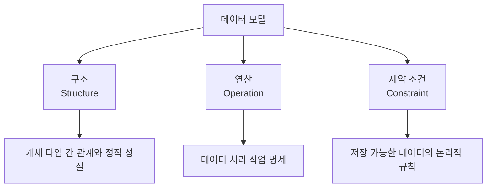

# 104 데이터 모델에 표시할 요소

작성 기준일: 2026-06-01
검색/보강일: 2026-06-01
PDF 확인 위치: 16페이지, 3과목 데이터베이스 구축, 104 데이터 모델에 표시할 요소

## 한 줄 요약

- 데이터 모델은 데이터의 정적인 모습인 구조, 데이터를 처리하는 동적인 작업인 연산, 저장 가능한 값의 규칙인 제약 조건을 함께 표현한다.

## 한눈에 보는 구조

| 요소 | PDF 기준 의미 | 예 |
|---|---|---|
| 구조 | 개체 타입 간 관계, 데이터 구조, 정적 성질 | 학생-수강-과목 관계 |
| 연산 | 실제 데이터를 처리하는 작업 명세 | 검색, 삽입, 삭제, 갱신 |
| 제약 조건 | 저장 가능한 실제 데이터의 논리적 제한 | 기본키, 외래키, 도메인 |

## PDF 기준 핵심

- `구조(Structure)`
  - 논리적으로 표현된 개체 타입들 간의 관계이다.
  - 데이터 구조 및 정적 성질을 표현한다.
- `연산(Operation)`
  - 데이터베이스에 저장된 실제 데이터를 처리하는 작업에 대한 명세이다.
  - 데이터베이스를 조작하는 기본 도구이다.
- `제약 조건(Constraint)`
  - 데이터베이스에 저장될 수 있는 실제 데이터의 논리적인 제약 조건이다.

## 개념 설명

### 왜 세 요소가 함께 필요한가

- 구조만 있으면 데이터가 어떤 모양인지 알 수 있지만, 어떻게 조작하는지는 알기 어렵다.
- 연산만 있으면 어떤 데이터 구조와 규칙을 대상으로 하는지 불명확하다.
- 제약 조건이 없으면 잘못된 값이나 모순된 관계가 저장될 수 있다.
- 따라서 데이터 모델은 구조, 연산, 제약 조건을 함께 표현해야 완전하다.

### 구조

- 구조는 데이터의 정적인 모양을 나타낸다.
- 관계형 데이터 모델에서는 릴레이션, 속성, 튜플, 속성 간 관계가 구조에 해당한다.
- E-R 모델에서는 개체, 속성, 관계가 구조 표현의 중심이다.
- IBM의 관계형 데이터베이스 모델 설명도 column을 attribute와 연결해 설명하며, 테이블 구조가 관계형 모델 표현의 핵심임을 보여준다.

### 연산

- 연산은 데이터베이스에 저장된 데이터를 처리하는 행위이다.
- 관계형 데이터베이스에서는 SELECT, INSERT, DELETE, UPDATE 같은 DML과 관계대수 연산이 대표적이다.
- 시험에서는 `데이터베이스를 조작하는 기본 도구`라는 PDF 표현을 기억한다.

### 제약 조건

- 제약 조건은 데이터가 만족해야 하는 규칙이다.
- 예:
  - 학번은 중복될 수 없다.
  - 기본키는 NULL이 될 수 없다.
  - 수강 테이블의 학번은 학생 테이블에 존재해야 한다.
  - 성적은 정해진 범위 안의 값이어야 한다.

## 시험 포인트

- 데이터 모델 3요소는 `구조`, `연산`, `제약 조건`이다.
- `정적 성질`은 구조와 연결한다.
- `데이터를 처리하는 작업 명세`는 연산과 연결한다.
- `논리적인 제약 조건`은 제약 조건과 연결한다.
- 구조·연산·제약 조건 중 하나를 설명하고 용어를 묻는 문제가 자주 나온다.

## 헷갈리는 비교

| 헷갈리는 요소 | 구분 단서 |
|---|---|
| 구조 vs 연산 | 구조는 데이터의 모양, 연산은 데이터 처리 행위 |
| 구조 vs 제약 조건 | 구조는 관계와 구성, 제약 조건은 허용 범위와 규칙 |
| 연산 vs 제약 조건 | 연산은 조작 도구, 제약 조건은 조작 결과가 지켜야 할 규칙 |

## 예시 또는 암기 포인트

- `학생(학번, 이름, 학과)`라는 테이블 모양은 구조이다.
- `학생을 검색한다`, `학생을 삽입한다`는 연산이다.
- `학번은 중복 불가`, `이름은 NULL 불가`는 제약 조건이다.
- 암기 문장: 데이터 모델 = `구조로 표현하고, 연산으로 조작하고, 제약 조건으로 통제한다`.

## 빠른 복습

- 데이터 모델에 표시할 요소는 구조, 연산, 제약 조건이다.
- 구조는 개체 타입 간 관계와 정적 성질이다.
- 연산은 저장된 실제 데이터를 처리하는 작업 명세이다.
- 제약 조건은 저장 가능한 데이터의 논리적 제한이다.
- 세 요소를 예시와 함께 구분하면 문제 풀이가 빠르다.

## 참고 링크

- [IBM - The relational database model](https://www.ibm.com/docs/en/SSGU8G_12.1.0/com.ibm.sqlt.doc/ids_sqt_020.htm)
- [Oracle - What Is a Relational Database?](https://www.oracle.com/ma/database/what-is-a-relational-database/)

