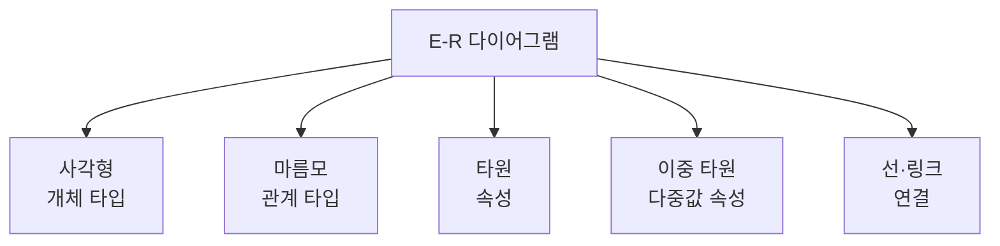
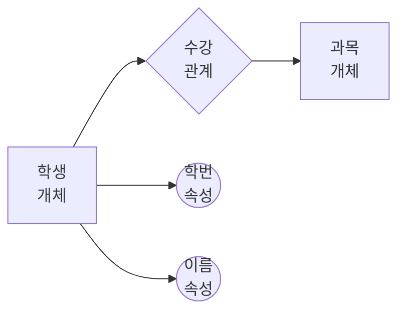

# 105 E-R 다이어그램

작성 기준일: 2026-06-01
검색/보강일: 2026-06-01
PDF 확인 위치: 16페이지, 3과목 데이터베이스 구축, 105 E-R 다이어그램

## 한 줄 요약

- E-R 다이어그램은 개체, 관계, 속성을 기호로 표현해 현실 세계의 데이터 구조를 시각적으로 모델링하는 개념적 설계 도구이다.

## 한눈에 보는 구조

| 기호 | 기호 이름 | 의미 |
|---|---|---|
| 사각형 | 개체(Entity) | 개체 타입 |
| 마름모 | 관계(Relationship) | 관계 타입 |
| 타원 | 속성(Attribute) | 속성 |
| 이중 타원 | 다중값 속성 | 여러 값을 가질 수 있는 속성 |
| 선, 링크 | 연결 | 개체 타입과 속성을 연결 |

## PDF 기준 핵심

- PDF는 E-R 다이어그램의 기호와 의미를 표로 제시한다.
- 사각형은 개체(Entity) 타입을 의미한다.
- 마름모는 관계(Relationship) 타입을 의미한다.
- 타원은 속성(Attribute)을 의미한다.
- 이중 타원은 다중값 속성, PDF 표기상 복합 속성과 함께 제시된다.
- 선 또는 링크는 개체 타입과 속성을 연결한다.

## 개념 설명

### E-R 다이어그램의 역할

- E-R은 Entity-Relationship의 약자이다.
- 개념적 설계 단계에서 현실 세계의 데이터 구조를 사람이 이해하기 쉽게 나타내는 데 사용한다.
- IBM Db2 문서는 논리 데이터 모델링에서 entity-relationship model을 다룬다고 설명한다.
- Microsoft의 데이터베이스 설계 자료도 테이블 간 관계와 키 연결을 설계의 핵심으로 설명한다.

### 개체(Entity)

- 독립적으로 식별할 수 있는 업무 대상이다.
- 예:
  - 학생
  - 과목
  - 교수
  - 주문
- E-R 다이어그램에서는 사각형으로 표현한다.

### 관계(Relationship)

- 개체와 개체 사이의 연관이다.
- 예:
  - 학생은 과목을 수강한다.
  - 고객은 주문을 생성한다.
  - 교수는 강의를 담당한다.
- E-R 다이어그램에서는 마름모로 표현한다.

### 속성(Attribute)

- 개체나 관계가 가지는 세부 항목이다.
- 예:
  - 학생의 학번, 이름, 학과
  - 과목의 과목코드, 과목명, 학점
- E-R 다이어그램에서는 타원으로 표현한다.

## 시험 포인트

- 사각형은 개체이다.
- 마름모는 관계이다.
- 타원은 속성이다.
- 이중 타원은 다중값 속성이다.
- 선, 링크는 개체 타입과 속성 등을 연결한다.
- E-R 다이어그램은 개념적 설계와 연결해서 기억한다.

## 헷갈리는 비교

| 기호 | 헷갈리는 이유 | 구분 팁 |
|---|---|---|
| 사각형 vs 마름모 | 둘 다 이름이 들어감 | 명사는 사각형, 동사형 관계는 마름모 |
| 타원 vs 이중 타원 | 둘 다 속성 | 값이 여러 개 가능하면 이중 타원 |
| 개체 vs 속성 | 둘 다 데이터 표현 | 독립 식별 대상은 개체, 설명 항목은 속성 |

## 예시 또는 암기 포인트

- 위 그림에서 학생과 과목은 개체이다.
- 수강은 학생과 과목 사이의 관계이다.
- 학번과 이름은 학생 개체의 속성이다.
- 시험에서는 실제 기호 그림을 보고 의미를 고르는 문제가 나올 수 있다.

## 빠른 복습

- E-R 다이어그램은 개체-관계 모델을 시각화한다.
- 사각형은 개체, 마름모는 관계, 타원은 속성이다.
- 이중 타원은 다중값 속성이다.
- 선과 링크는 연결을 의미한다.
- 개념적 설계의 대표 산출물로 이해한다.

## 참고 링크

- [IBM Db2 - Database objects and relationships](https://www.ibm.com/docs/en/db2-for-zos/13?topic=databases-database-objects-relationships)
- [Microsoft Support - Database design basics](https://support.microsoft.com/en-au/office/database-design-basics-eb2159cf-1e30-401a-8084-bd4f9c9ca1f5)

<!-- study-links:start -->
## 관련 문서

- `개념적 설계`: [[정보처리기사/3과목 데이터베이스 구축/101 개념적 설계(정보 모델링, 개념화)/101 개념적 설계(정보 모델링, 개념화)|101 개념적 설계(정보 모델링, 개념화)]]
<!-- study-links:end -->
