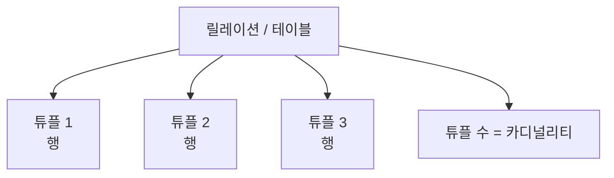

# 106 튜플(Tuple)

작성 기준일: 2026-06-01
검색/보강일: 2026-06-01
PDF 확인 위치: 16페이지, 3과목 데이터베이스 구축, 106 튜플(Tuple)

## 한 줄 요약

- 튜플은 릴레이션을 구성하는 하나의 행이며, 릴레이션에 포함된 튜플의 수를 카디널리티라고 한다.

## 한눈에 보는 구조

| 용어 | 의미 | SQL/테이블 관점 |
|---|---|---|
| 릴레이션 | 튜플과 속성으로 구성된 관계형 데이터 구조 | 테이블 |
| 튜플 | 릴레이션의 각 행 | row, record |
| 카디널리티 | 튜플의 수 | 행 개수 |

## PDF 기준 핵심

- 튜플은 릴레이션을 구성하는 각각의 행을 말한다.
- 튜플의 수는 카디널리티(Cardinality)이다.

## 개념 설명

### 튜플의 의미

- 관계형 데이터베이스 이론에서 튜플은 하나의 레코드 또는 행에 해당한다.
- Oracle은 관계형 데이터베이스에서 테이블의 각 행이 레코드이며, 키로 고유하게 식별될 수 있다고 설명한다.
- 예를 들어 학생 릴레이션에서 한 학생의 학번, 이름, 학과 값이 모인 한 줄이 튜플이다.

### 카디널리티

- 카디널리티는 릴레이션에 들어 있는 튜플의 개수이다.
- 학생 릴레이션에 학생 100명이 저장되어 있으면 카디널리티는 100이다.
- 시험에서는 `튜플의 수 = 카디널리티`로 바로 연결한다.

### 예시

| 학번 | 이름 | 학과 |
|---|---|---|
| 2026001 | 김정보 | 컴퓨터공학 |
| 2026002 | 이처리 | 소프트웨어 |

- 위 릴레이션에는 튜플이 2개 있다.
- 따라서 카디널리티는 2이다.

## 시험 포인트

- 튜플은 행이다.
- 튜플의 수는 카디널리티이다.
- 속성의 수는 디그리이므로 튜플과 헷갈리지 않는다.
- 관계형 데이터베이스 문제에서 `행`, `레코드`, `tuple`은 같은 방향으로 이해한다.

## 헷갈리는 비교

| 비교 | 튜플 | 속성 |
|---|---|---|
| 방향 | 행 | 열 |
| 개수 용어 | 카디널리티 | 디그리, 차수 |
| 예 | 학생 한 명의 전체 데이터 | 학번, 이름, 학과 |

## 예시 또는 암기 포인트

- `튜플 = 행 = 레코드`
- `튜플 수 = 카디널리티`
- `속성 수 = 디그리`
- 행과 열 문제가 나오면 표를 머릿속에 그려서 푼다.

## 빠른 복습

- 튜플은 릴레이션의 각각의 행이다.
- 튜플 수는 카디널리티이다.
- 테이블에서 레코드 하나를 튜플로 볼 수 있다.
- 속성은 열이므로 튜플과 구분한다.

## 참고 링크

- [Oracle - What Is a Relational Database?](https://www.oracle.com/ma/database/what-is-a-relational-database/)
- [IBM - The relational database model](https://www.ibm.com/docs/en/SSGU8G_12.1.0/com.ibm.sqlt.doc/ids_sqt_020.htm)

<!-- study-links:start -->
## 관련 문서

- `sql`: [[sql-query/sql-query|반드시 알아둬야 할 SQL 쿼리 정리]]
<!-- study-links:end -->
