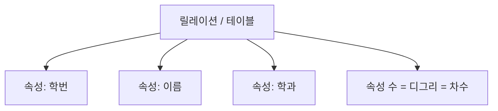

# 107 속성(Attribute)

작성 기준일: 2026-06-01
검색/보강일: 2026-06-01
PDF 확인 위치: 16페이지, 3과목 데이터베이스 구축, 107 속성(Attribute)

## 한 줄 요약

- 속성은 데이터베이스를 구성하는 가장 작은 논리적 단위이며, 릴레이션에서 열에 해당하고 속성의 수는 디그리 또는 차수라고 한다.

## 한눈에 보는 구조

| 용어 | 의미 | 테이블 관점 |
|---|---|---|
| 속성 | 데이터베이스의 가장 작은 논리적 단위 | column |
| 디그리 | 속성의 수 | 열 개수 |
| 차수 | 디그리의 다른 표현 | 열 개수 |

## PDF 기준 핵심

- 속성은 데이터베이스를 구성하는 가장 작은 논리적 단위이다.
- 속성의 수는 디그리(Degree)이다.
- 속성의 수는 차수라고도 한다.

## 개념 설명

### 속성의 의미

- 속성은 개체나 튜플을 설명하는 항목이다.
- Oracle 문서는 컬럼이 테이블이 설명하는 엔터티의 속성을 식별한다고 설명한다.
- 학생 릴레이션에서 `학번`, `이름`, `학과`는 각각 속성이다.
- 관계형 데이터베이스에서는 속성이 테이블의 열과 대응된다.

### 디그리와 차수

- 디그리는 한 릴레이션이 가진 속성의 개수이다.
- 같은 뜻으로 차수라고도 한다.
- 예:
  - 학생(학번, 이름, 학과) 릴레이션은 속성이 3개이다.
  - 따라서 디그리 또는 차수는 3이다.

### 속성 값

- 각 튜플의 특정 속성에 들어가는 실제 값을 속성 값으로 볼 수 있다.
- 속성 값은 도메인에 속해야 한다.
- 예:
  - `학과` 속성의 도메인이 등록된 학과명 집합이라면, 그 밖의 값은 들어가면 안 된다.

## 시험 포인트

- 속성은 열이다.
- 속성 수는 디그리 또는 차수이다.
- 튜플 수는 카디널리티이므로 디그리와 바꾸면 틀린다.
- `가장 작은 논리적 단위`라는 PDF 표현을 기억한다.
- 속성은 도메인을 가진다.

## 헷갈리는 비교

| 비교 | 속성 | 튜플 | 도메인 |
|---|---|---|---|
| 의미 | 열, 항목 | 행, 레코드 | 속성이 가질 수 있는 값의 집합 |
| 개수 용어 | 디그리, 차수 | 카디널리티 | 값의 허용 범위 |
| 예 | 학번 | 2026001 김정보 컴퓨터공학 | 학번 형식, 학과명 목록 |

## 예시 또는 암기 포인트

- `속성 = 열 = column`
- `속성 수 = Degree = 차수`
- `Tuple은 Row`, `Attribute는 Column`으로 영어 첫 글자를 붙여 기억한다.

## 빠른 복습

- 속성은 데이터베이스의 가장 작은 논리적 단위이다.
- 릴레이션에서는 열에 해당한다.
- 속성의 수는 디그리 또는 차수이다.
- 튜플의 수인 카디널리티와 반드시 구분한다.
- 속성 값은 도메인에 속해야 한다.

## 참고 링크

- [Oracle Database Concepts - Tables and Table Clusters](https://docs.oracle.com/html/E10713_02/tablecls.htm)
- [IBM - The relational database model](https://www.ibm.com/docs/en/SSGU8G_12.1.0/com.ibm.sqlt.doc/ids_sqt_020.htm)

<!-- study-links:start -->
## 관련 문서

- `튜플`: [[정보처리기사/3과목 데이터베이스 구축/106 튜플(Tuple)/106 튜플(Tuple)|106 튜플(Tuple)]]
<!-- study-links:end -->
