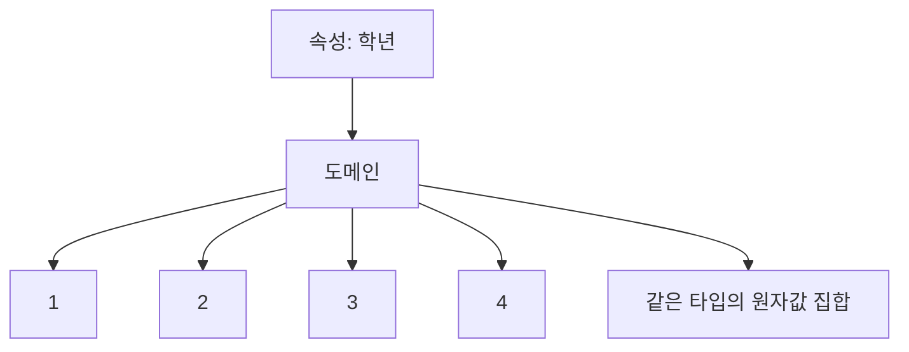

# 108 도메인(Domain)

작성 기준일: 2026-06-01
검색/보강일: 2026-06-01
PDF 확인 위치: 16페이지, 3과목 데이터베이스 구축, 108 도메인(Domain)

## 한 줄 요약

- 도메인은 하나의 속성이 가질 수 있는 같은 타입의 원자값들의 집합이다.

## 한눈에 보는 구조

| 구분 | 내용 |
|---|---|
| 대상 | 하나의 속성 |
| 의미 | 해당 속성이 취할 수 있는 값의 범위 |
| 값의 성격 | 같은 타입, 원자값 |
| 예 | 성별 = {남, 여}, 학년 = {1, 2, 3, 4} |
| 관련 개념 | 제약 조건, 무결성, 원자성 |

## PDF 기준 핵심

- 도메인은 하나의 애트리뷰트가 취할 수 있는 같은 타입의 원자(Atomic)값들의 집합이다.

## 개념 설명

### 도메인의 의미

- 도메인은 속성에 들어갈 수 있는 값의 허용 범위이다.
- 관계형 모델에서 속성 값은 해당 속성의 도메인에 속해야 한다.
- IBM의 관계형 데이터베이스 모델 설명은 관계형 모델에서 컬럼과 속성을 연결해 설명하므로, 도메인은 각 속성의 값 범위를 제한하는 개념으로 이해하면 된다.

### 같은 타입

- 도메인의 값들은 같은 타입이어야 한다.
- 예:
  - `나이` 속성: 정수 값
  - `생년월일` 속성: 날짜 값
  - `이름` 속성: 문자열 값
- 숫자 속성에 날짜나 문장을 섞어 저장하면 도메인 관점에서 잘못된 설계이다.

### 원자값

- 원자값은 더 이상 논리적으로 쪼갤 필요가 없는 값이다.
- 하나의 속성에 여러 값을 한꺼번에 넣으면 원자성 원칙과 어긋날 수 있다.
- 예:
  - 올바른 예: 전화번호 속성에 `010-1234-5678`
  - 주의할 예: 취미 속성 하나에 `축구, 독서, 영화`를 계속 이어 저장

## 시험 포인트

- `도메인 = 속성이 취할 수 있는 값들의 집합`이다.
- `같은 타입`과 `원자값`이 PDF 핵심 단서이다.
- 도메인은 속성 자체가 아니라 속성이 가질 수 있는 값의 범위이다.
- 원자값은 릴레이션 특징과 정규화에서도 중요하게 연결된다.

## 헷갈리는 비교

| 비교 | 속성 | 도메인 |
|---|---|---|
| 의미 | 데이터 항목 이름 | 데이터 항목이 가질 수 있는 값의 집합 |
| 예 | 학년 | {1, 2, 3, 4} |
| 관점 | 구조 | 제약과 값 범위 |

| 비교 | 도메인 | 튜플 |
|---|---|---|
| 의미 | 속성의 허용 값 집합 | 릴레이션의 행 |
| 예 | 성별 값 집합 | 김정보 학생의 전체 레코드 |

## 예시 또는 암기 포인트

- `학년` 속성의 도메인: 1, 2, 3, 4
- `성적등급` 속성의 도메인: A, B, C, D, F
- `주민등록번호` 속성의 도메인: 정해진 형식의 문자열
- 암기 문장: 도메인은 `속성 값의 울타리`이다.

## 빠른 복습

- 도메인은 하나의 속성이 취할 수 있는 값들의 집합이다.
- 값들은 같은 타입이어야 한다.
- 값들은 원자값이어야 한다.
- 도메인은 속성의 값 범위를 제한하는 제약 성격을 가진다.
- 속성과 도메인을 구분해서 외운다.

## 참고 링크

- [IBM - The relational database model](https://www.ibm.com/docs/en/SSGU8G_12.1.0/com.ibm.sqlt.doc/ids_sqt_020.htm)
- [Oracle - What Is a Relational Database?](https://www.oracle.com/ma/database/what-is-a-relational-database/)

