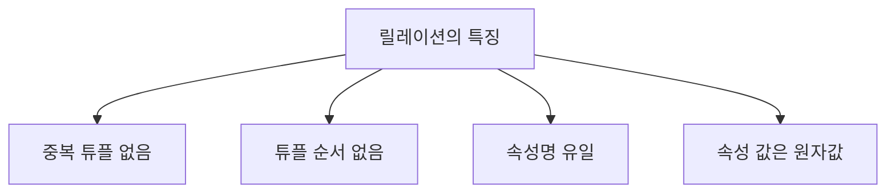

# 109 릴레이션의 특징

작성 기준일: 2026-06-01
검색/보강일: 2026-06-01
PDF 확인 위치: 16페이지, 3과목 데이터베이스 구축, 109 릴레이션의 특징

## 한 줄 요약

- 릴레이션은 중복 튜플을 허용하지 않고, 튜플 간 순서가 없으며, 속성명은 유일하고, 속성 값은 원자값이어야 한다.

## 한눈에 보는 구조

| 특징 | 의미 | 시험 단서 |
|---|---|---|
| 튜플 유일성 | 같은 튜플이 포함될 수 없음 | 중복 튜플 불가 |
| 튜플 무순서 | 튜플 사이에 순서가 없음 | 행 순서 의미 없음 |
| 속성명 유일 | 한 릴레이션 안에서 속성 이름이 유일 | 열 이름 구분 |
| 속성 값 원자성 | 더 이상 쪼갤 수 없는 값 저장 | atomic |

## PDF 기준 핵심

- 한 릴레이션에는 똑같은 튜플이 포함될 수 없으므로 릴레이션에 포함된 튜플들은 모두 상이하다.
- 한 릴레이션에 포함된 튜플 사이에는 순서가 없다.
- 속성의 유일한 식별을 위해 속성의 명칭은 유일해야 한다.
- 속성의 값은 논리적으로 더 이상 쪼갤 수 없는 원자값만을 저장한다.

## 개념 설명

### 중복 튜플 없음

- 관계형 모델에서 릴레이션은 집합 성격을 가진다.
- 집합에서는 같은 원소가 중복되지 않는다.
- 따라서 동일한 튜플이 같은 릴레이션에 두 번 존재할 수 없다고 본다.

### 튜플 사이 순서 없음

- 릴레이션 안의 튜플은 순서가 의미를 가지지 않는다.
- SQL에서 결과를 특정 순서로 보고 싶으면 `ORDER BY`를 사용해야 한다.
- 저장 순서나 입력 순서가 논리적 의미를 갖는 것은 아니다.

### 속성명 유일

- 한 릴레이션 안에서 각 속성은 구분 가능한 이름을 가져야 한다.
- 같은 이름의 속성이 여러 개 있으면 어떤 값을 의미하는지 구분하기 어렵다.

### 속성 값은 원자값

- 하나의 속성 값은 논리적으로 더 쪼개지지 않는 값이어야 한다.
- 원자값 원칙은 제1정규형과도 연결된다.
- Microsoft의 정규화 설명도 1정규형에서 반복 그룹 제거와 관련 데이터 분리를 설명하므로, 한 속성에 반복 값을 우겨 넣지 않는다는 관점으로 이해할 수 있다.

## 시험 포인트

- 릴레이션에는 같은 튜플이 중복될 수 없다.
- 튜플 사이에는 순서가 없다.
- 속성명은 유일해야 한다.
- 속성 값은 원자값이어야 한다.
- `튜플 순서 없음`과 `속성 순서 없음`을 섞는 보기에는 주의한다. PDF 핵심은 튜플 사이 순서 없음이다.

## 헷갈리는 비교

| 특징 | 맞는 설명 | 틀리기 쉬운 설명 |
|---|---|---|
| 튜플 | 중복 튜플 불가 | 입력한 순서가 논리적 의미를 가짐 |
| 속성명 | 유일해야 함 | 같은 속성명을 반복해도 됨 |
| 속성 값 | 원자값만 저장 | 한 칸에 여러 값을 계속 나열 |
| 릴레이션 | 집합적 성격 | 리스트처럼 순서가 핵심 |

## 예시 또는 암기 포인트

- 잘못된 예:
  - 한 학생 릴레이션에 완전히 같은 학생 튜플이 두 번 저장됨
  - `전화번호` 속성에 `010..., 02..., 031...`처럼 여러 값을 한꺼번에 저장
  - 같은 테이블에 `이름` 속성이 두 개 존재
- 암기 문장:
  - `중복 없음, 순서 없음, 이름 유일, 값은 원자`

## 빠른 복습

- 릴레이션의 튜플은 모두 달라야 한다.
- 튜플 사이에는 순서가 없다.
- 속성명은 유일해야 한다.
- 속성 값은 원자값만 저장한다.
- 원자값은 도메인과 정규화 문제에서도 반복해서 나온다.

## 참고 링크

- [Oracle - What Is a Relational Database?](https://www.oracle.com/ma/database/what-is-a-relational-database/)
- [Microsoft Learn - Database normalization description](https://learn.microsoft.com/en-us/troubleshoot/office/access/database-normalization-description)

