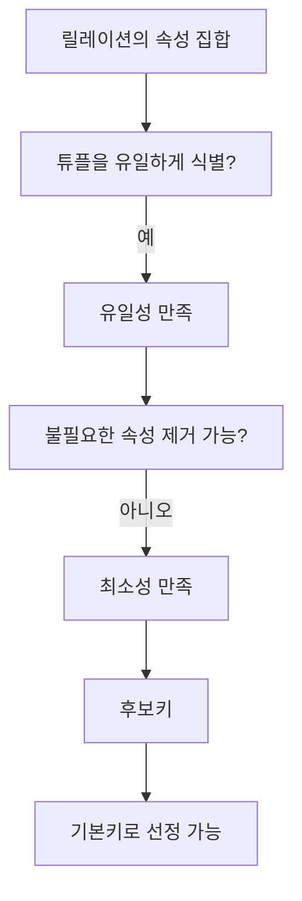

# 110 후보키(Candidate Key)

작성 기준일: 2026-06-01
검색/보강일: 2026-06-01
PDF 확인 위치: 17페이지, 3과목 데이터베이스 구축, 110 후보키(Candidate Key)

## 한 줄 요약

- 후보키는 릴레이션의 튜플을 유일하게 식별할 수 있는 속성 또는 속성 집합 중에서 유일성과 최소성을 모두 만족해 기본키가 될 수 있는 키이다.

## 한눈에 보는 구조

| 조건 | 의미 | 예 |
|---|---|---|
| 유일성 | 모든 튜플을 서로 다르게 식별 | 학번으로 학생 한 명 식별 |
| 최소성 | 식별에 불필요한 속성이 없어야 함 | 학번만으로 되면 학번+이름은 후보키 아님 |
| 기본키 가능성 | 후보키 중 하나를 기본키로 선택 | 학번, 주민번호 중 학번 선택 |

## PDF 기준 핵심

- 후보키는 릴레이션을 구성하는 속성들 중에서 튜플을 유일하게 식별하기 위해 사용하는 속성들의 부분집합이다.
- 후보키는 기본키로 사용할 수 있는 속성들을 말한다.
- 릴레이션에 있는 모든 튜플에 대해서 유일성과 최소성을 만족시켜야 한다.

## 개념 설명

### 후보키의 의미

- 후보키는 기본키 후보이다.
- 하나의 릴레이션에는 후보키가 하나일 수도 있고 여러 개일 수도 있다.
- Microsoft의 데이터 모델 관계 설명은 alternate key 또는 candidate key를 primary key가 아닌 unique한 column으로 설명한다.
- IBM의 정규화 설명도 관계형 데이터베이스에서 키를 행을 식별하는 컬럼 또는 컬럼 집합으로 설명한다.

### 유일성

- 후보키 값이 같으면 같은 튜플로 판단할 수 있어야 한다.
- 즉, 서로 다른 두 튜플이 후보키 값까지 같으면 안 된다.
- 예:
  - 학생 릴레이션에서 `학번`은 학생마다 다르므로 유일성을 만족할 수 있다.

### 최소성

- 유일하게 식별하는 데 꼭 필요한 속성만 포함해야 한다.
- 예:
  - `학번`만으로 학생을 식별할 수 있다면 `학번 + 이름`은 최소성이 없다.
  - `학번 + 과목코드`가 수강 릴레이션의 한 튜플을 식별한다면, 두 속성이 모두 필요할 수 있다.

## 시험 포인트

- 후보키는 `유일성 + 최소성`을 모두 만족한다.
- 기본키로 사용할 수 있는 속성 또는 속성 집합이다.
- 유일성만 만족하고 최소성을 만족하지 못하면 슈퍼키이다.
- 후보키 중 선택된 하나가 기본키이다.
- 후보키가 둘 이상이면 기본키로 선택되지 않은 후보키는 대체키이다.

## 헷갈리는 비교

| 키 | 유일성 | 최소성 | 설명 |
|---|---|---|---|
| 슈퍼키 | 만족 | 만족하지 않을 수 있음 | 튜플 식별은 가능하지만 불필요한 속성이 있을 수 있음 |
| 후보키 | 만족 | 만족 | 기본키가 될 수 있는 최소 식별자 |
| 기본키 | 만족 | 만족 | 후보키 중 대표로 선정된 키 |
| 대체키 | 만족 | 만족 | 후보키 중 기본키로 선택되지 않은 키 |

## 예시 또는 암기 포인트

### 예시 릴레이션

| 학번 | 주민번호 | 이름 | 학과 |
|---|---|---|---|
| 2026001 | 010101-1234567 | 김정보 | 컴퓨터공학 |
| 2026002 | 020202-2345678 | 이처리 | 소프트웨어 |

- `학번`은 후보키가 될 수 있다.
- `주민번호`도 후보키가 될 수 있다.
- `학번 + 이름`은 유일성은 만족할 수 있지만 최소성이 부족하므로 후보키가 아니다.
- `학번`을 기본키로 선택하면 `주민번호`는 대체키가 된다.

## 빠른 복습

- 후보키는 기본키 후보이다.
- 후보키는 유일성과 최소성을 만족해야 한다.
- 유일성만 만족하면 슈퍼키일 수 있다.
- 후보키 중 하나를 기본키로 선택한다.
- 선택되지 않은 후보키는 대체키이다.

## 참고 링크

- [IBM - What Is Database Normalization?](https://www.ibm.com/think/topics/database-normalization)
- [Microsoft Support - Relationships between tables in a Data Model](https://support.microsoft.com/en-au/office/relationships-between-tables-in-a-data-model-533dc2b6-9288-4363-9538-8ea6e469112b)

<!-- study-links:start -->
## 관련 문서

- `기본키`: [[정보처리기사/3과목 데이터베이스 구축/111 기본키(Primary Key)/111 기본키(Primary Key)|111 기본키(Primary Key)]]
- `대체키`: [[정보처리기사/3과목 데이터베이스 구축/112 대체키(Alternate Key)/112 대체키(Alternate Key)|112 대체키(Alternate Key)]]
- `슈퍼키`: [[정보처리기사/3과목 데이터베이스 구축/113 슈퍼키(Super Key)/113 슈퍼키(Super Key)|113 슈퍼키(Super Key)]]
- `정규화`: [[정보처리기사/3과목 데이터베이스 구축/123 정규화(Normalization)/123 정규화(Normalization)|123 정규화(Normalization)]]
- `튜플`: [[정보처리기사/3과목 데이터베이스 구축/106 튜플(Tuple)/106 튜플(Tuple)|106 튜플(Tuple)]]
<!-- study-links:end -->
