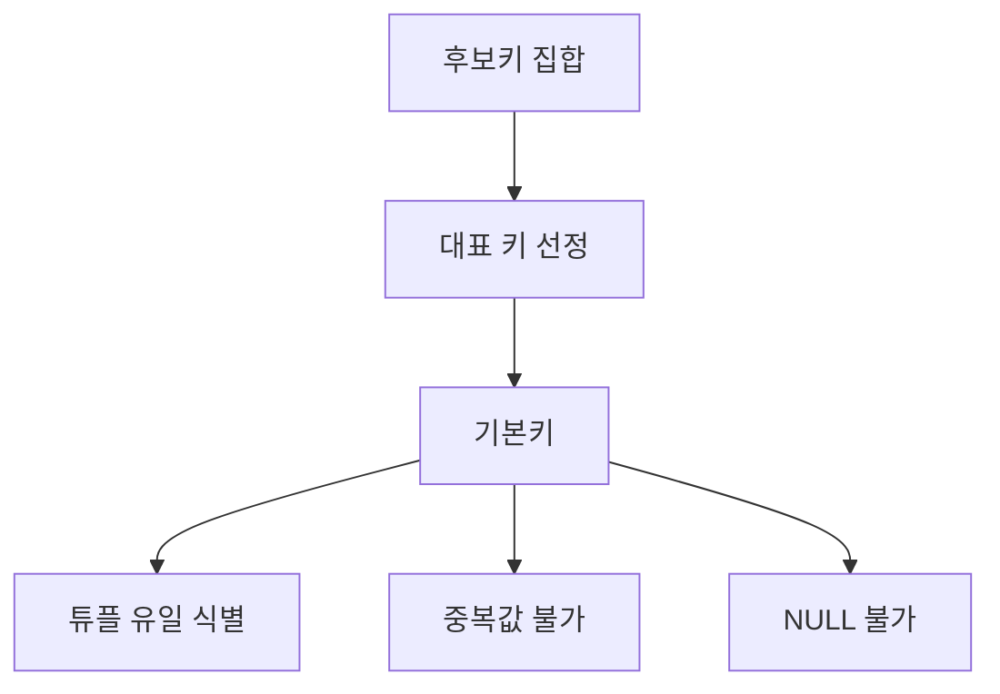

# 111 기본키(Primary Key)

작성 기준일: 2026-06-01
검색/보강일: 2026-06-01
PDF 확인 위치: 17페이지, 3과목 데이터베이스 구축, 111 기본키(Primary Key)

## 한 줄 요약

- 기본키는 후보키 중 대표로 선정된 주키이며, 릴레이션의 각 튜플을 유일하게 식별하고 중복값과 NULL 값을 가질 수 없다.

## 한눈에 보는 구조

| 구분 | 내용 |
|---|---|
| 출발점 | 후보키 중 하나 |
| 역할 | 릴레이션의 대표 식별자 |
| 금지 | 중복값, NULL |
| 다른 이름 | 주키(Main Key) |
| 관련 제약 | 개체 무결성 |

## PDF 기준 핵심

- 기본키는 후보키 중에서 특별히 선정된 주키(Main Key)이다.
- 기본키는 중복된 값을 가질 수 없다.
- 기본키는 NULL 값을 가질 수 없다.

## 개념 설명

### 기본키의 의미

- 후보키가 여러 개 있을 때 데이터베이스 설계자가 대표 식별자로 선택한 키가 기본키이다.
- PostgreSQL 공식 문서는 기본키 제약이 행을 고유하게 식별할 수 있음을 나타내며, 값이 unique이면서 not null이어야 한다고 설명한다.
- Oracle도 기본키 제약을 각 행을 유일하게 식별하는 컬럼 또는 컬럼 집합으로 설명한다.

### 왜 NULL이 안 되는가

- 기본키는 각 튜플을 반드시 식별해야 한다.
- NULL은 값이 없거나 알 수 없다는 의미이므로, 기본키 값으로 쓰면 식별자가 비게 된다.
- 그래서 기본키는 개체 무결성과 직접 연결된다.

### 왜 중복이 안 되는가

- 기본키 값이 중복되면 두 튜플을 구분할 수 없다.
- 예를 들어 학생 릴레이션에서 학번이 기본키인데 같은 학번이 두 번 나오면 어느 학생인지 식별할 수 없다.

## 시험 포인트

- 기본키는 후보키 중 선택된 키이다.
- 기본키는 중복값을 가질 수 없다.
- 기본키는 NULL 값을 가질 수 없다.
- 기본키는 개체 무결성과 연결된다.
- 외래키는 다른 릴레이션의 기본키를 참조한다.

## 헷갈리는 비교

| 키 | 핵심 | 중복 | NULL |
|---|---|---|---|
| 후보키 | 기본키 후보 | 불가 | 보통 식별자이므로 불가로 이해 |
| 기본키 | 대표로 선정된 후보키 | 불가 | 불가 |
| 외래키 | 다른 릴레이션 기본키 참조 | 가능할 수 있음 | 가능할 수 있음 |

## 예시 또는 암기 포인트

- 학생(학번, 주민번호, 이름)에서 `학번`과 `주민번호`가 모두 후보키라면, 그중 `학번`을 기본키로 선택할 수 있다.
- 암기 문장: 기본키 = `후보키 중 대표 + 중복 금지 + NULL 금지`

## 빠른 복습

- 기본키는 후보키 중 선정된 주키이다.
- 중복값을 가질 수 없다.
- NULL 값을 가질 수 없다.
- 개체 무결성의 핵심이다.
- 다른 테이블의 외래키가 참조하는 기준이 될 수 있다.

## 참고 링크

- [PostgreSQL Documentation - Constraints](https://www.postgresql.org/docs/17/ddl-constraints.html)
- [Oracle - Identifying Constraints](https://download.oracle.com/oll/tutorials/DBXETutorial/html/module3/les03_mancon02_tellme.htm)

