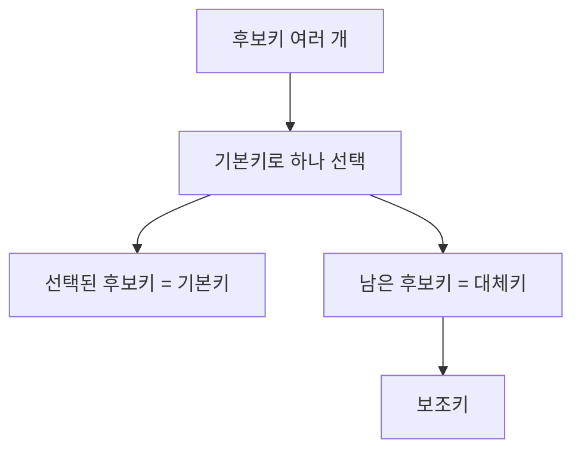

# 112 대체키(Alternate Key)

작성 기준일: 2026-06-01
검색/보강일: 2026-06-01
PDF 확인 위치: 17페이지, 3과목 데이터베이스 구축, 112 대체키(Alternate Key)

## 한 줄 요약

- 대체키는 후보키가 둘 이상일 때 기본키로 선택되지 않은 나머지 후보키이며, 보조키라고도 한다.

## 한눈에 보는 구조

| 구분 | 내용 |
|---|---|
| 발생 조건 | 후보키가 둘 이상 |
| 의미 | 기본키를 제외한 나머지 후보키 |
| 다른 이름 | 보조키 |
| 성질 | 후보키이므로 유일성과 최소성 만족 |
| 예 | 학번을 기본키로 선택했을 때 주민번호 |

## PDF 기준 핵심

- 후보키가 둘 이상일 때 기본키를 제외한 나머지 후보키를 의미한다.
- 보조키라고도 한다.

## 개념 설명

### 대체키의 의미

- 대체키는 기본키가 되지 못한 후보키이다.
- 중요한 점은 대체키도 후보키이므로 유일성과 최소성을 만족한다는 것이다.
- Microsoft의 데이터 모델 관계 설명은 alternate key 또는 candidate key를 primary key가 아닌 unique한 column으로 설명한다.

### 예시

- 학생 릴레이션:
  - 후보키: 학번, 주민번호, 이메일
  - 기본키로 선택: 학번
  - 대체키: 주민번호, 이메일
- 대체키는 기본키를 대체할 수 있는 식별 능력이 있지만, 대표 키로 선정되지 않았을 뿐이다.

## 시험 포인트

- 대체키는 후보키 중 기본키가 아닌 것이다.
- 후보키가 하나뿐이면 대체키는 없다.
- 대체키는 보조키라고도 한다.
- 대체키는 유일성과 최소성을 만족한다.
- 슈퍼키처럼 최소성이 없는 키가 아니다.

## 헷갈리는 비교

| 비교 | 기본키 | 대체키 |
|---|---|---|
| 후보키 여부 | 후보키 중 하나 | 후보키 중 하나 |
| 선정 여부 | 대표로 선정됨 | 대표로 선정되지 않음 |
| 다른 이름 | 주키 | 보조키 |
| 역할 | 주요 식별 기준 | 대체 가능한 식별 기준 |

## 예시 또는 암기 포인트

- `후보키 - 기본키 = 대체키`
- `대체`라는 말 때문에 기능이 약한 키로 오해하면 안 된다.
- 기본키로 선택되지 않았을 뿐 후보키의 조건은 그대로 만족한다.

## 빠른 복습

- 대체키는 기본키가 아닌 후보키이다.
- 후보키가 둘 이상일 때만 생긴다.
- 보조키라고도 한다.
- 유일성과 최소성을 만족한다.
- 기본키와 대체키는 모두 후보키 집합 안에 있다.

## 참고 링크

- [Microsoft Support - Relationships between tables in a Data Model](https://support.microsoft.com/en-au/office/relationships-between-tables-in-a-data-model-533dc2b6-9288-4363-9538-8ea6e469112b)
- [IBM - What Is Database Normalization?](https://www.ibm.com/think/topics/database-normalization)

