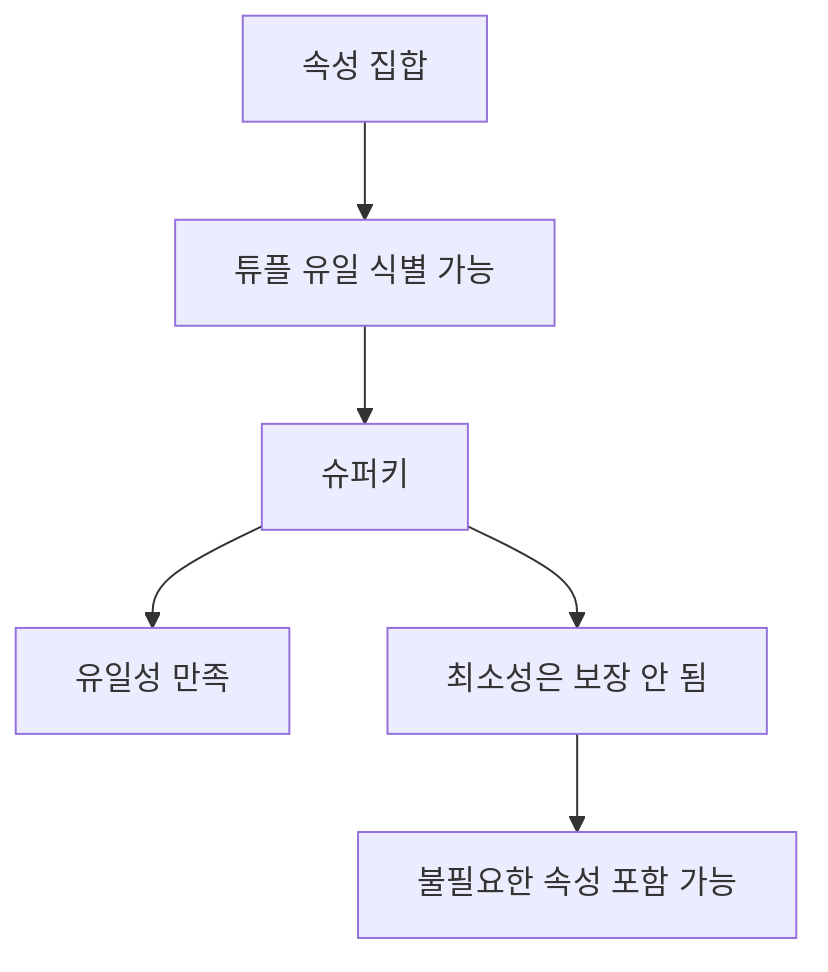

# 113 슈퍼키(Super Key)

작성 기준일: 2026-06-01
검색/보강일: 2026-06-01
PDF 확인 위치: 17페이지, 3과목 데이터베이스 구축, 113 슈퍼키(Super Key)

## 한 줄 요약

- 슈퍼키는 튜플을 유일하게 식별할 수 있는 속성 집합이지만, 불필요한 속성이 포함될 수 있어 최소성은 만족하지 못할 수 있다.

## 한눈에 보는 구조

| 구분 | 슈퍼키 |
|---|---|
| 구성 | 릴레이션 내 속성들의 집합 |
| 유일성 | 만족 |
| 최소성 | 만족하지 못할 수 있음 |
| 후보키와 관계 | 후보키는 최소성을 만족하는 슈퍼키 |
| 예 | 학번, 학번+이름, 학번+학과 |

## PDF 기준 핵심

- 슈퍼키는 한 릴레이션 내에 있는 속성들의 집합으로 구성된 키이다.
- 릴레이션을 구성하는 모든 튜플에 대해 유일성은 만족시킨다.
- 최소성은 만족시키지 못한다.

## 개념 설명

### 슈퍼키의 의미

- 슈퍼키는 튜플을 구분할 수 있는 속성 집합 전체를 넓게 부르는 말이다.
- 최소성 조건이 없으므로 불필요한 속성이 붙어도 슈퍼키가 될 수 있다.
- IBM의 정규화 설명처럼 관계형 데이터베이스에서 키는 행을 식별하는 컬럼 또는 컬럼 집합이라는 점이 기본 출발점이다.

### 예시

- 학생 릴레이션에서 `학번`만으로 학생을 유일하게 식별할 수 있다.
- 그러면 다음은 모두 유일성을 만족한다.
  - 학번
  - 학번 + 이름
  - 학번 + 학과
  - 학번 + 이름 + 학과
- 하지만 `학번 + 이름`은 이름이 없어도 학번만으로 식별 가능하므로 최소성이 없다.

## 시험 포인트

- 슈퍼키는 유일성을 만족한다.
- 슈퍼키는 최소성을 만족하지 못할 수 있다.
- 후보키는 유일성과 최소성을 모두 만족한다.
- 기본키는 후보키 중 선정된 키이다.
- `유일성만 만족`이라는 문장이 나오면 슈퍼키를 떠올린다.

## 헷갈리는 비교

| 키 | 유일성 | 최소성 | 핵심 |
|---|---|---|---|
| 슈퍼키 | 만족 | 불필요한 속성 포함 가능 | 넓은 식별자 집합 |
| 후보키 | 만족 | 만족 | 최소 슈퍼키 |
| 기본키 | 만족 | 만족 | 선택된 후보키 |
| 대체키 | 만족 | 만족 | 선택되지 않은 후보키 |

## 예시 또는 암기 포인트

- `후보키 ⊂ 슈퍼키`로 기억한다.
- 모든 후보키는 슈퍼키이지만, 모든 슈퍼키가 후보키는 아니다.
- 암기 문장: 슈퍼키 = `유일성 OK, 최소성은 글쎄`

## 빠른 복습

- 슈퍼키는 속성들의 집합으로 구성된다.
- 모든 튜플을 유일하게 식별한다.
- 최소성은 만족하지 못할 수 있다.
- 최소성을 만족하는 슈퍼키가 후보키이다.
- 기본키와 대체키는 후보키에서 갈라진다.

## 참고 링크

- [IBM - What Is Database Normalization?](https://www.ibm.com/think/topics/database-normalization)
- [PostgreSQL Documentation - Constraints](https://www.postgresql.org/docs/17/ddl-constraints.html)

