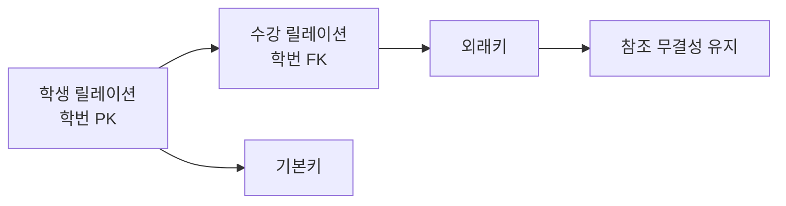

# 114 외래키(Foreign Key)

작성 기준일: 2026-06-01
검색/보강일: 2026-06-01
PDF 확인 위치: 17페이지, 3과목 데이터베이스 구축, 114 외래키(Foreign Key)

## 한 줄 요약

- 외래키는 한 릴레이션의 속성 또는 속성 집합이 다른 릴레이션의 기본키를 참조해 릴레이션 사이의 관계와 참조 무결성을 유지하는 키이다.

## 한눈에 보는 구조

| 구분 | 내용 |
|---|---|
| 정의 | 다른 릴레이션의 기본키를 참조하는 속성 또는 속성 집합 |
| 위치 | 참조하는 쪽 릴레이션 |
| 참조 대상 | 참조 릴레이션의 기본키 |
| 도메인 조건 | 참조하는 기본키와 동일한 도메인 |
| 관련 무결성 | 참조 무결성 |

## PDF 기준 핵심

- 외래키는 다른 릴레이션의 기본키를 참조하는 속성 또는 속성들의 집합을 의미한다.
- 한 릴레이션에 속한 속성 A와 참조 릴레이션의 기본키인 B가 동일한 도메인 상에서 정의되었을 때 속성 A를 외래키라고 한다.

## 개념 설명

### 외래키의 의미

- 외래키는 릴레이션 사이의 연결 고리이다.
- PostgreSQL 공식 문서는 외래키가 기본키 또는 unique 제약이 있는 컬럼을 참조해야 한다고 설명한다.
- IBM은 참조 무결성을 외래키가 기본키에 갖는 논리적 의존성으로 설명한다.

### 예시

- 학생(학번, 이름)
- 수강(학번, 과목코드, 성적)
- 수강 릴레이션의 `학번`은 학생 릴레이션의 `학번`을 참조한다.
- 이때 수강.학번은 외래키이다.

### 도메인이 같아야 하는 이유

- 참조하는 값과 참조되는 값이 같은 종류여야 비교가 가능하다.
- 학생.학번이 문자열 형식인데 수강.학번이 전혀 다른 형식이면 관계가 깨진다.

## 시험 포인트

- 외래키는 다른 릴레이션의 기본키를 참조한다.
- 외래키와 참조되는 기본키는 동일한 도메인에서 정의되어야 한다.
- 외래키는 참조 무결성과 연결된다.
- 기본키는 NULL 불가이지만, 외래키는 규칙에 따라 NULL이 허용될 수 있다.
- 외래키는 릴레이션 간 관계를 표현하는 핵심 장치이다.

## 헷갈리는 비교

| 비교 | 기본키 | 외래키 |
|---|---|---|
| 위치 | 자기 릴레이션의 대표 식별자 | 다른 릴레이션 키를 참조하는 속성 |
| 중복 | 불가 | 가능할 수 있음 |
| NULL | 불가 | 가능할 수 있음 |
| 무결성 | 개체 무결성 | 참조 무결성 |

## 예시 또는 암기 포인트

- 외래키 = `남의 기본키를 내 테이블에서 참조`
- `학생`의 학번은 기본키이고, `수강`의 학번은 외래키가 될 수 있다.
- 문제에서 `동일한 도메인`, `참조 릴레이션의 기본키`가 나오면 외래키를 떠올린다.

## 빠른 복습

- 외래키는 다른 릴레이션의 기본키를 참조한다.
- 속성 하나 또는 속성 집합일 수 있다.
- 참조되는 기본키와 같은 도메인을 가져야 한다.
- 참조 무결성과 연결된다.
- 릴레이션 사이의 관계를 표현한다.

## 참고 링크

- [PostgreSQL Documentation - Constraints](https://www.postgresql.org/docs/17/ddl-constraints.html)
- [IBM Informix - Referential integrity](https://www.ibm.com/docs/en/informix-servers/15.0.0?topic=integrity-referential)

<!-- study-links:start -->
## 관련 문서

- `기본키`: [[정보처리기사/3과목 데이터베이스 구축/111 기본키(Primary Key)/111 기본키(Primary Key)|111 기본키(Primary Key)]]
- `무결성`: [[정보처리기사/3과목 데이터베이스 구축/115 무결성/115 무결성|115 무결성]]
<!-- study-links:end -->
