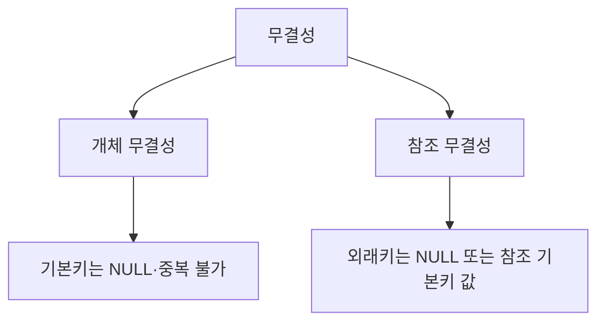

# 115 무결성

작성 기준일: 2026-06-01
검색/보강일: 2026-06-01
PDF 확인 위치: 17페이지, 3과목 데이터베이스 구축, 115 무결성

## 한 줄 요약

- 무결성은 데이터가 정확하고 일관된 상태를 유지하도록 하는 규칙이며, PDF 핵심은 기본키를 지키는 개체 무결성과 외래키 참조를 지키는 참조 무결성이다.

## 한눈에 보는 구조

| 종류 | 기준 키 | 핵심 규칙 |
|---|---|---|
| 개체 무결성 | 기본키 | 기본키는 NULL 값이나 중복값을 가질 수 없음 |
| 참조 무결성 | 외래키 | 외래키는 NULL이거나 참조 기본키 값과 같아야 함 |

## PDF 기준 핵심

- `개체 무결성`
  - 기본 테이블의 기본키를 구성하는 어떤 속성도 NULL 값이나 중복값을 가질 수 없다는 규정이다.
- `참조 무결성`
  - 외래키 값은 NULL이거나 참조 릴레이션의 기본키 값과 동일해야 한다.
  - 릴레이션은 참조할 수 없는 외래키 값을 가질 수 없다는 규정이다.

## 개념 설명

### 개체 무결성

- 한 릴레이션 안의 각 튜플이 명확하게 식별되어야 한다는 규칙이다.
- 기본키가 NULL이면 식별할 수 없고, 중복이면 둘을 구분할 수 없다.
- PostgreSQL 공식 문서도 기본키 값은 unique이면서 not null이어야 한다고 설명한다.

### 참조 무결성

- 릴레이션 사이의 참조 관계가 깨지지 않아야 한다는 규칙이다.
- IBM Db2 문서는 참조 무결성이 외래키 값이 부모 테이블의 기본키 값과 일치하도록 보장한다고 설명한다.
- 예:
  - 수강 테이블에 학번 `2026001`이 있다면 학생 테이블에도 `2026001` 학생이 있어야 한다.
  - 참조할 학생이 없는데 수강 데이터만 있으면 참조 무결성 위반이다.

## 시험 포인트

- 기본키와 연결되면 개체 무결성이다.
- 외래키와 연결되면 참조 무결성이다.
- 개체 무결성은 NULL과 중복을 모두 금지한다.
- 참조 무결성은 외래키가 NULL이거나 참조 기본키 값과 같아야 한다.
- `참조할 수 없는 외래키 값`이라는 표현은 참조 무결성 위반이다.

## 헷갈리는 비교

| 비교 | 개체 무결성 | 참조 무결성 |
|---|---|---|
| 대상 | 한 릴레이션 내부 식별 | 릴레이션 간 참조 관계 |
| 중심 키 | 기본키 | 외래키 |
| 위반 예 | 기본키 NULL, 기본키 중복 | 부모 키 없는 외래키 |
| 핵심 질문 | 이 튜플을 식별할 수 있는가 | 참조 대상이 존재하는가 |

## 예시 또는 암기 포인트

- 개체 무결성 위반:
  - 학생 테이블에서 학번이 NULL
  - 학생 테이블에서 같은 학번이 두 번 등장
- 참조 무결성 위반:
  - 수강 테이블에 존재하지 않는 학생 학번이 들어감
- 암기 문장: `개체는 기본키, 참조는 외래키`

## 빠른 복습

- 무결성은 데이터의 정확성과 일관성을 지키는 규칙이다.
- 개체 무결성은 기본키가 NULL이나 중복이 되면 안 된다는 규칙이다.
- 참조 무결성은 외래키가 NULL이거나 참조 기본키 값과 같아야 한다는 규칙이다.
- 기본키 문제는 개체 무결성으로, 외래키 문제는 참조 무결성으로 연결한다.

## 참고 링크

- [PostgreSQL Documentation - Constraints](https://www.postgresql.org/docs/17/ddl-constraints.html)
- [IBM Db2 - Referential constraints](https://www.ibm.com/docs/en/db2-for-zos/12.0.0?topic=constraints-referential)

<!-- study-links:start -->
## 관련 문서

- `기본키`: [[정보처리기사/3과목 데이터베이스 구축/111 기본키(Primary Key)/111 기본키(Primary Key)|111 기본키(Primary Key)]]
- `외래키`: [[정보처리기사/3과목 데이터베이스 구축/114 외래키(Foreign Key)/114 외래키(Foreign Key)|114 외래키(Foreign Key)]]
- `튜플`: [[정보처리기사/3과목 데이터베이스 구축/106 튜플(Tuple)/106 튜플(Tuple)|106 튜플(Tuple)]]
<!-- study-links:end -->
