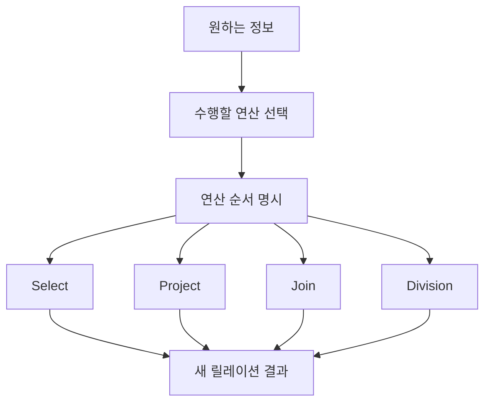

# 116 관계대수

작성 기준일: 2026-06-01
검색/보강일: 2026-06-01
PDF 확인 위치: 17페이지, 3과목 데이터베이스 구축, 116 관계대수

## 한 줄 요약

- 관계대수는 원하는 정보를 얻기 위해 어떤 연산을 어떤 순서로 수행할지 명시하는 관계형 데이터베이스의 절차적 질의 언어이다.

## 한눈에 보는 구조

| 구분 | 내용 |
|---|---|
| 성격 | 절차적 언어 |
| 대상 | 관계형 데이터베이스 |
| 핵심 | 원하는 정보를 얻는 방법과 연산 순서를 명시 |
| 입력 | 릴레이션 |
| 출력 | 새로운 릴레이션 |

## PDF 기준 핵심

- 관계형 데이터베이스에서 원하는 정보와 그 정보를 검색하기 위해서 어떻게 유도하는가를 기술하는 절차적인 언어이다.
- 질의에 대한 해를 구하기 위해 수행해야 할 연산의 순서를 명시한다.

## 개념 설명

### 관계대수의 의미

- 관계대수는 릴레이션을 입력으로 받아 연산을 수행하고, 결과로 또 다른 릴레이션을 만든다.
- UMBC 데이터베이스 강의 자료도 관계대수 연산으로 select, project, join, division 등을 설명한다.
- 시험에서는 관계해석과 대비해 `절차적`이라는 성격이 가장 중요하다.

### 절차적이라는 뜻

- 절차적 언어는 `무엇을 얻을지`뿐 아니라 `어떻게 얻을지`를 표현한다.
- 예:
  - 먼저 조건에 맞는 튜플을 고른다.
  - 그다음 필요한 속성만 뽑는다.
  - 필요하면 다른 릴레이션과 조인한다.

### 주요 연산

- 순수 관계 연산자:
  - Select
  - Project
  - Join
  - Division
- 일반 집합 연산자:
  - 합집합
  - 교집합
  - 차집합
  - 교차곱

## 시험 포인트

- 관계대수는 절차적 언어이다.
- 연산의 순서를 명시한다.
- 관계해석은 비절차적 성격으로 대비된다.
- 관계대수 연산의 결과는 릴레이션이다.
- Select는 튜플, Project는 속성, Join은 결합, Division은 모두 포함 조건과 연결한다.

## 헷갈리는 비교

| 비교 | 관계대수 | 관계해석 |
|---|---|---|
| 성격 | 절차적 | 비절차적 |
| 초점 | 어떻게 유도할지 | 무엇을 원하는지 |
| 표현 | 연산 순서 명시 | 술어 해석 기반 조건 표현 |
| 시험 단서 | 수행해야 할 연산의 순서 | Predicate Calculus |

## 예시 또는 암기 포인트

- SQL에서 `WHERE` 조건으로 행을 거르는 것은 관계대수의 Select와 연결된다.
- SQL에서 특정 열만 조회하는 것은 Project와 연결된다.
- 두 테이블을 연결하는 것은 Join과 연결된다.
- 암기 문장: 관계대수 = `관계를 대수 연산으로 절차적으로 계산`

## 빠른 복습

- 관계대수는 관계형 데이터베이스의 절차적 질의 언어이다.
- 원하는 정보를 얻기 위한 연산 순서를 명시한다.
- 입력과 출력은 릴레이션이다.
- 관계해석과 비교해서 외운다.
- Select, Project, Join, Division은 순수 관계 연산자이다.

## 참고 링크

- [UMBC - Relational Algebra](https://courses.cs.umbc.edu/461/current/burt/lectures/lec09/relationalAlgebra.shtml)
- [PostgreSQL Documentation - Queries Overview](https://www.postgresql.org/docs/17/queries.html)

<!-- study-links:start -->
## 관련 문서

- `순수 관계 연산자`: [[정보처리기사/3과목 데이터베이스 구축/117 순수 관계 연산자 - Select/117 순수 관계 연산자 - Select|117 순수 관계 연산자 - Select]]
- `일반 집합 연산자`: [[정보처리기사/3과목 데이터베이스 구축/121 일반 집합 연산자 - 교차곱(CARTESIAN PRODUCT)/121 일반 집합 연산자 - 교차곱(CARTESIAN PRODUCT)|121 일반 집합 연산자 - 교차곱(CARTESIAN PRODUCT)]]
- `division`: [[정보처리기사/3과목 데이터베이스 구축/120 순수 관계 연산자 - Division/120 순수 관계 연산자 - Division|120 순수 관계 연산자 - Division]]
- `join`: [[정보처리기사/3과목 데이터베이스 구축/119 순수 관계 연산자 - Join/119 순수 관계 연산자 - Join|119 순수 관계 연산자 - Join]]
- `관계해석`: [[정보처리기사/3과목 데이터베이스 구축/122 관계해석/122 관계해석|122 관계해석]]
- `sql`: [[sql-query/sql-query|반드시 알아둬야 할 SQL 쿼리 정리]]
- `튜플`: [[정보처리기사/3과목 데이터베이스 구축/106 튜플(Tuple)/106 튜플(Tuple)|106 튜플(Tuple)]]
<!-- study-links:end -->
