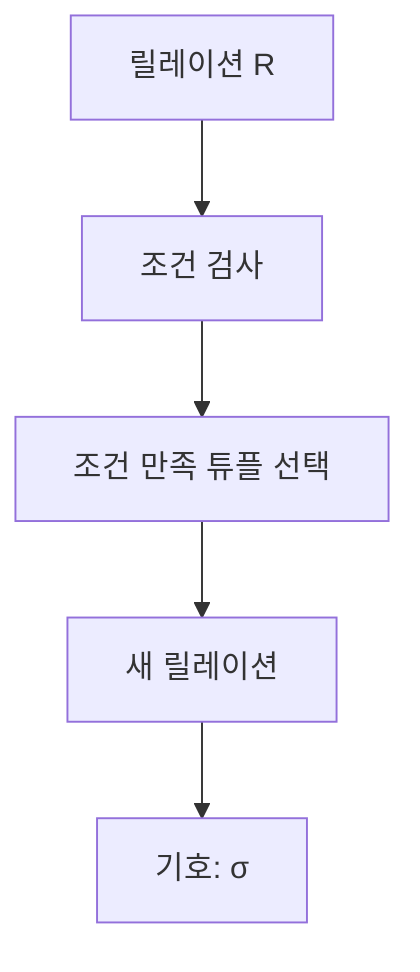

# 117 순수 관계 연산자 - Select

작성 기준일: 2026-06-01
검색/보강일: 2026-06-01
PDF 확인 위치: 17페이지, 3과목 데이터베이스 구축, 117 순수 관계 연산자 - Select

## 한 줄 요약

- Select는 릴레이션에서 조건을 만족하는 튜플, 즉 행의 부분집합을 추출하는 순수 관계 연산자이며 기호는 σ이다.

## 한눈에 보는 구조

| 구분 | 내용 |
|---|---|
| 연산 대상 | 튜플, 행 |
| 결과 | 조건을 만족하는 튜플의 부분집합 |
| 기호 | σ, 시그마 |
| SQL 대응 | WHERE 조건으로 행 필터링 |
| 방향 | 수평적 분할 |

## PDF 기준 핵심

- Select는 릴레이션에 존재하는 튜플 중에서 선택 조건을 만족하는 튜플의 부분집합을 구하여 새로운 릴레이션을 만드는 연산이다.
- 기호는 시그마(σ)이다.

## 개념 설명

### Select의 의미

- 관계대수의 Select는 SQL의 `SELECT` 절 이름과 다르게 이해해야 한다.
- 관계대수 Select는 행을 고르는 연산이다.
- UMBC 자료도 select를 관계대수 연산 중 하나로 설명하며, 조건에 맞는 튜플을 선택하는 흐름으로 다룬다.

### 수평적 분할

- 테이블을 가로 방향으로 잘라 조건에 맞는 행만 남긴다고 생각하면 된다.
- 속성 목록은 그대로 유지되고, 튜플 수가 줄어든다.

### 예시

- 학생 릴레이션에서 `학과 = '컴퓨터공학'`인 학생만 추출한다.
- 결과는 학생 릴레이션과 같은 속성을 가지지만, 조건을 만족한 튜플만 포함한다.

## 시험 포인트

- Select는 튜플을 선택한다.
- 기호는 σ이다.
- 조건을 만족하는 행의 부분집합을 만든다.
- Project는 속성을 추출하므로 Select와 구분한다.
- SQL `SELECT` 문 전체와 관계대수 Select를 그대로 동일시하면 안 된다.

## 헷갈리는 비교

| 비교 | Select | Project |
|---|---|---|
| 대상 | 튜플, 행 | 속성, 열 |
| 기호 | σ | π |
| 방향 | 수평적 분할 | 수직적 분할 |
| 예 | 컴퓨터공학과 학생만 | 학번과 이름만 |

## 예시 또는 암기 포인트

- `σ 학과='컴퓨터공학'(학생)`은 컴퓨터공학과 학생 튜플을 고르는 연산으로 이해한다.
- 암기 문장: `시그마는 조건으로 행을 고른다.`

## 빠른 복습

- Select는 순수 관계 연산자이다.
- 조건을 만족하는 튜플의 부분집합을 만든다.
- 기호는 σ이다.
- 행을 고르는 연산이다.
- Project와 가장 자주 헷갈린다.

## 참고 링크

- [UMBC - Relational Algebra](https://courses.cs.umbc.edu/461/current/burt/lectures/lec09/relationalAlgebra.shtml)

<!-- study-links:start -->
## 관련 문서

- `순수 관계 연산자`: [[정보처리기사/3과목 데이터베이스 구축/118 순수 관계 연산자 - Project/118 순수 관계 연산자 - Project|118 순수 관계 연산자 - Project]]
- `관계대수`: [[정보처리기사/3과목 데이터베이스 구축/116 관계대수/116 관계대수|116 관계대수]]
- `sql`: [[sql-query/sql-query|반드시 알아둬야 할 SQL 쿼리 정리]]
- `튜플`: [[정보처리기사/3과목 데이터베이스 구축/106 튜플(Tuple)/106 튜플(Tuple)|106 튜플(Tuple)]]
<!-- study-links:end -->
