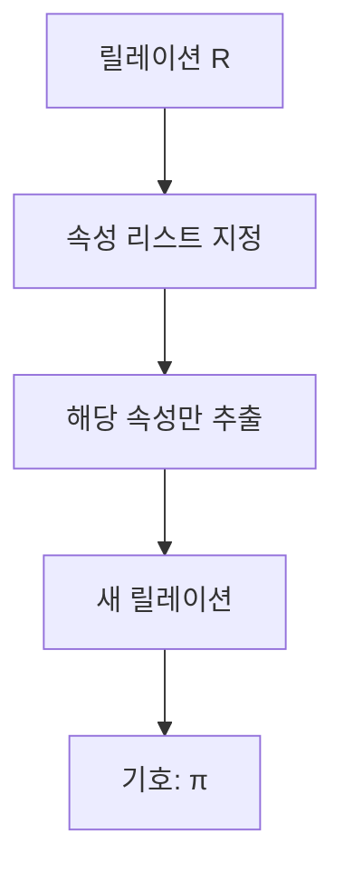

# 118 순수 관계 연산자 - Project

작성 기준일: 2026-06-01
검색/보강일: 2026-06-01
PDF 확인 위치: 17페이지, 3과목 데이터베이스 구축, 118 순수 관계 연산자 - Project

## 한 줄 요약

- Project는 릴레이션에서 지정한 속성 값만 추출해 새로운 릴레이션을 만드는 순수 관계 연산자이며 기호는 π이다.

## 한눈에 보는 구조

| 구분 | 내용 |
|---|---|
| 연산 대상 | 속성, 열 |
| 결과 | 지정한 속성 값만 가진 릴레이션 |
| 기호 | π, 파이 |
| SQL 대응 | SELECT 절의 컬럼 목록 |
| 방향 | 수직적 분할 |

## PDF 기준 핵심

- Project는 주어진 릴레이션에서 속성 리스트에 제시된 속성 값만을 추출하여 새로운 릴레이션을 만드는 연산이다.
- 기호는 파이(π)이다.

## 개념 설명

### Project의 의미

- Project는 행 조건이 아니라 열 선택이다.
- 필요한 속성만 남겨 결과 릴레이션을 만든다.
- Select와 달리 조건식보다 속성 목록이 핵심이다.

### 수직적 분할

- 테이블을 세로 방향으로 잘라 필요한 열만 남기는 것으로 이해한다.
- 튜플 수는 그대로일 수 있지만, 중복 튜플이 생기면 관계 모델의 집합 성격에 따라 중복 제거가 논리적으로 고려될 수 있다.

### 예시

- 학생 릴레이션에서 `학번`, `이름` 속성만 추출한다.
- 결과 릴레이션은 학생의 모든 속성이 아니라 학번과 이름만 가진다.

## 시험 포인트

- Project는 속성을 추출한다.
- 기호는 π이다.
- Select는 튜플을 고르는 연산이고, Project는 속성을 고르는 연산이다.
- SQL의 컬럼 선택과 연결해 기억하면 쉽다.
- PDF 표현인 `속성 리스트에 제시된 속성 값만 추출`을 기억한다.

## 헷갈리는 비교

| 비교 | Select | Project |
|---|---|---|
| 대상 | 튜플 | 속성 |
| 기호 | σ | π |
| 결과 변화 | 행 수 감소 | 열 수 감소 |
| 시험 단서 | 선택 조건 | 속성 리스트 |

## 예시 또는 암기 포인트

- `π 학번, 이름(학생)`은 학생 릴레이션에서 학번과 이름만 가져온다.
- 암기 문장: `파이는 필요한 필드만 뽑는다.`

## 빠른 복습

- Project는 순수 관계 연산자이다.
- 속성 리스트에 있는 속성 값만 추출한다.
- 기호는 π이다.
- 열을 고르는 연산이다.
- Select와 표로 비교해 외우면 실수가 줄어든다.

## 참고 링크

- [UMBC - Relational Algebra](https://courses.cs.umbc.edu/461/current/burt/lectures/lec09/relationalAlgebra.shtml)

