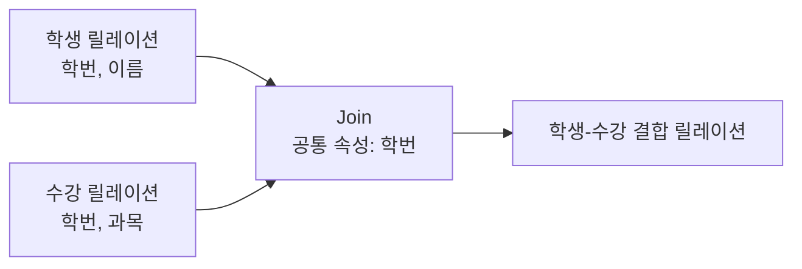

# 119 순수 관계 연산자 - Join

작성 기준일: 2026-06-01
검색/보강일: 2026-06-01
PDF 확인 위치: 17페이지, 3과목 데이터베이스 구축, 119 순수 관계 연산자 - Join

## 한 줄 요약

- Join은 공통 속성을 중심으로 두 릴레이션을 결합해 하나의 새로운 릴레이션을 만드는 순수 관계 연산자이다.

## 한눈에 보는 구조

| 구분 | 내용 |
|---|---|
| 연산 대상 | 두 릴레이션 |
| 기준 | 공통 속성 |
| 결과 | 두 릴레이션을 결합한 새 릴레이션 |
| 대표 기호 | ⋈ |
| SQL 대응 | JOIN |

## PDF 기준 핵심

- Join은 공통 속성을 중심으로 두 개의 릴레이션을 하나로 합쳐서 새로운 릴레이션을 만드는 연산이다.
- PDF의 기호 부분은 추출 텍스트에서 깨져 보이지만, 일반적으로 Join은 ⋈ 기호로 표현한다.

## 개념 설명

### Join의 의미

- Join은 서로 다른 릴레이션에 나뉜 정보를 관계 기준으로 합치는 연산이다.
- UMBC 자료는 natural join이 두 입력 릴레이션의 스키마를 결합하고 중복 속성명을 정리해 결과를 만든다고 설명한다.
- 시험에서는 상세 조인 종류보다 `공통 속성 중심 결합`이 핵심이다.

### 예시

- 학생(학번, 이름)
- 수강(학번, 과목코드)
- 두 릴레이션은 `학번`을 공통 속성으로 가진다.
- Join 결과는 학번을 기준으로 학생 이름과 수강 과목 정보를 함께 볼 수 있게 한다.

## 시험 포인트

- Join은 두 릴레이션을 합친다.
- 공통 속성이 기준이다.
- 결과는 새로운 릴레이션이다.
- Select는 행 선택, Project는 열 선택, Join은 릴레이션 결합이다.
- 외래키와 기본키 관계를 떠올리면 Join이 이해하기 쉽다.

## 헷갈리는 비교

| 연산 | 대상 | 핵심 |
|---|---|---|
| Select | 한 릴레이션의 튜플 | 조건 만족 행 |
| Project | 한 릴레이션의 속성 | 지정 열 |
| Join | 두 릴레이션 | 공통 속성 기준 결합 |
| Cartesian Product | 두 릴레이션 | 가능한 모든 튜플 쌍 |

## 예시 또는 암기 포인트

- Join = `공통 속성으로 붙이기`
- 학생과 수강을 학번으로 Join하면 학생별 수강 정보를 얻을 수 있다.
- Join은 단순히 옆으로 붙이는 것이 아니라 공통 속성의 값이 맞는 튜플을 연결하는 연산으로 이해한다.

## 빠른 복습

- Join은 순수 관계 연산자이다.
- 두 릴레이션을 공통 속성 중심으로 합친다.
- 결과는 새로운 릴레이션이다.
- 일반 기호는 ⋈이다.
- Cartesian Product와 혼동하지 않는다.

## 참고 링크

- [UMBC - Relational Algebra](https://courses.cs.umbc.edu/461/current/burt/lectures/lec09/relationalAlgebra.shtml)

