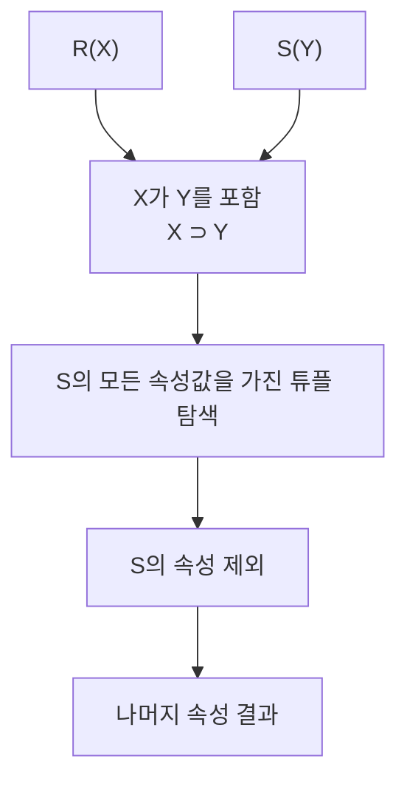

# 120 순수 관계 연산자 - Division

작성 기준일: 2026-06-01
검색/보강일: 2026-06-01
PDF 확인 위치: 18페이지, 3과목 데이터베이스 구축, 120 순수 관계 연산자 - Division

## 한 줄 요약

- Division은 한 릴레이션의 속성이 다른 릴레이션의 속성값을 모두 포함하는 튜플을 찾고, 나누는 쪽 속성을 제외한 속성만 결과로 구하는 순수 관계 연산자이다.

## 한눈에 보는 구조

| 구분 | 내용 |
|---|---|
| 입력 | R(X), S(Y) |
| 조건 | X가 Y를 포함, 즉 X ⊃ Y |
| 핵심 의미 | S가 가진 속성값을 모두 가진 R의 튜플을 찾음 |
| 결과 | S가 가진 속성을 제외한 속성 |
| 기호 | ÷ |

## PDF 기준 핵심

- Division은 X⊃Y인 두 개의 릴레이션 R(X)와 S(Y)가 있을 때 사용하는 연산이다.
- R의 속성이 S의 속성값을 모두 가진 튜플에서 S가 가진 속성을 제외한 속성만을 구한다.
- 기호는 ÷이다.

## 개념 설명

### Division의 의미

- Division은 `모든`, `전부`, `전체 조건을 만족`하는 대상을 찾을 때 이해하기 쉽다.
- 예를 들어 모든 필수 과목을 수강한 학생을 찾는 질의가 Division의 전형적인 예이다.
- UMBC 자료도 division 결과가 S와 공통된 속성을 버린 스키마의 릴레이션이라고 설명한다.

### 예시

- R(학생, 과목): 학생이 수강한 과목 목록
- S(과목): 졸업 필수 과목 목록
- R ÷ S의 결과:
  - S에 있는 모든 과목을 수강한 학생
- 결과에서는 `과목` 속성을 제외하고 `학생`만 남는다.

## 시험 포인트

- Division의 기호는 ÷이다.
- `모두 가진`, `전부 만족`, `S가 가진 속성값을 모두 포함`이 핵심 단서이다.
- 결과는 S가 가진 속성을 제외한 속성만 구한다.
- Select, Project, Join보다 덜 직관적이므로 PDF 문장을 그대로 기억하는 것이 안전하다.
- R(X), S(Y), X⊃Y 구조를 함께 외운다.

## 헷갈리는 비교

| 연산 | 핵심 단서 | 결과 |
|---|---|---|
| Join | 공통 속성으로 결합 | 두 릴레이션의 결합 결과 |
| Cartesian Product | 모든 튜플 쌍 | 조합 수가 곱으로 증가 |
| Division | 모든 조건을 만족하는 대상 | 나누는 릴레이션 속성을 제외한 결과 |

## 예시 또는 암기 포인트

- `모든 필수 과목을 들은 학생`
- `모든 프로젝트에 참여한 직원`
- `모든 부품을 공급하는 공급자`
- 이런 `모든` 질의가 보이면 Division을 의심한다.

## 빠른 복습

- Division은 순수 관계 연산자이다.
- 기호는 ÷이다.
- R(X), S(Y), X⊃Y 조건에서 설명된다.
- S의 속성값을 모두 가진 R의 튜플을 대상으로 한다.
- 결과는 S의 속성을 제외한 속성만 남긴다.

## 참고 링크

- [UMBC - Relational Algebra](https://courses.cs.umbc.edu/461/current/burt/lectures/lec09/relationalAlgebra.shtml)

