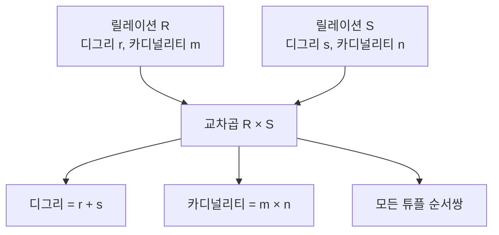

# 121 일반 집합 연산자 - 교차곱(CARTESIAN PRODUCT)

작성 기준일: 2026-06-01
검색/보강일: 2026-06-01
PDF 확인 위치: 18페이지, 3과목 데이터베이스 구축, 121 일반 집합 연산자 - 교차곱(CARTESIAN PRODUCT)

## 한 줄 요약

- 교차곱은 두 릴레이션의 모든 튜플 순서쌍을 만드는 일반 집합 연산자이며, 결과 디그리는 두 디그리의 합이고 결과 카디널리티는 두 카디널리티의 곱이다.

## 한눈에 보는 구조

| 구분 | 내용 |
|---|---|
| 연산 이름 | 교차곱, Cartesian Product, Cross Product |
| 기호 | × |
| 결과 튜플 | 두 릴레이션 튜플의 모든 순서쌍 |
| 결과 디그리 | 두 릴레이션의 디그리 합 |
| 결과 카디널리티 | 두 릴레이션의 카디널리티 곱 |

## PDF 기준 핵심

- 두 릴레이션에 있는 튜플들의 순서쌍을 구하는 연산이다.
- 교차곱의 디그리는 두 릴레이션의 디그리를 더한 것과 같다.
- 교차곱의 카디널리티는 두 릴레이션의 카디널리티를 곱한 것과 같다.

## 개념 설명

### 교차곱의 의미

- 교차곱은 한 릴레이션의 각 튜플을 다른 릴레이션의 모든 튜플과 하나씩 짝짓는다.
- OpenStax는 관계대수의 완전한 연산 집합 중 하나로 Cartesian product를 제시한다.
- UMBC 관계대수 자료도 교차곱과 조인을 구분해 설명한다.

### 계산 예

- R의 디그리: 3, 카디널리티: 4
- S의 디그리: 2, 카디널리티: 5
- R × S 결과:
  - 디그리 = 3 + 2 = 5
  - 카디널리티 = 4 × 5 = 20

### Join과의 관계

- Join은 보통 교차곱 결과에서 조건에 맞는 튜플을 선택하는 방식으로 이해할 수 있다.
- 교차곱은 조건 없이 가능한 모든 조합을 만들기 때문에 결과가 매우 커질 수 있다.

## 시험 포인트

- 교차곱은 튜플의 모든 순서쌍이다.
- 결과 디그리는 더한다.
- 결과 카디널리티는 곱한다.
- Join은 공통 속성 중심 결합이고, 교차곱은 모든 조합이다.
- 계산 문제에서 디그리와 카디널리티를 반대로 적용하지 않는다.

## 헷갈리는 비교

| 비교 | 교차곱 | Join |
|---|---|---|
| 기준 | 조건 없이 모든 조합 | 공통 속성 또는 조인 조건 |
| 카디널리티 | 두 카디널리티의 곱 | 조건에 따라 달라짐 |
| 결과 크기 | 매우 커질 수 있음 | 조건으로 줄어들 수 있음 |
| 시험 단서 | 순서쌍, Cartesian Product | 공통 속성 중심 결합 |

## 예시 또는 암기 포인트

- `디그리 = 열 수`이므로 교차곱에서는 열을 합친다.
- `카디널리티 = 행 수`이므로 모든 행 조합을 만들면 곱한다.
- 암기 문장: 교차곱 = `열은 더하고, 행은 곱한다`.

## 빠른 복습

- 교차곱은 일반 집합 연산자이다.
- 두 릴레이션의 모든 튜플 순서쌍을 구한다.
- 디그리는 합이다.
- 카디널리티는 곱이다.
- 기호는 ×이다.

## 참고 링크

- [OpenStax - Relational Database Management Systems](https://openstax.org/books/introduction-computer-science/pages/8-3-relational-database-management-systems)
- [UMBC - Relational Algebra](https://courses.cs.umbc.edu/461/current/burt/lectures/lec09/relationalAlgebra.shtml)

<!-- study-links:start -->
## 관련 문서

- `관계대수`: [[정보처리기사/3과목 데이터베이스 구축/116 관계대수/116 관계대수|116 관계대수]]
- `join`: [[정보처리기사/3과목 데이터베이스 구축/119 순수 관계 연산자 - Join/119 순수 관계 연산자 - Join|119 순수 관계 연산자 - Join]]
- `튜플`: [[정보처리기사/3과목 데이터베이스 구축/106 튜플(Tuple)/106 튜플(Tuple)|106 튜플(Tuple)]]
<!-- study-links:end -->
