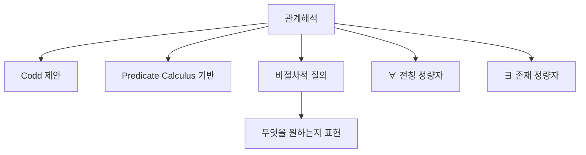

# 122 관계해석

작성 기준일: 2026-06-01
검색/보강일: 2026-06-01
PDF 확인 위치: 18페이지, 3과목 데이터베이스 구축, 122 관계해석

## 한 줄 요약

- 관계해석은 Codd가 술어 해석에 기반해 제안한 관계 데이터베이스 질의 표현 방식으로, 무엇을 원하는지 조건으로 표현하는 비절차적 언어이다.

## 한눈에 보는 구조

| 구분 | 내용 |
|---|---|
| 제안자 | Codd |
| 기반 | Predicate Calculus, 술어 해석 |
| 성격 | 비절차적 |
| 핵심 | 어떻게보다 무엇을 원하는지 표현 |
| 주요 기호 | ∀, ∃ |

## PDF 기준 핵심

- 관계해석은 관계 데이터 모델의 제안자인 코드(Codd)가 제안했다.
- 수학의 Predicate Calculus, 즉 술어 해석에 기반을 두고 관계 데이터베이스를 위해 제안했다.
- 주요 기호:
  - `∀`: 전칭 정량자, 가능한 모든 튜플에 대하여
  - `∃`: 존재 정량자, 하나라도 일치하는 튜플이 있음

## 개념 설명

### 관계해석의 의미

- 관계해석은 결과를 얻기 위한 절차보다 결과가 만족해야 할 조건을 표현한다.
- OpenStax는 튜플 관계해석 표현이 튜플 변수와 조건, 검색할 속성 타입 목록을 지정한다고 설명한다.
- 관계대수와 달리 연산 순서를 직접 나열하는 방식이 아니다.

### 정량자

- `∀`는 모든 대상에 대해 조건이 성립함을 의미한다.
- `∃`는 조건을 만족하는 대상이 적어도 하나 존재함을 의미한다.
- 데이터베이스 질의에서는 `모든 과목을 수강한 학생`, `어떤 주문이라도 존재하는 고객` 같은 조건을 표현할 때 쓰인다.

## 시험 포인트

- 관계해석은 Codd와 Predicate Calculus를 연결한다.
- 관계대수는 절차적, 관계해석은 비절차적이다.
- `∀`는 전칭 정량자이다.
- `∃`는 존재 정량자이다.
- PDF에서 `There Exists`가 보이면 ∃와 연결한다.

## 헷갈리는 비교

| 비교 | 관계대수 | 관계해석 |
|---|---|---|
| 성격 | 절차적 | 비절차적 |
| 초점 | 어떻게 유도할지 | 무엇을 만족할지 |
| 기반 | 대수 연산 | 술어 해석 |
| 시험 단서 | 연산 순서 명시 | Codd, Predicate Calculus |

## 예시 또는 암기 포인트

- `∀` = 모든 튜플에 대하여
- `∃` = 하나라도 존재
- 암기 문장: 관계해석 = `조건으로 해석하고, 절차는 숨긴다`.

## 빠른 복습

- 관계해석은 Codd가 제안했다.
- 술어 해석에 기반을 둔다.
- 비절차적 언어로 분류한다.
- ∀는 모든 튜플에 대하여이다.
- ∃는 하나라도 일치하는 튜플이 있음을 뜻한다.

## 참고 링크

- [OpenStax - Relational Database Management Systems](https://openstax.org/books/introduction-computer-science/pages/8-3-relational-database-management-systems)

