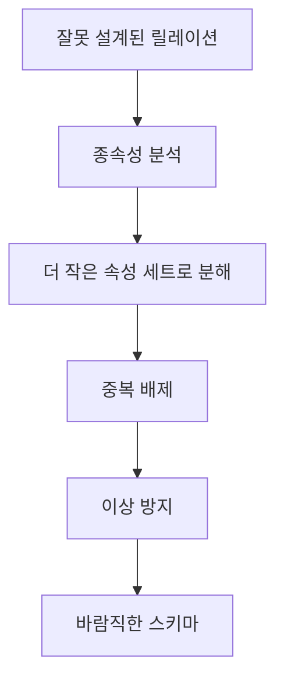

# 123 정규화(Normalization)

작성 기준일: 2026-06-01
검색/보강일: 2026-06-01
PDF 확인 위치: 18페이지, 3과목 데이터베이스 구축, 123 정규화(Normalization)

## 한 줄 요약

- 정규화는 함수적 종속성 같은 종속성 이론을 이용해 잘못 설계된 릴레이션을 더 작은 속성 집합으로 분해하여 중복과 이상을 줄이는 논리적 설계 과정이다.

## 한눈에 보는 구조

| 구분 | 내용 |
|---|---|
| 수행 단계 | 논리적 설계 |
| 근거 이론 | 함수적 종속성 등 종속성 이론 |
| 핵심 작업 | 릴레이션 분해 |
| 목적 | 중복 배제, 이상 방지, 저장 공간 최소화 |
| 반대 방향 | 반정규화 |

## PDF 기준 핵심

- 정규화는 함수적 종속성 등의 종속성 이론을 이용한다.
- 잘못 설계된 관계형 스키마를 더 작은 속성의 세트로 쪼개어 바람직한 스키마로 만들어 가는 과정이다.
- 논리적 설계 단계에서 수행한다.
- 데이터 중복을 배제하여 이상(Anomaly)의 발생을 방지한다.
- 자료 저장 공간의 최소화가 가능하다.

## 개념 설명

### 정규화의 의미

- IBM은 정규화를 데이터 무결성을 높이고, 데이터 이상을 방지하고, 데이터 중복을 최소화하는 데이터베이스 설계 과정으로 설명한다.
- Microsoft도 정규화를 데이터 보호와 유연성 확보를 위해 중복과 일관되지 않은 종속성을 제거하는 과정으로 설명한다.
- 시험에서는 이론적 설명보다 `종속성`, `분해`, `중복 배제`, `이상 방지`가 중요하다.

### 왜 필요한가

- 한 테이블에 서로 다른 주제의 데이터가 섞이면 같은 정보가 여러 번 저장된다.
- 중복 데이터는 삽입, 삭제, 갱신 시 예기치 않은 문제를 만든다.
- 정규화는 릴레이션을 적절히 나누어 데이터가 한 곳에서 관리되도록 돕는다.

## 시험 포인트

- 정규화는 논리적 설계 단계에서 수행한다.
- 함수적 종속성 등 종속성 이론을 이용한다.
- 이상 발생을 방지한다.
- 데이터 중복을 줄인다.
- 정규화의 반대 성격으로 성능을 위해 중복을 허용하는 반정규화가 있다.

## 헷갈리는 비교

| 비교 | 정규화 | 반정규화 |
|---|---|---|
| 방향 | 분해, 중복 감소 | 통합, 중복 허용 |
| 목적 | 이상 방지, 무결성 향상 | 성능 향상, 운영 편의 |
| 설계 원칙 | 원칙 준수 | 의도적으로 원칙 위배 |
| 주요 단계 | 논리적 설계 | 성능 개선 설계 |

## 예시 또는 암기 포인트

- 같은 학생 정보가 여러 행에 반복 저장되면 갱신 이상이 생길 수 있다.
- 정규화는 학생 정보와 수강 정보를 분리해 반복을 줄인다.
- 암기 문장: 정규화 = `종속성 보고, 테이블 나눠, 중복 줄이고, 이상 막기`

## 빠른 복습

- 정규화는 Normalization이다.
- 종속성 이론을 이용한다.
- 잘못 설계된 스키마를 더 작은 속성 세트로 나눈다.
- 논리적 설계 단계에서 수행한다.
- 중복 배제, 이상 방지, 저장 공간 최소화가 핵심 목적이다.

## 참고 링크

- [IBM - What Is Database Normalization?](https://www.ibm.com/think/topics/database-normalization)
- [Microsoft Learn - Database normalization description](https://learn.microsoft.com/en-us/troubleshoot/office/access/database-normalization-description)

<!-- study-links:start -->
## 관련 문서

- `논리적 설계`: [[정보처리기사/3과목 데이터베이스 구축/102 논리적 설계(데이터 모델링)/102 논리적 설계(데이터 모델링)|102 논리적 설계(데이터 모델링)]]
- `함수적 종속`: [[정보처리기사/3과목 데이터베이스 구축/126 함수적 종속(Functional Dependency)/126 함수적 종속(Functional Dependency)|126 함수적 종속(Functional Dependency)]]
- `반정규화`: [[정보처리기사/3과목 데이터베이스 구축/128 반정규화(Denormalization)/128 반정규화(Denormalization)|128 반정규화(Denormalization)]]
- `무결성`: [[정보처리기사/3과목 데이터베이스 구축/115 무결성/115 무결성|115 무결성]]
<!-- study-links:end -->
