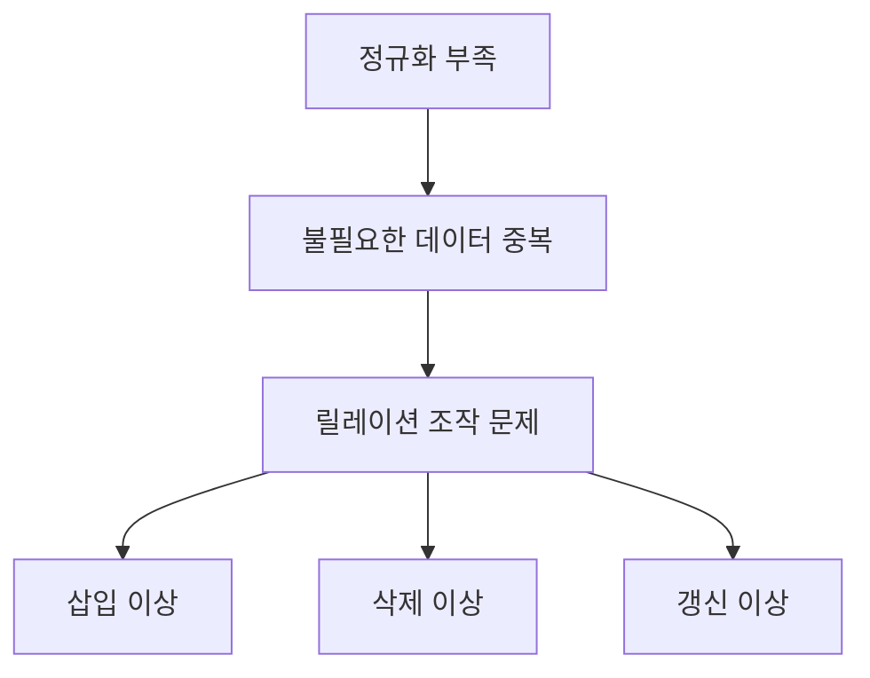

# 124 이상(Anomaly)

작성 기준일: 2026-06-01
검색/보강일: 2026-06-01
PDF 확인 위치: 18페이지, 3과목 데이터베이스 구축, 124 이상(Anomaly)

## 한 줄 요약

- 이상은 정규화되지 않은 릴레이션에서 불필요한 데이터 중복 때문에 삽입, 삭제, 갱신 작업 시 예기치 않은 문제가 발생하는 현상이다.

## 한눈에 보는 구조

| 종류 | 의미 | 대표 상황 |
|---|---|---|
| 삽입 이상 | 필요한 데이터를 삽입하려면 원치 않는 다른 정보도 필요 | 과목만 등록하고 싶은데 학생 정보가 필요 |
| 삭제 이상 | 한 데이터를 삭제하다가 필요한 다른 정보까지 사라짐 | 마지막 수강 학생 삭제 시 과목 정보도 삭제 |
| 갱신 이상 | 중복된 값 일부만 수정되어 불일치 발생 | 같은 학과명이 여러 행에서 다르게 수정 |

## PDF 기준 핵심

- 정규화를 거치지 않으면 데이터베이스 내에 데이터들이 불필요하게 중복된다.
- 릴레이션 조작 시 예기치 못한 곤란한 현상이 발생하는 것을 이상(Anomaly)이라고 한다.
- 종류는 삽입 이상, 삭제 이상, 갱신 이상이다.

## 개념 설명

### 이상의 원인

- 하나의 릴레이션에 서로 다른 주제의 데이터가 섞이면 중복이 발생한다.
- 중복된 데이터는 한 번의 조작으로 일관되게 관리하기 어렵다.
- IBM은 정규화가 삽입 이상, 삭제 이상, 갱신 이상을 방지할 수 있다고 설명한다.

### 삽입 이상

- 데이터를 넣고 싶지만 불필요한 다른 데이터가 없어 삽입하지 못하는 문제이다.
- 예:
  - 과목 정보를 등록하고 싶은데 수강 학생이 아직 없어서 행을 만들 수 없음

### 삭제 이상

- 데이터를 삭제하면서 보존해야 할 정보까지 함께 사라지는 문제이다.
- 예:
  - 어떤 과목을 수강한 마지막 학생 정보를 삭제했더니 과목 정보도 사라짐

### 갱신 이상

- 중복된 정보 중 일부만 수정되어 불일치가 생기는 문제이다.
- 예:
  - 여러 행에 반복 저장된 학과 전화번호 중 일부만 변경됨

## 시험 포인트

- 이상은 정규화 부족과 중복에서 발생한다.
- 종류는 삽입, 삭제, 갱신 이상이다.
- 삽입 이상은 넣고 싶은 데이터를 못 넣는 문제이다.
- 삭제 이상은 지우면 안 되는 정보까지 사라지는 문제이다.
- 갱신 이상은 중복 데이터의 일부만 바뀌어 불일치가 생기는 문제이다.

## 헷갈리는 비교

| 이상 | 핵심 질문 |
|---|---|
| 삽입 이상 | 넣고 싶은 데이터를 독립적으로 넣을 수 있는가 |
| 삭제 이상 | 지우는 과정에서 필요한 정보가 함께 사라지는가 |
| 갱신 이상 | 같은 정보가 여러 곳에서 다르게 바뀌는가 |

## 예시 또는 암기 포인트

- 암기 순서: `삽삭갱`
- 삽입: 못 넣음
- 삭제: 같이 사라짐
- 갱신: 일부만 바뀜

## 빠른 복습

- 이상은 Anomaly이다.
- 정규화 부족과 불필요한 중복 때문에 발생한다.
- 릴레이션 조작 시 문제가 생긴다.
- 종류는 삽입 이상, 삭제 이상, 갱신 이상이다.
- 정규화는 이상을 방지하기 위한 핵심 방법이다.

## 참고 링크

- [IBM - What Is Database Normalization?](https://www.ibm.com/think/topics/database-normalization)
- [Microsoft Learn - Database normalization description](https://learn.microsoft.com/en-us/troubleshoot/office/access/database-normalization-description)

<!-- study-links:start -->
## 관련 문서

- `정규화`: [[정보처리기사/3과목 데이터베이스 구축/123 정규화(Normalization)/123 정규화(Normalization)|123 정규화(Normalization)]]
<!-- study-links:end -->
