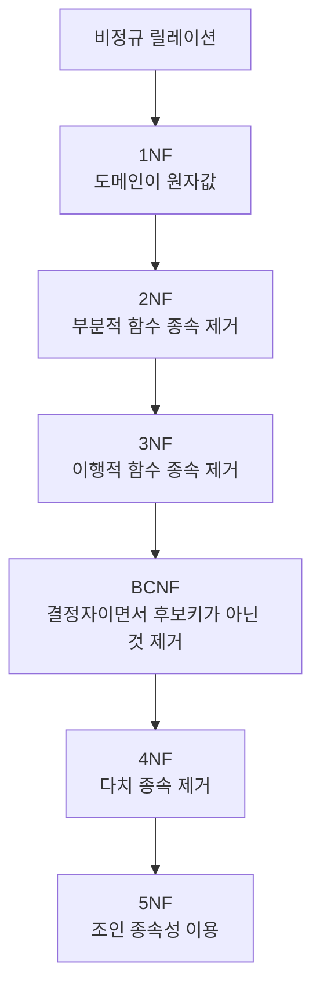

# 125 정규화 과정

작성 기준일: 2026-06-01
검색/보강일: 2026-06-01
PDF 확인 위치: 18페이지, 3과목 데이터베이스 구축, 125 정규화 과정

## 한 줄 요약

- 정규화 과정은 비정규 릴레이션에서 시작해 1NF, 2NF, 3NF, BCNF, 4NF, 5NF 순서로 종속성 문제를 제거해 나가는 단계적 분해 과정이다.

## 한눈에 보는 구조

| 단계 | 제거 또는 만족 조건 | 암기 단서 |
|---|---|---|
| 1NF | 도메인이 원자값 | 도 |
| 2NF | 부분적 함수 종속 제거 | 부 |
| 3NF | 이행적 함수 종속 제거 | 이 |
| BCNF | 결정자이면서 후보키가 아닌 것 제거 | 결 |
| 4NF | 다치 종속 제거 | 다 |
| 5NF | 조인 종속성 이용 | 조 |

## PDF 기준 핵심

- 정규화 과정은 다음 순서로 제시된다.
  - 비정규 릴레이션
  - 도메인이 원자값 → 1NF
  - 부분적 함수 종속 제거 → 2NF
  - 이행적 함수 종속 제거 → 3NF
  - 결정자이면서 후보키가 아닌 것 제거 → BCNF
  - 다치 종속 제거 → 4NF
  - 조인 종속성 이용 → 5NF

## 개념 설명

### 정규형의 의미

- 정규형은 릴레이션이 만족해야 하는 설계 규칙의 단계이다.
- IBM은 일반적인 정규형으로 1NF, 2NF, 3NF, BCNF, 4NF, 5NF를 설명한다.
- 단계가 올라갈수록 더 엄격한 종속성 문제를 다룬다.

### 단계별 핵심

- 1NF:
  - 속성 값이 원자값이어야 한다.
  - 반복 그룹이나 여러 값을 한 칸에 넣는 구조를 피한다.
- 2NF:
  - 기본키의 일부에만 종속되는 부분적 함수 종속을 제거한다.
- 3NF:
  - 기본키가 아닌 속성 사이의 이행적 함수 종속을 제거한다.
- BCNF:
  - 모든 결정자가 후보키가 되도록 더 엄격하게 정리한다.
- 4NF:
  - 다치 종속을 제거한다.
- 5NF:
  - 조인 종속성과 관련된 분해를 다룬다.

## 시험 포인트

- 정규화 순서는 반드시 외운다.
- 암기어는 `도부이결다조`이다.
- 1NF는 원자값이다.
- 2NF는 부분적 함수 종속 제거이다.
- 3NF는 이행적 함수 종속 제거이다.
- BCNF는 결정자이면서 후보키가 아닌 것을 제거한다.
- 4NF는 다치 종속, 5NF는 조인 종속성이다.

## 헷갈리는 비교

| 단계 | 자주 헷갈리는 점 |
|---|---|
| 2NF | 부분 종속 제거이지 이행 종속 제거가 아님 |
| 3NF | 이행 종속 제거이지 다치 종속 제거가 아님 |
| BCNF | 결정자와 후보키 관계가 핵심 |
| 4NF | 다치 종속 제거 |
| 5NF | 조인 종속성 |

## 예시 또는 암기 포인트

- 암기 문장: `도부이결다조`
- 풀이 순서:
  - 도메인이 원자값인가
  - 부분 종속이 남았는가
  - 이행 종속이 남았는가
  - 결정자가 후보키인가
  - 다치 종속이 있는가
  - 조인 종속성으로 분해 가능한가

## 빠른 복습

- 정규화는 비정규 릴레이션에서 시작한다.
- 1NF는 도메인 원자값이다.
- 2NF는 부분적 함수 종속 제거이다.
- 3NF는 이행적 함수 종속 제거이다.
- BCNF는 결정자이면서 후보키가 아닌 것을 제거한다.
- 4NF는 다치 종속, 5NF는 조인 종속성이다.

## 참고 링크

- [IBM - What Is Database Normalization?](https://www.ibm.com/think/topics/database-normalization)
- [Microsoft Learn - Database normalization description](https://learn.microsoft.com/en-us/troubleshoot/office/access/database-normalization-description)

