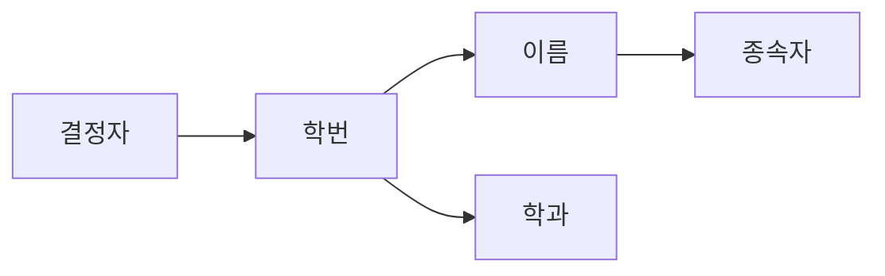

# 126 함수적 종속(Functional Dependency)

작성 기준일: 2026-06-01
검색/보강일: 2026-06-01
PDF 확인 위치: 18페이지, 3과목 데이터베이스 구축, 126 함수적 종속(Functional Dependency)

## 한 줄 요약

- 함수적 종속은 어떤 기준 속성 값이 정해지면 다른 속성 값이 하나로 결정되는 관계이며, `학번 → 이름`처럼 표현한다.

## 한눈에 보는 구조

| 구분 | 내용 |
|---|---|
| 표기 | X → Y |
| 의미 | X 값이 정해지면 Y 값이 결정됨 |
| 결정자 | 왼쪽 속성 X |
| 종속자 | 오른쪽 속성 Y |
| 예 | 학번 → 이름 |

## PDF 기준 핵심

- 함수적 종속은 데이터들이 어떤 기준값에 의해 종속되는 것을 의미한다.
- `학번`에 따라 `이름`이 결정될 때 `이름`은 `학번`에 함수 종속적이다.
- 표기는 `학번 → 이름`과 같이 쓴다.

## 개념 설명

### 함수적 종속의 의미

- 함수적 종속은 정규화의 핵심 판단 기준이다.
- IBM은 한 속성, 즉 결정자가 다른 속성의 값을 결정하는 관계를 함수적 종속으로 설명한다.
- 학생 릴레이션에서 학번이 같으면 이름도 하나로 정해진다면 `학번 → 이름`이 성립한다.

### 결정자와 종속자

- `X → Y`에서 X는 결정자이다.
- Y는 X에 종속되는 속성이다.
- X가 같으면 Y도 같아야 함수적 종속이 성립한다.

### 정규화와의 관계

- 2NF는 부분적 함수 종속을 제거한다.
- 3NF는 이행적 함수 종속을 제거한다.
- BCNF는 결정자가 후보키가 아닌 경우를 제거한다.

## 시험 포인트

- 함수적 종속 표기는 `A → B`이다.
- 왼쪽이 기준값, 오른쪽이 결정되는 값이다.
- `학번 → 이름` 예시를 그대로 기억한다.
- 정규화 과정의 2NF, 3NF, BCNF와 연결된다.
- `A가 B를 결정한다`와 `B가 A에 종속된다`는 같은 관계를 반대 방향으로 말한 것이다.

## 헷갈리는 비교

| 표현 | 의미 |
|---|---|
| A → B | A가 B를 결정 |
| B는 A에 함수 종속 | A 값이 정해지면 B 값이 정해짐 |
| 결정자 | 화살표 왼쪽 |
| 종속자 | 화살표 오른쪽 |

## 예시 또는 암기 포인트

- 학번 → 이름
- 주민번호 → 생년월일
- 상품코드 → 상품명
- 암기 문장: `화살표 왼쪽이 오른쪽을 결정한다`.

## 빠른 복습

- 함수적 종속은 어떤 기준값에 의해 다른 값이 결정되는 관계이다.
- 표기는 X → Y이다.
- X는 결정자, Y는 종속자이다.
- PDF 예시는 학번 → 이름이다.
- 정규화 판단의 핵심 개념이다.

## 참고 링크

- [IBM - What Is Database Normalization?](https://www.ibm.com/think/topics/database-normalization)
- [Microsoft Learn - Database normalization description](https://learn.microsoft.com/en-us/troubleshoot/office/access/database-normalization-description)

