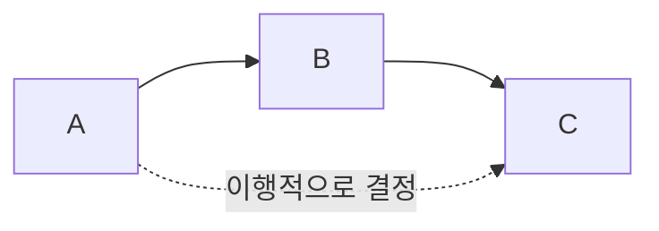

# 127 이행적 종속 관계

작성 기준일: 2026-06-01
검색/보강일: 2026-06-01
PDF 확인 위치: 19페이지, 3과목 데이터베이스 구축, 127 이행적 종속 관계

## 한 줄 요약

- 이행적 종속은 A가 B를 결정하고 B가 C를 결정할 때 A가 C를 간접적으로 결정하는 관계이다.

## 한눈에 보는 구조

| 구분 | 내용 |
|---|---|
| 조건 1 | A → B |
| 조건 2 | B → C |
| 결론 | A → C |
| 정규화 연결 | 3NF에서 제거 |
| 핵심 단서 | 간접 종속 |

## PDF 기준 핵심

- A → B이고 B → C일 때 A → C를 만족하는 관계를 의미한다.

## 개념 설명

### 이행적 종속의 의미

- 직접 결정이 아니라 중간 속성을 거쳐 결정되는 종속이다.
- IBM은 함수적 종속의 유형으로 부분 종속, 이행 종속, 다치 종속, 조인 종속 등을 언급한다.
- 정규화 과정에서 3NF는 이행적 함수 종속을 제거하는 단계이다.

### 예시

- 학번 → 학과코드
- 학과코드 → 학과명
- 따라서 학번 → 학과명이 이행적으로 성립한다.
- 이 경우 학생 릴레이션에 학과명을 반복 저장하면 갱신 이상이 생길 수 있다.

## 시험 포인트

- A → B, B → C이면 A → C이다.
- 이행적 종속은 3NF에서 제거한다.
- 중간 속성 B가 핵심이다.
- 함수적 종속의 특수한 형태로 이해한다.
- 정규화 과정의 `도부이결다조`에서 `이`가 이행적 종속 제거이다.

## 헷갈리는 비교

| 비교 | 부분적 함수 종속 | 이행적 함수 종속 |
|---|---|---|
| 관련 단계 | 2NF | 3NF |
| 핵심 | 복합키의 일부에 종속 | 중간 속성을 거쳐 종속 |
| 단서 | 부분 | A → B → C |

## 예시 또는 암기 포인트

- `학번 → 학과코드 → 학과명`
- 학번이 학과명을 직접 저장하게 만들면 학과명 변경 시 여러 학생 행을 고쳐야 한다.
- 암기 문장: 이행적 종속 = `한 번 건너 결정`

## 빠른 복습

- 이행적 종속은 A → B, B → C일 때 A → C가 되는 관계이다.
- 3NF에서 제거한다.
- 중간 결정 속성이 있다.
- 정규화와 이상 방지에 중요하다.

## 참고 링크

- [IBM - What Is Database Normalization?](https://www.ibm.com/think/topics/database-normalization)
- [Microsoft Learn - Database normalization description](https://learn.microsoft.com/en-us/troubleshoot/office/access/database-normalization-description)

