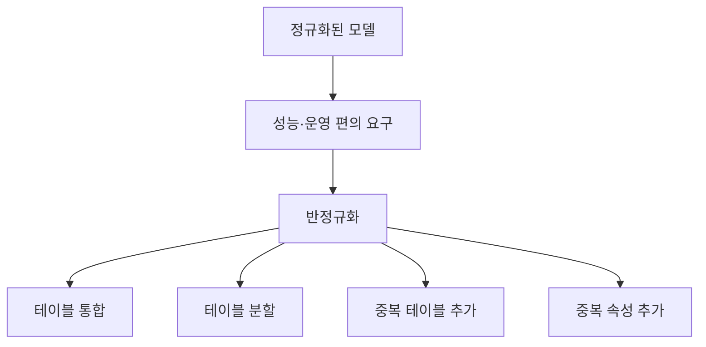

# 128 반정규화(Denormalization)

작성 기준일: 2026-06-01
검색/보강일: 2026-06-01
PDF 확인 위치: 19페이지, 3과목 데이터베이스 구축, 128 반정규화(Denormalization)

## 한 줄 요약

- 반정규화는 성능 향상이나 운영 편의를 위해 정규화된 데이터 모델을 의도적으로 통합, 중복, 분리하여 정규화 원칙을 일부 위배하는 설계 기법이다.

## 한눈에 보는 구조

| 구분 | 내용 |
|---|---|
| 목적 | 성능 향상, 개발 및 운영 편의 |
| 대상 | 정규화된 데이터 모델 |
| 성격 | 의도적으로 정규화 원칙 위배 |
| 방법 | 테이블 통합, 테이블 분할, 중복 테이블 추가, 중복 속성 추가 |
| 위험 | 중복 증가, 이상 가능성 증가 |

## PDF 기준 핵심

- 시스템의 성능 향상, 개발 및 운영의 편의성 등을 위해 수행한다.
- 정규화된 데이터 모델을 통합, 중복, 분리하는 과정이다.
- 의도적으로 정규화 원칙을 위배하는 행위이다.
- 방법은 테이블 통합, 테이블 분할, 중복 테이블 추가, 중복 속성 추가 등이 있다.

## 개념 설명

### 반정규화의 의미

- 정규화는 중복을 줄이고 무결성을 높이는 방향이다.
- 반정규화는 조회 성능이나 운영 편의를 위해 일부 중복을 허용한다.
- IBM Informix 성능 문서는 성능 향상을 위해 데이터 모델을 반정규화할 수 있음을 설명한다.
- SAP HANA 문서도 반정규화가 정규형을 의도적으로 위반하여 중복과 이상 위험을 높일 수 있으므로 성능 분석에 기반해야 한다고 설명한다.

### 대표 방법

- 테이블 통합:
  - 자주 함께 조회되는 테이블을 합쳐 조인 비용을 줄인다.
- 테이블 분할:
  - 큰 테이블을 업무나 접근 패턴별로 나눈다.
- 중복 테이블 추가:
  - 특정 조회 목적의 복제 테이블을 둔다.
- 중복 속성 추가:
  - 매번 조인해야 얻는 값을 한 테이블에 중복 저장한다.

## 시험 포인트

- 반정규화는 정규화 원칙을 의도적으로 위배한다.
- 목적은 성능 향상, 개발 및 운영 편의성이다.
- 방법 네 가지를 외운다.
  - 테이블 통합
  - 테이블 분할
  - 중복 테이블 추가
  - 중복 속성 추가
- 정규화가 부족해서 생긴 실수가 아니라, 목적을 가진 설계 선택이다.

## 헷갈리는 비교

| 비교 | 정규화 | 반정규화 |
|---|---|---|
| 목적 | 이상 방지, 중복 제거 | 성능 향상, 운영 편의 |
| 방향 | 분해 | 통합·중복·분리 |
| 원칙 | 정규화 원칙 준수 | 의도적 위배 |
| 위험 | 조인 증가 가능 | 중복과 불일치 가능 |

## 예시 또는 암기 포인트

- 매번 주문과 고객 테이블을 조인해야 고객명을 보여주는 화면이 매우 많다면, 주문 테이블에 고객명을 중복 저장하는 방안을 검토할 수 있다.
- 단, 고객명이 바뀌면 중복 저장된 값도 관리해야 한다.
- 암기 문장: 반정규화 = `성능 때문에 일부러 중복을 허용`

## 빠른 복습

- 반정규화는 Denormalization이다.
- 성능 향상과 운영 편의를 위해 수행한다.
- 정규화된 모델을 통합, 중복, 분리한다.
- 의도적으로 정규화 원칙을 위배한다.
- 방법은 테이블 통합, 분할, 중복 테이블 추가, 중복 속성 추가이다.

## 참고 링크

- [IBM Informix - Denormalize the data model to improve performance](https://www.ibm.com/docs/SSGU8G_12.1.0/com.ibm.perf.doc/ids_prf_343.htm)
- [SAP Help - Denormalization](https://help.sap.com/docs/hana-cloud-database/sap-hana-cloud-sap-hana-database-performance-guide-for-developers/denormalization)

