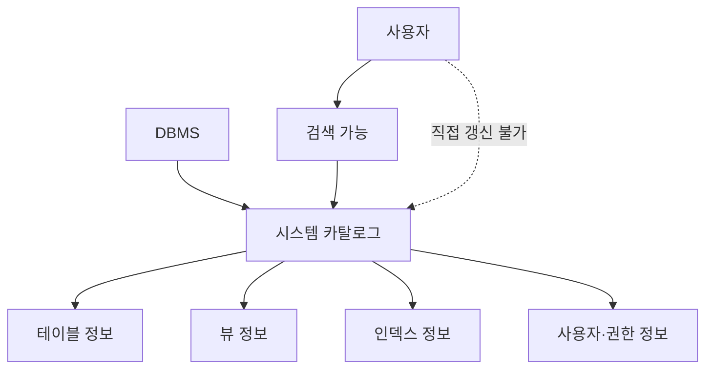

# 129 시스템 카탈로그(System Catalog)

작성 기준일: 2026-06-01
검색/보강일: 2026-06-01
PDF 확인 위치: 19페이지, 3과목 데이터베이스 구축, 129 시스템 카탈로그(System Catalog)

## 한 줄 요약

- 시스템 카탈로그는 DBMS가 데이터베이스 객체와 시스템 관련 정보를 관리하기 위해 유지하는 시스템 데이터베이스로, 사용자는 조회할 수 있지만 직접 갱신할 수 없다.

## 한눈에 보는 구조

| 구분 | 내용 |
|---|---|
| 정체 | 시스템 데이터베이스 |
| 저장 정보 | DB 객체, 구조, 권한, 통계 등 메타데이터 |
| 다른 이름 | 데이터 사전과 유사한 개념 |
| 사용자 작업 | 검색 가능 |
| 제한 | 직접 갱신 불가 |

## PDF 기준 핵심

- 시스템 카탈로그는 시스템 그 자체에 관련이 있는 다양한 객체에 관한 정보를 포함하는 시스템 데이터베이스이다.
- 사용자가 시스템 카탈로그 내용을 검색할 수는 있지만 갱신할 수는 없다.

## 개념 설명

### 시스템 카탈로그의 의미

- 시스템 카탈로그는 DBMS가 데이터베이스 구조를 알기 위해 유지하는 메타데이터 저장소이다.
- IBM Informix 문서는 시스템 카탈로그가 데이터베이스 구조를 설명하는 테이블과 뷰로 구성되며, 데이터베이스가 자신에 대해 알고 있는 정보를 담는다고 설명한다.
- PostgreSQL도 각 데이터베이스에 시스템 테이블과 내장 데이터 타입, 함수, 연산자 등을 포함하는 `pg_catalog` 스키마가 있다고 설명한다.

### 포함 정보 예

- 테이블 이름과 소유자
- 컬럼 이름과 데이터 타입
- 인덱스 정보
- 제약 조건 정보
- 뷰 정의
- 사용자와 권한 관련 정보

### 왜 직접 갱신하지 않는가

- 시스템 카탈로그는 DBMS 내부 동작의 기준이다.
- 사용자가 직접 바꾸면 데이터베이스 구조와 실제 객체 상태가 불일치할 수 있다.
- 일반적으로 DDL 명령을 수행하면 DBMS가 시스템 카탈로그를 자동으로 갱신한다.

## 시험 포인트

- 시스템 카탈로그는 시스템 데이터베이스이다.
- 데이터베이스 객체에 관한 정보를 담는다.
- 사용자는 검색할 수 있지만 갱신할 수 없다.
- 메타데이터와 연결해서 이해한다.
- 테이블을 만들거나 삭제하면 DBMS가 카탈로그 정보를 관리한다.

## 헷갈리는 비교

| 비교 | 시스템 카탈로그 | 사용자 테이블 |
|---|---|---|
| 저장 내용 | 객체 정의, 구조, 권한 등 메타데이터 | 업무 데이터 |
| 관리 주체 | DBMS | 사용자와 응용 프로그램 |
| 사용자 조회 | 가능 | 가능 |
| 사용자 직접 갱신 | 불가로 기억 | 권한에 따라 가능 |

## 예시 또는 암기 포인트

- `CREATE TABLE 학생 ...`을 실행하면 DBMS는 학생 테이블의 구조 정보를 시스템 카탈로그에 기록한다.
- 사용자는 카탈로그를 조회해 어떤 테이블과 컬럼이 있는지 확인할 수 있다.
- 암기 문장: 시스템 카탈로그 = `DBMS가 관리하는 데이터베이스의 자기소개서`

## 빠른 복습

- 시스템 카탈로그는 System Catalog이다.
- 시스템 자체와 다양한 객체 정보를 포함한다.
- 시스템 데이터베이스이다.
- 사용자는 검색할 수 있지만 갱신할 수 없다.
- 메타데이터 저장소로 이해한다.

## 참고 링크

- [IBM Informix - System catalog tables](https://www.ibm.com/docs/en/informix-servers/14.10.0?topic=reference-system-catalog-tables)
- [PostgreSQL Documentation - Schemas and pg_catalog](https://www.postgresql.org/docs/18/ddl-schemas.html)

