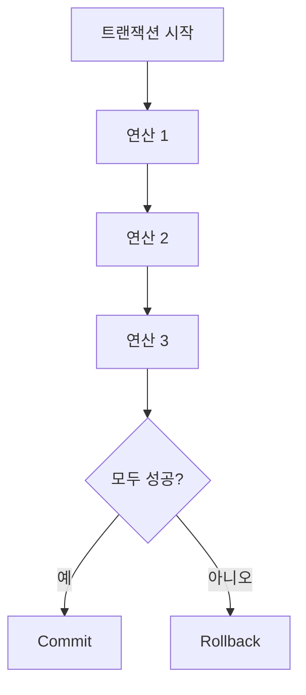

# 130 트랜잭션(Transaction) 정의

작성 기준일: 2026-06-01
검색/보강일: 2026-06-01
PDF 확인 위치: 19페이지, 3과목 데이터베이스 구축, 130 트랜잭션(Transaction) 정의

## 한 줄 요약

- 트랜잭션은 데이터베이스 상태를 변화시키는 하나의 논리적 작업 단위이며, 포함된 연산들은 한꺼번에 모두 수행되어야 한다.

## 한눈에 보는 구조

| 구분 | 내용 |
|---|---|
| 정체 | 논리적 작업 단위 |
| 대상 | 데이터베이스 상태 변화 |
| 구성 | 한꺼번에 수행되어야 할 일련의 연산 |
| 성공 종료 | Commit |
| 실패 처리 | Rollback |

## PDF 기준 핵심

- 트랜잭션은 데이터베이스의 상태를 변환시키는 하나의 논리적 기능을 수행하기 위한 작업의 단위이다.
- 한꺼번에 모두 수행되어야 할 일련의 연산이다.

## 개념 설명

### 트랜잭션의 의미

- Oracle 문서는 트랜잭션을 하나 이상의 SQL 문을 포함하는 논리적 작업 단위로 설명한다.
- 또 다른 Oracle 문서는 트랜잭션을 데이터베이스가 하나의 단위로 취급하는 SQL 문들의 시퀀스로 설명하며, 모두 수행되거나 아무것도 수행되지 않아야 한다고 설명한다.
- 시험에서는 `논리적 기능`, `작업 단위`, `일련의 연산`, `모두 수행`이 핵심이다.

### 예시

- 계좌 A에서 10만 원을 빼고 계좌 B에 10만 원을 넣는 작업을 생각한다.
- 출금만 성공하고 입금이 실패하면 데이터가 불일치한다.
- 따라서 출금과 입금은 하나의 트랜잭션으로 묶어 모두 성공하거나 모두 취소되어야 한다.

### Commit과 Rollback

- Commit은 트랜잭션 결과를 확정하는 연산이다.
- Rollback은 트랜잭션 수행 중 문제가 생겼을 때 이전 상태로 되돌리는 연산이다.
- 다음 항목의 트랜잭션 상태와 ACID 특성으로 이어진다.

## 시험 포인트

- 트랜잭션은 하나의 논리적 작업 단위이다.
- 데이터베이스 상태를 변화시킨다.
- 한꺼번에 모두 수행되어야 할 연산들의 집합이다.
- Commit과 Rollback이 함께 출제될 수 있다.
- ACID 특성의 원자성과 직접 연결된다.

## 헷갈리는 비교

| 비교 | 트랜잭션 | 개별 SQL 문 |
|---|---|---|
| 범위 | 하나 이상의 연산을 묶은 논리 단위 | 단일 명령일 수 있음 |
| 목적 | 업무 단위의 일관성 보장 | 특정 조작 수행 |
| 종료 | Commit 또는 Rollback | 문장 실행 완료 |

## 예시 또는 암기 포인트

- 은행 이체:
  - A 계좌 출금
  - B 계좌 입금
  - 둘 다 성공하면 Commit
  - 하나라도 실패하면 Rollback
- 암기 문장: 트랜잭션 = `All or Nothing 작업 단위`

## 빠른 복습

- 트랜잭션은 Transaction이다.
- 데이터베이스 상태를 변화시키는 논리적 기능의 작업 단위이다.
- 한꺼번에 모두 수행되어야 할 일련의 연산이다.
- Commit은 확정, Rollback은 복구이다.
- ACID와 트랜잭션 상태 학습의 출발점이다.

## 참고 링크

- [Oracle Database - Transaction Management](https://docs.oracle.com/cd/A91202_01/901_doc/server.901/a88856/c17trans.htm)
- [Oracle Database - Transaction Processing and Control](https://docs.oracle.com/en/database/oracle/oracle-database/19/lnpls/transaction-processing-and-control.html)

<!-- study-links:start -->
## 관련 문서

- `acid`: [[ACID-트랜잭션/ACID-트랜잭션|ACID 트랜잭션 상세 정리]]
- `sql`: [[sql-query/sql-query|반드시 알아둬야 할 SQL 쿼리 정리]]
<!-- study-links:end -->
