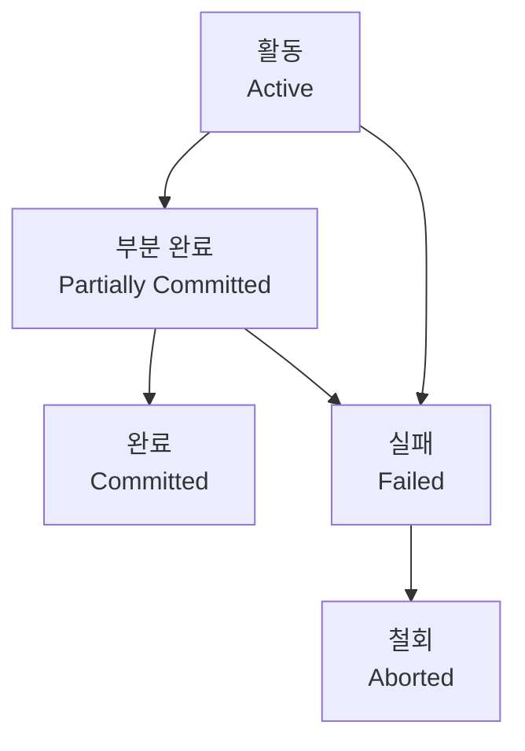

# 131 트랜잭션의 상태

작성 기준일: 2026-06-01
검색/보강일: 2026-06-01
PDF 확인 위치: 19페이지, 3과목 데이터베이스 구축, 131 트랜잭션의 상태

## 한 줄 요약

- 트랜잭션은 실행 중인 활동 상태에서 시작해 성공하면 부분 완료와 완료로, 오류가 나면 실패와 철회 상태로 이동한다.

## 한눈에 보는 구조

| 상태 | 의미 | 시험 단서 |
|---|---|---|
| 활동 | 트랜잭션이 실행 중 | Active |
| 부분 완료 | 마지막 연산까지 완료, Commit 직전 | Partially Committed |
| 완료 | Commit까지 수행 | Committed |
| 실패 | 실행 중 오류로 중단 | Failed |
| 철회 | Rollback 수행 후 비정상 종료 | Aborted |

## PDF 기준 핵심

- `활동(Active)`: 트랜잭션이 실행 중인 상태이다.
- `실패(Failed)`: 트랜잭션 실행 중 오류가 발생하여 중단된 상태이다.
- `철회(Aborted)`: 트랜잭션이 비정상적으로 종료되어 Rollback 연산을 수행한 상태이다.
- `부분 완료(Partially Committed)`: 트랜잭션의 마지막 연산까지 완료했지만 Commit 연산이 실행되기 직전의 상태이다.
- `완료(Committed)`: 트랜잭션이 성공적으로 종료되어 Commit 연산까지 수행한 상태이다.

## 개념 설명

### 상태 흐름

- 트랜잭션은 처음에 활동 상태로 실행된다.
- 모든 연산을 마치면 부분 완료 상태가 된다.
- Commit이 성공하면 완료 상태가 된다.
- 실행 중 오류가 발견되면 실패 상태가 되고, Rollback을 거치면 철회 상태가 된다.

### Commit 직전과 Commit 이후

- 부분 완료는 마지막 연산까지 끝났지만 결과가 아직 확정되지 않은 상태이다.
- 완료는 Commit이 수행되어 데이터베이스에 결과가 확정된 상태이다.
- 이 둘의 차이를 구분하는 문제가 자주 나온다.

## 시험 포인트

- 마지막 연산 완료 후 Commit 직전은 부분 완료이다.
- Commit까지 끝나면 완료이다.
- 오류로 중단되면 실패이다.
- Rollback을 수행하면 철회이다.
- 상태 이름의 영어와 한글을 함께 외운다.

## 헷갈리는 비교

| 비교 | 부분 완료 | 완료 |
|---|---|---|
| 마지막 연산 | 완료 | 완료 |
| Commit | 아직 수행 전 | 수행 완료 |
| 결과 확정 | 아직 | 확정 |

| 비교 | 실패 | 철회 |
|---|---|---|
| 원인 | 오류 발생으로 중단 | 실패 후 Rollback 수행 |
| 상태 | 복구 전 | 복구 후 |

## 예시 또는 암기 포인트

- 상태 흐름 암기:
  - 성공: `활동 → 부분 완료 → 완료`
  - 실패: `활동 또는 부분 완료 → 실패 → 철회`
- Commit 직전이라는 문장이 나오면 부분 완료를 고른다.

## 빠른 복습

- 트랜잭션 상태는 활동, 부분 완료, 완료, 실패, 철회이다.
- Active는 실행 중이다.
- Partially Committed는 마지막 연산 완료 후 Commit 직전이다.
- Committed는 Commit 완료 상태이다.
- Failed는 오류 중단, Aborted는 Rollback 후 상태이다.

## 참고 링크

- [Oracle Database Concepts - Transactions](https://docs.oracle.com/database/121/CNCPT/transact.htm)
- [University of Mannheim - Transaction and Concurrency](https://www.uni-mannheim.de/media/Einrichtungen/dws/Files_Teaching/Database_Technology/FSS2020/Lecture/DBT10-Transaction_and_Concurrency.pdf)

<!-- study-links:start -->
## 관련 문서

- `트랜잭션`: [[ACID-트랜잭션/ACID-트랜잭션|ACID 트랜잭션 상세 정리]]
<!-- study-links:end -->
