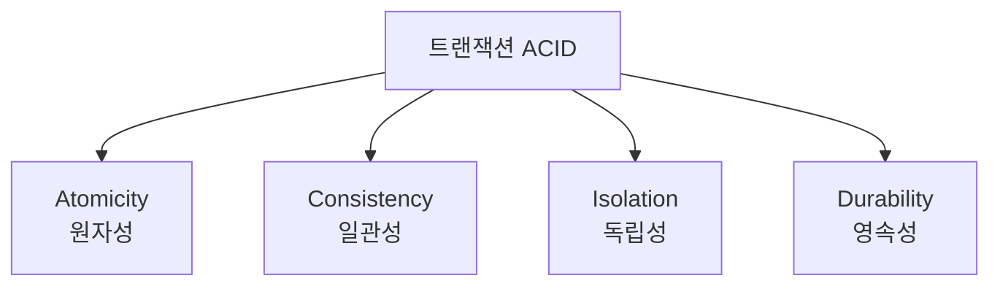

# 132 트랜잭션의 특성

작성 기준일: 2026-06-01
검색/보강일: 2026-06-01
PDF 확인 위치: 19페이지, 3과목 데이터베이스 구축, 132 트랜잭션의 특성

## 한 줄 요약

- 트랜잭션의 ACID 특성은 원자성, 일관성, 독립성, 영속성으로, 작업 단위가 모두 수행되거나 모두 취소되고 일관된 결과가 보존되도록 보장한다.

## 한눈에 보는 구조

| 특성 | 한글 | 핵심 의미 |
|---|---|---|
| Atomicity | 원자성 | 모두 반영되거나 전혀 반영되지 않음 |
| Consistency | 일관성 | 성공 후 일관된 DB 상태 유지 |
| Isolation | 독립성 | 병행 실행 시 서로 끼어들지 않음 |
| Durability | 영속성 | 완료 결과는 장애 후에도 보존 |

## PDF 기준 핵심

- `Atomicity(원자성)`: 트랜잭션의 연산은 모두 반영되도록 완료되거나 전혀 반영되지 않도록 복구되어야 한다.
- `Consistency(일관성)`: 트랜잭션이 성공적으로 완료되면 언제나 일관성 있는 데이터베이스 상태로 변환한다.
- `Isolation(독립성)`: 둘 이상의 트랜잭션이 동시에 병행 실행되는 경우 어느 하나의 트랜잭션 실행 중 다른 트랜잭션의 연산이 끼어들 수 없다.
- `Durability(영속성)`: 성공적으로 완료된 트랜잭션의 결과는 시스템이 고장나더라도 영구적으로 반영되어야 한다.

## 개념 설명

### ACID의 의미

- Oracle 문서는 모든 Oracle 트랜잭션이 ACID로 알려진 기본 속성을 따른다고 설명한다.
- ACID는 트랜잭션 처리의 안정성을 설명하는 대표 약어이다.
- 시험에서는 영어 첫 글자와 한글 의미를 직접 연결해야 한다.

### 예시

- 은행 이체에서 출금과 입금은 모두 성공해야 한다.
- 출금만 되고 입금이 안 되면 원자성과 일관성이 깨진다.
- 동시에 여러 이체가 실행되어도 서로의 중간 상태가 섞이면 독립성이 깨진다.
- Commit된 이체 결과가 장애 후 사라지면 영속성이 깨진다.

## 시험 포인트

- ACID는 원자성, 일관성, 독립성, 영속성이다.
- `All or Nothing`은 원자성이다.
- `일관성 있는 상태`는 일관성이다.
- `동시 실행 중 끼어들 수 없음`은 독립성이다.
- `장애 후에도 결과 보존`은 영속성이다.

## 헷갈리는 비교

| 헷갈리는 특성 | 구분 단서 |
|---|---|
| 원자성 vs 일관성 | 원자성은 모두/전혀, 일관성은 규칙에 맞는 상태 |
| 독립성 vs 영속성 | 독립성은 병행 실행, 영속성은 완료 후 보존 |
| 일관성 vs 무결성 | 일관성은 트랜잭션 전후 상태, 무결성은 데이터 규칙 |

## 예시 또는 암기 포인트

- 암기어: `ACID = 원일독영`
- 원자성: 모두 아니면 전혀 없음
- 일관성: 성공 후 규칙 만족
- 독립성: 서로 끼어들지 않음
- 영속성: Commit 결과는 남음

## 빠른 복습

- 트랜잭션 특성은 ACID이다.
- A는 Atomicity, 원자성이다.
- C는 Consistency, 일관성이다.
- I는 Isolation, 독립성이다.
- D는 Durability, 영속성이다.

## 참고 링크

- [Oracle Database Concepts - Transactions](https://docs.oracle.com/database/121/CNCPT/transact.htm)
- [Oracle Database - Transaction Processing and Control](https://docs.oracle.com/en/database/oracle/oracle-database/19/lnpls/transaction-processing-and-control.html)

