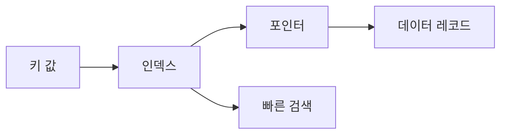

# 133 인덱스(Index)

작성 기준일: 2026-06-01
검색/보강일: 2026-06-01
PDF 확인 위치: 19페이지, 3과목 데이터베이스 구축, 133 인덱스(Index)

## 한 줄 요약

- 인덱스는 데이터 레코드에 빠르게 접근하기 위해 키 값과 포인터 쌍으로 구성하는 데이터 구조이다.

## 한눈에 보는 구조

| 구분 | 내용 |
|---|---|
| 목적 | 데이터 레코드에 빠르게 접근 |
| 구성 | 키 값, 포인터 |
| 성격 | 데이터 접근 경로를 제공하는 자료 구조 |
| 생성/변경/제거 | DDL 사용 |
| 주의 | 조회 성능은 높일 수 있지만 관리 비용이 생김 |

## PDF 기준 핵심

- 인덱스는 데이터 레코드를 빠르게 접근하기 위해 `<키 값, 포인터>` 쌍으로 구성되는 데이터 구조이다.
- 데이터 정의어(DDL)를 이용하여 사용자가 생성, 변경, 제거할 수 있다.

## 개념 설명

### 인덱스의 의미

- 인덱스는 책의 찾아보기와 비슷하다.
- 테이블 전체를 처음부터 끝까지 확인하지 않고, 키 값을 통해 원하는 레코드 위치를 빠르게 찾도록 돕는다.
- PostgreSQL 공식 문서는 인덱스가 특정 행을 더 빠르게 찾고 검색할 수 있게 해 데이터베이스 성능을 높이는 일반적 방법이라고 설명한다.

### 키 값과 포인터

- 키 값은 검색 기준이 되는 값이다.
- 포인터는 실제 데이터 레코드가 있는 위치를 가리킨다.
- 시험에서는 `<키 값, 포인터>` 쌍이라는 표현이 가장 중요하다.

## 시험 포인트

- 인덱스는 빠른 접근을 위한 데이터 구조이다.
- 구성은 `<키 값, 포인터>`이다.
- DDL로 생성, 변경, 제거할 수 있다.
- 인덱스는 물리적 설계와 성능 튜닝에 연결된다.
- 인덱스가 많다고 항상 좋은 것은 아니며, 갱신 비용이 생길 수 있다.

## 헷갈리는 비교

| 비교 | 인덱스 | 기본키 |
|---|---|---|
| 목적 | 빠른 접근 경로 | 튜플 유일 식별 |
| 구성 단서 | 키 값과 포인터 | 중복 불가, NULL 불가 |
| 관계 | 기본키에 인덱스가 만들어질 수 있음 | 인덱스 자체와 동일한 개념은 아님 |

## 예시 또는 암기 포인트

- `학번`으로 학생을 자주 찾는다면 학번 인덱스를 만들 수 있다.
- 암기 문장: 인덱스 = `키 값으로 포인터를 찾아 레코드로 간다`.

## 빠른 복습

- 인덱스는 Index이다.
- 데이터 레코드를 빠르게 접근하게 한다.
- `<키 값, 포인터>` 쌍으로 구성된다.
- DDL로 생성, 변경, 제거할 수 있다.
- 조회 성능과 접근 경로 단서로 출제된다.

## 참고 링크

- [PostgreSQL Documentation - Indexes](https://www.postgresql.org/docs/current/indexes.html)
- [Oracle Database Concepts - Introduction to Oracle Database](https://docs.oracle.com/en/database/oracle/oracle-database/12.2/cncpt/introduction-to-oracle-database.html)

<!-- study-links:start -->
## 관련 문서

- `물리적 설계`: [[정보처리기사/3과목 데이터베이스 구축/103 물리적 설계/103 물리적 설계|103 물리적 설계]]
- `기본키`: [[정보처리기사/3과목 데이터베이스 구축/111 기본키(Primary Key)/111 기본키(Primary Key)|111 기본키(Primary Key)]]
- `ddl`: [[정보처리기사/3과목 데이터베이스 구축/143 DDL(데이터 정의어)/143 DDL(데이터 정의어)|143 DDL(데이터 정의어)]]
- `물리적`: [[정보처리기사/5과목 정보시스템 구축 관리/320 관리적 물리적 기술적 보안/320 관리적 물리적 기술적 보안|320 관리적/물리적/기술적 보안]]
- `튜플`: [[정보처리기사/3과목 데이터베이스 구축/106 튜플(Tuple)/106 튜플(Tuple)|106 튜플(Tuple)]]
<!-- study-links:end -->
