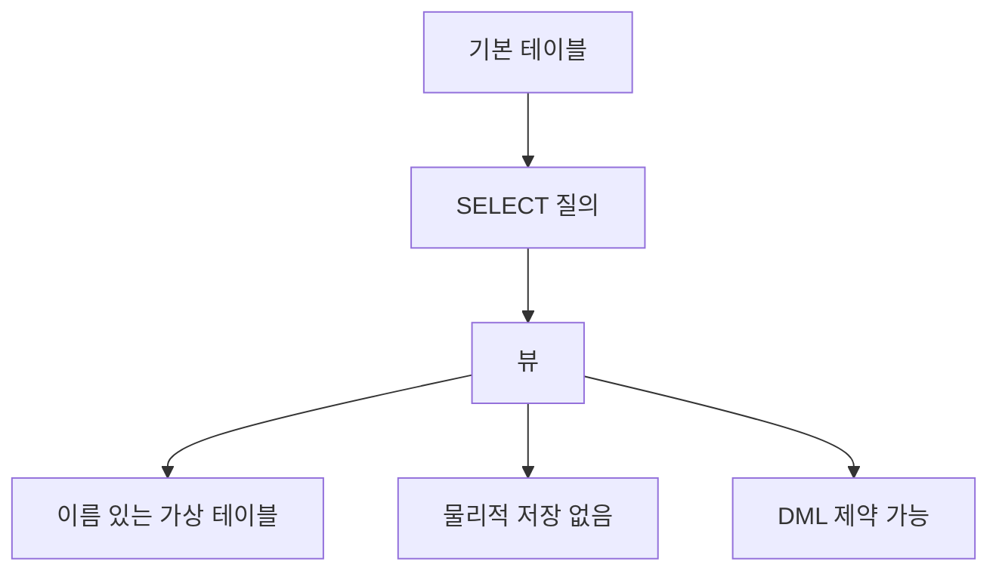

# 134 뷰(View)

작성 기준일: 2026-06-01
검색/보강일: 2026-06-01
PDF 확인 위치: 19페이지, 3과목 데이터베이스 구축, 134 뷰(View)

## 한 줄 요약

- 뷰는 기본 테이블에서 유도된 이름 있는 가상 테이블로, 물리적으로 데이터를 저장하지 않으며 조작에 제약이 있고 독립적인 인덱스를 가질 수 없다.

## 한눈에 보는 구조

| 구분 | 내용 |
|---|---|
| 정체 | 가상 테이블 |
| 유도 대상 | 기본 테이블 |
| 저장 여부 | 물리적으로 구현되어 있지 않음 |
| 정의/삭제 | CREATE, DROP |
| 제한 | 삽입·삭제·갱신 제약, 독립 인덱스 없음 |

## PDF 기준 핵심

- 뷰는 기본 테이블로부터 유도된, 이름을 가지는 가상 테이블이다.
- 뷰는 가상 테이블이기 때문에 물리적으로 구현되어 있지 않다.
- 뷰로 구성된 내용에 대한 삽입, 삭제, 갱신 연산에 제약이 따른다.
- 뷰를 정의할 때는 CREATE문, 제거할 때는 DROP문을 사용한다.
- 독립적인 인덱스를 가질 수 없다.

## 개념 설명

### 뷰의 의미

- PostgreSQL 공식 문서는 CREATE VIEW가 질의의 뷰를 정의하며, 뷰는 물리적으로 materialized되지 않고 참조될 때 질의가 실행된다고 설명한다.
- 뷰는 실제 데이터를 별도로 저장하기보다 기본 테이블을 바라보는 이름 있는 질의로 이해하면 된다.
- 보안상 특정 컬럼만 보여주거나, 복잡한 질의를 단순화할 때 사용한다.

### 뷰 조작 제약

- 단순 뷰는 DBMS에 따라 갱신 가능할 수 있다.
- 하지만 집계, 그룹화, 조인, 계산 컬럼이 포함된 뷰는 삽입·삭제·갱신에 제약이 생기기 쉽다.
- 시험에서는 PDF 표현대로 `삽입, 삭제, 갱신 연산에 제약`을 기억한다.

## 시험 포인트

- 뷰는 가상 테이블이다.
- 기본 테이블에서 유도된다.
- 물리적으로 구현되어 있지 않다.
- CREATE로 정의하고 DROP으로 제거한다.
- 독립적인 인덱스를 가질 수 없다.

## 헷갈리는 비교

| 비교 | 뷰 | 기본 테이블 |
|---|---|---|
| 정체 | 가상 테이블 | 실제 데이터 저장 테이블 |
| 데이터 저장 | 저장하지 않음 | 저장함 |
| DML | 제약 가능 | 일반적으로 가능 |
| 인덱스 | 독립 인덱스 없음 | 인덱스 생성 가능 |

## 예시 또는 암기 포인트

- 고객 테이블에서 이름과 등급만 보여주는 `우수고객뷰`를 만들 수 있다.
- 실제 데이터는 고객 테이블에 있고, 뷰는 질의 결과를 보여주는 창이다.
- 암기 문장: 뷰 = `이름 있는 가상 테이블`

## 빠른 복습

- 뷰는 View이다.
- 기본 테이블로부터 유도된다.
- 가상 테이블이므로 물리적으로 구현되어 있지 않다.
- 삽입, 삭제, 갱신에 제약이 있다.
- CREATE와 DROP을 사용하며 독립 인덱스를 가질 수 없다.

## 참고 링크

- [PostgreSQL Documentation - CREATE VIEW](https://www.postgresql.org/docs/current/sql-createview.html)

