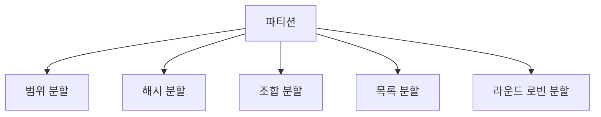

# 135 파티션의 종류

작성 기준일: 2026-06-01
검색/보강일: 2026-06-01
PDF 확인 위치: 20페이지, 3과목 데이터베이스 구축, 135 파티션의 종류

## 한 줄 요약

- 파티션은 큰 테이블을 기준에 따라 여러 부분으로 나누는 기법이며, PDF 기준 종류는 범위, 해시, 조합, 목록, 라운드 로빈 분할이다.

## 한눈에 보는 구조

| 종류 | 기준 | 시험 단서 |
|---|---|---|
| 범위 분할 | 지정 열 값의 범위 | 일별, 월별, 분기별 |
| 해시 분할 | 해시 함수 결과 | 균등 분산 |
| 조합 분할 | 범위 분할 후 해시 등 재분할 | Range + Hash |
| 목록 분할 | 지정 열 값 목록 | 지역, 상태, 코드 목록 |
| 라운드 로빈 분할 | 순서대로 균일 분배 | 균등 분배 |

## PDF 기준 핵심

- `범위 분할(Range Partitioning)`: 지정한 열의 값을 기준으로 범위를 지정하여 분할한다. 예는 일별, 월별, 분기별 등이다.
- `해시 분할(Hash Partitioning)`: 해시 함수를 적용한 결과 값에 따라 데이터를 분할한다.
- `조합 분할(Composite Partitioning)`: 범위 분할로 분할한 다음 해시 함수를 적용하여 다시 분할하는 방식이다.
- `목록 분할(List Partitioning)`: 지정한 열 값에 대한 목록을 만들어 이를 기준으로 분할한다.
- `라운드 로빈 분할(Round Robin Partitioning)`: 레코드를 균일하게 분배하는 방식이다.

## 개념 설명

### 파티션의 의미

- PostgreSQL 공식 문서는 파티셔닝을 논리적으로 하나의 큰 테이블을 더 작은 물리 조각으로 나누는 것이라고 설명한다.
- 파티션은 대용량 테이블의 조회 성능, 관리 편의, 보관 정책 처리에 도움을 줄 수 있다.

### 종류별 이해

- 범위 분할:
  - 날짜, 숫자 구간처럼 범위가 명확할 때 사용한다.
- 해시 분할:
  - 해시 함수 결과로 데이터를 나누어 특정 파티션에 치우치지 않게 한다.
- 조합 분할:
  - 먼저 기간별로 나누고, 각 기간 안에서 해시로 다시 나누는 식이다.
- 목록 분할:
  - 지역이 `서울`, `부산`, `대구`처럼 목록으로 정해질 때 사용한다.
- 라운드 로빈:
  - 들어오는 레코드를 여러 파티션에 돌아가며 배치해 균등 분산한다.

## 시험 포인트

- 범위 분할은 일별, 월별, 분기별 단서와 연결한다.
- 해시 분할은 해시 함수 결과 값이다.
- 조합 분할은 범위 분할 후 해시 함수 적용이다.
- 목록 분할은 열 값 목록 기준이다.
- 라운드 로빈은 균일 분배이다.

## 헷갈리는 비교

| 비교 | 범위 분할 | 목록 분할 |
|---|---|---|
| 기준 | 값의 구간 | 값의 목록 |
| 예 | 1월, 2월, 3월 | 서울, 부산, 제주 |

| 비교 | 해시 분할 | 라운드 로빈 |
|---|---|---|
| 기준 | 해시 함수 결과 | 순차적 균등 배분 |
| 목적 | 분산 | 균등 배치 |

## 예시 또는 암기 포인트

- 날짜는 범위 분할을 먼저 떠올린다.
- 지역 코드 목록은 목록 분할을 떠올린다.
- `Range + Hash`가 보이면 조합 분할이다.
- 암기 문장: `범해조목라`

## 빠른 복습

- 파티션 종류는 범위, 해시, 조합, 목록, 라운드 로빈이다.
- 범위는 값의 구간이다.
- 해시는 해시 함수 결과이다.
- 조합은 범위 후 해시이다.
- 목록은 값 목록, 라운드 로빈은 균일 분배이다.

## 참고 링크

- [PostgreSQL Documentation - Table Partitioning](https://www.postgresql.org/docs/17/ddl-partitioning.html)

<!-- study-links:start -->
## 관련 문서

- `해시`: [[정보처리기사/5과목 정보시스템 구축 관리/304 해시(Hash)/304 해시(Hash)|304 해시(Hash)]]
<!-- study-links:end -->
