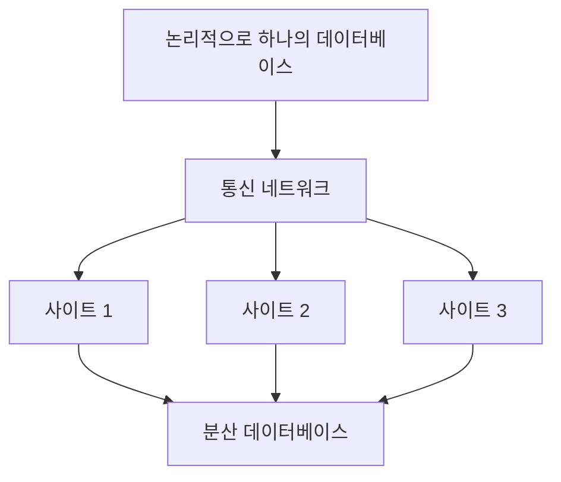

# 136 분산 데이터베이스

작성 기준일: 2026-06-01
검색/보강일: 2026-06-01
PDF 확인 위치: 20페이지, 3과목 데이터베이스 구축, 136 분산 데이터베이스

## 한 줄 요약

- 분산 데이터베이스는 논리적으로 하나의 시스템에 속하지만 물리적으로는 네트워크로 연결된 여러 사이트에 분산된 데이터베이스이다.

## 한눈에 보는 구조

| 구분 | 내용 |
|---|---|
| 논리 관점 | 하나의 데이터베이스 시스템 |
| 물리 관점 | 여러 사이트에 분산 |
| 연결 | 네트워크 |
| 구성 요소 | 분산 처리기, 분산 데이터베이스, 통신 네트워크 |
| 단점 | 설계 및 소프트웨어 개발이 어려움 |

## PDF 기준 핵심

- 논리적으로는 하나의 시스템에 속한다.
- 물리적으로는 네트워크를 통해 연결된 여러 개의 컴퓨터 사이트에 분산되어 있는 데이터베이스를 말한다.
- 데이터베이스 설계 및 소프트웨어 개발이 어렵다.
- 분산 데이터베이스의 구성 요소는 분산 처리기, 분산 데이터베이스, 통신 네트워크이다.

## 개념 설명

### 분산 데이터베이스의 의미

- 사용자는 하나의 데이터베이스처럼 접근하지만, 실제 데이터는 여러 위치에 나뉘어 저장될 수 있다.
- IBM Research의 분산 데이터베이스 논문은 데이터의 분산과 복제가 프로그램에 투명해야 한다고 설명한다.
- 분산 구조는 지역별 서비스, 고가용성, 부하 분산에 유리할 수 있지만 설계가 복잡하다.

### 구성 요소

- 분산 처리기:
  - 각 사이트의 질의 처리와 트랜잭션 처리를 담당한다.
- 분산 데이터베이스:
  - 여러 사이트에 나누어 저장된 데이터의 집합이다.
- 통신 네트워크:
  - 사이트 간 데이터 교환과 제어 정보를 전달한다.

## 시험 포인트

- 논리적으로 하나, 물리적으로 여러 사이트라는 문장을 기억한다.
- 네트워크로 연결된 컴퓨터 사이트에 분산된다.
- 구성 요소는 분산 처리기, 분산 데이터베이스, 통신 네트워크이다.
- 설계와 소프트웨어 개발이 어렵다는 단점도 PDF 핵심이다.
- 분산 데이터베이스 목표는 다음 항목의 투명성 네 가지와 연결된다.

## 헷갈리는 비교

| 비교 | 중앙 집중 DB | 분산 DB |
|---|---|---|
| 물리 위치 | 한 곳 중심 | 여러 사이트 |
| 논리 관점 | 하나 | 하나처럼 보이게 함 |
| 장점 | 관리 단순 | 지역성, 가용성, 확장성 |
| 단점 | 단일 지점 부담 | 설계·동기화·개발 복잡 |

## 예시 또는 암기 포인트

- 서울, 부산, 대구 지점에 데이터가 나뉘어 있어도 사용자는 하나의 고객 DB처럼 조회할 수 있다.
- 암기 문장: 분산 DB = `논리 하나, 물리 여러 곳`

## 빠른 복습

- 분산 데이터베이스는 Distributed Database이다.
- 논리적으로는 하나의 시스템이다.
- 물리적으로는 여러 사이트에 분산된다.
- 네트워크로 연결된다.
- 구성 요소는 분산 처리기, 분산 데이터베이스, 통신 네트워크이다.

## 참고 링크

- [IBM Research - Transactions and Consistency in Distributed Database Systems](https://research.ibm.com/publications/transactions-and-consistency-in-distributed-database-systems)

<!-- study-links:start -->
## 관련 문서

- `트랜잭션`: [[ACID-트랜잭션/ACID-트랜잭션|ACID 트랜잭션 상세 정리]]
- `물리적`: [[정보처리기사/5과목 정보시스템 구축 관리/320 관리적 물리적 기술적 보안/320 관리적 물리적 기술적 보안|320 관리적/물리적/기술적 보안]]
<!-- study-links:end -->
