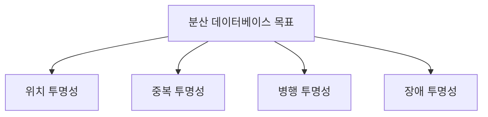

# 137 분산 데이터베이스의 목표

작성 기준일: 2026-06-01
검색/보강일: 2026-06-01
PDF 확인 위치: 20페이지, 3과목 데이터베이스 구축, 137 분산 데이터베이스의 목표

## 한 줄 요약

- 분산 데이터베이스의 목표는 위치, 중복, 병행, 장애 투명성을 제공해 사용자가 분산 구조를 의식하지 않고 정확하게 데이터를 사용하게 하는 것이다.

## 한눈에 보는 구조

| 목표 | 의미 | 시험 단서 |
|---|---|---|
| 위치 투명성 | 실제 위치를 몰라도 논리명으로 접근 | Location |
| 중복 투명성 | 중복 데이터가 하나처럼 보임 | Replication |
| 병행 투명성 | 동시 트랜잭션 결과가 영향받지 않음 | Concurrency |
| 장애 투명성 | 장애에도 정확히 처리 | Failure |

## PDF 기준 핵심

- `위치 투명성`: 데이터베이스의 실제 위치를 알 필요 없이 논리적인 명칭만으로 액세스할 수 있다.
- `중복 투명성`: 동일 데이터가 여러 곳에 중복되어 있어도 사용자는 하나의 데이터만 존재하는 것처럼 사용하고, 시스템은 여러 자료에 대한 작업을 자동 수행한다.
- `병행 투명성`: 다수의 트랜잭션들이 동시에 실행되어도 결과는 영향을 받지 않는다.
- `장애 투명성`: 트랜잭션, DBMS, 네트워크, 컴퓨터 장애에도 트랜잭션을 정확하게 처리한다.

## 개념 설명

### 투명성의 의미

- 투명성은 사용자가 내부 복잡성을 의식하지 않아도 되는 성질이다.
- IBM Research의 분산 DB 논문은 위치, 복제, 병행, 장애 투명성을 제공해야 한다고 설명한다.
- 시험에서는 각 투명성의 이름과 설명을 1:1로 연결하는 문제가 많다.

### 목표별 이해

- 위치 투명성:
  - 데이터가 서울 서버에 있는지 부산 서버에 있는지 몰라도 된다.
- 중복 투명성:
  - 같은 데이터가 여러 곳에 있어도 사용자에게는 하나처럼 보인다.
- 병행 투명성:
  - 여러 사용자가 동시에 작업해도 결과가 어긋나지 않는다.
- 장애 투명성:
  - 장애가 나도 트랜잭션이 정확하게 처리되도록 한다.

## 시험 포인트

- 실제 위치를 몰라도 되면 위치 투명성이다.
- 여러 곳에 중복되어 있어도 하나처럼 보이면 중복 투명성이다.
- 동시 실행 결과가 영향받지 않으면 병행 투명성이다.
- 장애에도 정확히 처리하면 장애 투명성이다.
- 네 가지 모두 `사용자에게 복잡성을 숨김`이라는 공통점이 있다.

## 헷갈리는 비교

| 비교 | 위치 투명성 | 중복 투명성 |
|---|---|---|
| 숨기는 것 | 데이터의 실제 위치 | 데이터의 중복 존재 |
| 사용자 관점 | 논리명으로 접근 | 하나의 데이터처럼 사용 |

| 비교 | 병행 투명성 | 장애 투명성 |
|---|---|---|
| 문제 상황 | 동시 트랜잭션 | 트랜잭션·DBMS·네트워크·컴퓨터 장애 |
| 목표 | 결과 간섭 방지 | 정확한 처리 보장 |

## 예시 또는 암기 포인트

- 암기어: `위중병장`
- 위치: 어디 있는지 숨김
- 중복: 몇 개 있는지 숨김
- 병행: 동시에 해도 안 꼬임
- 장애: 문제가 나도 정확히 처리

## 빠른 복습

- 분산 데이터베이스 목표는 위치, 중복, 병행, 장애 투명성이다.
- 위치 투명성은 논리명 접근이다.
- 중복 투명성은 하나처럼 사용이다.
- 병행 투명성은 동시 트랜잭션 영향 없음이다.
- 장애 투명성은 장애에도 정확한 처리이다.

## 참고 링크

- [IBM Research - Transactions and Consistency in Distributed Database Systems](https://research.ibm.com/publications/transactions-and-consistency-in-distributed-database-systems)
- [IBM - What Is Data Replication?](https://www.ibm.com/think/topics/data-replication)

