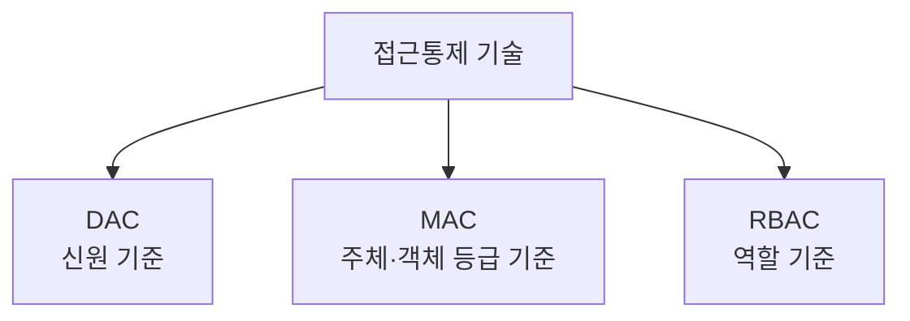

# 139 접근통제 기술

작성 기준일: 2026-06-01
검색/보강일: 2026-06-01
PDF 확인 위치: 20페이지, 3과목 데이터베이스 구축, 139 접근통제 기술

## 한 줄 요약

- 접근통제 기술은 데이터 접근 권한을 어떤 기준으로 부여하느냐에 따라 DAC, MAC, RBAC로 구분하며, 각각 신원, 보안 등급, 역할이 핵심 기준이다.

## 한눈에 보는 구조

| 기술 | 한글 | 권한 부여 기준 | 시험 단서 |
|---|---|---|---|
| DAC | 임의 접근통제 | 사용자 신원 | Discretionary |
| MAC | 강제 접근통제 | 주체와 객체의 등급 | Mandatory |
| RBAC | 역할기반 접근통제 | 사용자의 역할 | Role |

## PDF 기준 핵심

- `임의 접근통제(DAC; Discretionary Access Control)`: 데이터에 접근하는 사용자의 신원에 따라 접근 권한을 부여하는 방식이다.
- `강제 접근통제(MAC; Mandatory Access Control)`: 주체와 객체의 등급을 비교하여 접근 권한을 부여하는 방식이다.
- `역할기반 접근통제(RBAC; Role Based Access Control)`: 사용자의 역할에 따라 접근 권한을 부여하는 방식이다.

## 개념 설명

### DAC

- DAC는 사용자의 신원과 소유자 권한에 기반한 접근통제 방식으로 이해한다.
- NIST CSRC 용어집은 DAC를 접근 권한을 가진 주체가 그 권한을 다른 주체에게 넘기거나 권한 규칙을 바꿀 수 있는 재량적 성격으로 설명한다.
- 시험에서는 PDF 표현인 `사용자 신원`을 우선 기억한다.

### MAC

- MAC은 중앙 정책과 보안 등급에 따라 접근을 강제한다.
- 주체는 사용자나 프로세스이고, 객체는 파일이나 데이터 같은 보호 대상이다.
- 등급 비교가 핵심이므로 군사 보안 모델과 함께 출제되기 쉽다.

### RBAC

- RBAC는 개인이 아니라 역할에 권한을 부여한다.
- NIST RBAC 자료는 역할을 권한 집합으로 정의하는 접근통제 모델을 설명한다.
- 예:
  - DBA 역할
  - 개발자 역할
  - 감사자 역할

## 시험 포인트

- DAC는 신원 기준이다.
- MAC은 주체와 객체의 등급 비교이다.
- RBAC는 역할 기준이다.
- Discretionary, Mandatory, Role Based의 영어를 함께 외운다.
- Bell-LaPadula는 MAC 계열의 기밀성 모델로 연결해서 이해한다.

## 헷갈리는 비교

| 비교 | DAC | MAC | RBAC |
|---|---|---|---|
| 기준 | 사용자 신원 | 주체·객체 등급 | 역할 |
| 통제 성격 | 재량적 | 강제적 | 직무 중심 |
| 예 | 소유자가 권한 부여 | 보안 등급 비교 | DBA 역할에 권한 부여 |

## 예시 또는 암기 포인트

- DAC: `누구냐`
- MAC: `등급이 맞냐`
- RBAC: `무슨 역할이냐`
- 암기 문장: `D는 신원, M은 등급, R은 역할`

## 빠른 복습

- 접근통제 기술은 DAC, MAC, RBAC이다.
- DAC는 사용자의 신원에 따라 권한을 부여한다.
- MAC은 주체와 객체의 등급을 비교한다.
- RBAC는 사용자의 역할에 따라 권한을 부여한다.
- 접근통제는 데이터 보안과 권한 관리의 핵심이다.

## 참고 링크

- [NIST CSRC Glossary - Discretionary Access Control](https://csrc.nist.gov/glossary/term/discretionary_access_control)
- [NIST CSRC - Role Based Access Control FAQ](https://csrc.nist.gov/Projects/role-based-access-control/faqs)
- [NIST SP 800-162 - Attribute Based Access Control](https://nvlpubs.nist.gov/nistpubs/specialpublications/nist.sp.800-162.pdf)

<!-- study-links:start -->
## 관련 문서

- `rbac`: [[abac-rbac/abac-rbac|ABAC와 RBAC 권한 모델]]
<!-- study-links:end -->
