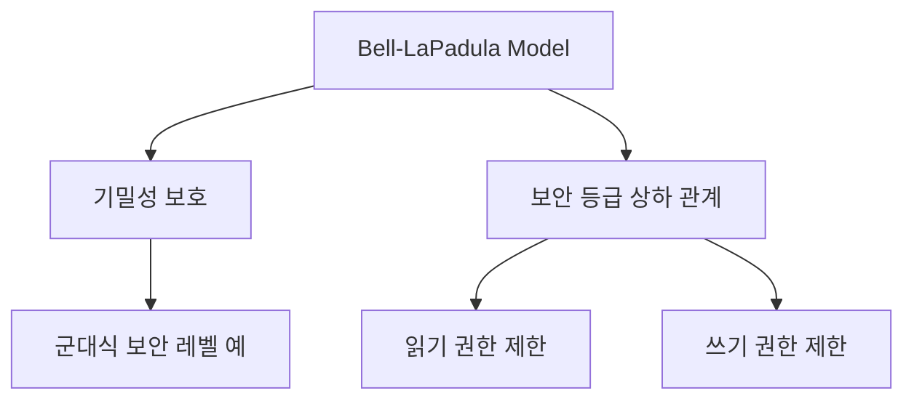

# 140 벨 라파듈라 모델(Bell-LaPadula Model)

작성 기준일: 2026-06-01
검색/보강일: 2026-06-01
PDF 확인 위치: 20페이지, 3과목 데이터베이스 구축, 140 벨 라파듈라 모델(Bell-LaPadula Model)

## 한 줄 요약

- Bell-LaPadula 모델은 정보의 기밀성을 보호하기 위해 보안 등급을 기준으로 읽기와 쓰기 권한을 제한하는 접근제어 모델이다.

## 한눈에 보는 구조

| 구분 | 내용 |
|---|---|
| 목적 | 기밀성 보호 |
| 기준 | 보안 취급자의 등급 |
| 통제 대상 | 읽기 권한, 쓰기 권한 |
| 접근통제 계열 | MAC과 연결 |
| 대표 암기 | No Read Up, No Write Down |

## PDF 기준 핵심

- 군대의 보안 레벨처럼 정보의 기밀성에 따라 상하 관계가 구분된 정보를 보호하기 위해 사용하는 접근제어 모델이다.
- 보안 취급자의 등급을 기준으로 읽기 권한과 쓰기 권한이 제한된다.

## 개념 설명

### 모델의 의미

- Bell-LaPadula 모델은 기밀성 중심 보안 모델이다.
- NIST 자료는 Bell-LaPadula를 기밀성 모델로 언급하며, 다단계 보안 모델의 대표 예로 다룬다.
- 시험에서는 무결성보다 기밀성과 연결해야 한다.

### 보안 등급

- 정보와 사용자는 서로 다른 보안 등급을 가질 수 있다.
- 예:
  - Top Secret
  - Secret
  - Confidential
  - Unclassified
- 등급을 기준으로 낮은 등급 사용자가 높은 등급 정보를 읽지 못하게 한다.

### No Read Up, No Write Down

- 보조 암기 포인트:
  - No Read Up: 낮은 등급 주체가 높은 등급 객체를 읽지 못한다.
  - No Write Down: 높은 등급 주체가 낮은 등급 객체로 정보를 쓰지 못한다.
- PDF에는 이 표현이 직접 나오지는 않지만, 읽기와 쓰기 권한 제한을 이해하는 데 도움이 된다.

## 시험 포인트

- Bell-LaPadula는 기밀성 모델이다.
- 군대식 보안 레벨처럼 상하 등급이 있다.
- 보안 취급자의 등급을 기준으로 읽기와 쓰기 권한을 제한한다.
- MAC과 연결된다.
- Biba 모델은 무결성 중심으로 대비될 수 있다.

## 헷갈리는 비교

| 비교 | Bell-LaPadula | Biba |
|---|---|---|
| 보호 목표 | 기밀성 | 무결성 |
| 대표 규칙 | No Read Up, No Write Down | No Read Down, No Write Up |
| 시험 단서 | 군대 보안 레벨, 기밀성 | 데이터 무결성 |

## 예시 또는 암기 포인트

- 낮은 등급 사용자가 높은 등급 문서를 읽을 수 없게 한다.
- 높은 등급 사용자가 낮은 등급 영역에 민감 정보를 쓰지 못하게 한다.
- 암기 문장: `Bell은 비밀을 지킨다`

## 빠른 복습

- Bell-LaPadula 모델은 기밀성 보호 모델이다.
- 정보의 기밀성에 따라 상하 관계가 구분된다.
- 보안 취급자의 등급을 기준으로 읽기와 쓰기 권한이 제한된다.
- MAC 계열과 연결된다.
- Biba와 비교하면 Bell-LaPadula는 기밀성, Biba는 무결성이다.

## 참고 링크

- [NIST SP 800-162 - Attribute Based Access Control](https://nvlpubs.nist.gov/nistpubs/specialpublications/nist.sp.800-162.pdf)
- [NIST - Assessment of Access Control Systems](https://tsapps.nist.gov/publication/get_pdf.cfm?pub_id=50886)

<!-- study-links:start -->
## 관련 문서

- `무결성`: [[정보처리기사/3과목 데이터베이스 구축/115 무결성/115 무결성|115 무결성]]
<!-- study-links:end -->
