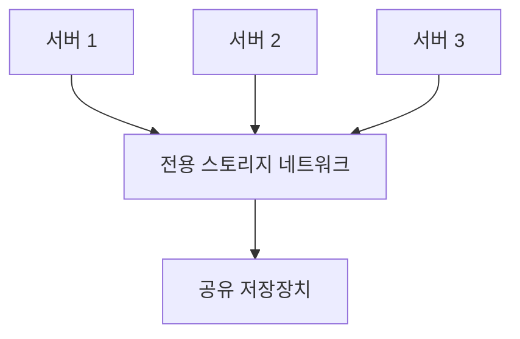

# 142 SAN(Storage Area Network)

작성 기준일: 2026-06-01
검색/보강일: 2026-06-01
PDF 확인 위치: 21페이지, 3과목 데이터베이스 구축, 142 SAN(Storage Area Network)

## 한 줄 요약

- SAN은 서버와 저장장치를 연결하는 전용 네트워크를 별도로 구성해 고속 저장 접근과 공유를 지원하는 방식이다.

## 한눈에 보는 구조

| 구분 | 내용 |
|---|---|
| 전체 이름 | Storage Area Network |
| 연결 방식 | 서버와 저장장치를 별도 전용 네트워크로 연결 |
| 성격 | 고속 스토리지 네트워크 |
| 장점 | 여러 서버 공유, 성능, 확장성 |
| PDF 단서 | DAS의 빠른 처리 + NAS의 파일 공유 장점 혼합 |

## PDF 기준 핵심

- SAN은 DAS의 빠른 처리와 NAS의 파일 공유 장점을 혼합한 방식이다.
- 서버와 저장장치를 연결하는 전용 네트워크를 별도로 구성한다.

## 개념 설명

### SAN의 의미

- IBM은 SAN을 서버, 스토리지 시스템, 네트워크 스위치, 소프트웨어와 서비스가 결합된 전용 네트워크로 설명한다.
- SAN은 저장장치를 특정 서버 버스에 묶어두지 않고, 전용 네트워크를 통해 여러 서버가 스토리지에 접근하게 한다.
- 기업 환경에서 고성능 데이터베이스, 가상화, 백업, 재해복구 등에 사용된다.

### DAS와의 차이

- DAS는 서버에 저장장치를 직접 연결한다.
- SAN은 서버와 저장장치 사이에 전용 네트워크를 둔다.
- SAN은 구성이 복잡하고 비용이 들지만, 공유와 확장에 유리하다.

## 시험 포인트

- SAN은 Storage Area Network이다.
- 전용 네트워크를 별도로 구성한다.
- DAS의 빠른 처리와 NAS의 파일 공유 장점 혼합이라는 PDF 표현을 기억한다.
- DAS는 직접 연결, SAN은 네트워크 연결이다.

## 헷갈리는 비교

| 비교 | DAS | NAS | SAN |
|---|---|---|---|
| 연결 | 직접 케이블 | 일반 네트워크 파일 공유 | 전용 스토리지 네트워크 |
| 중심 | 서버-디스크 직접 연결 | 파일 공유 | 블록 스토리지 접근 |
| 시험 단서 | 외장하드 | 파일 공유 | DAS+NAS 장점, 전용 네트워크 |

## 예시 또는 암기 포인트

- SAN = `Storage 전용 Area Network`
- 서버 여러 대가 전용 저장소 네트워크를 통해 스토리지 풀에 접근하는 구조로 기억한다.

## 빠른 복습

- SAN은 Storage Area Network이다.
- DAS의 빠른 처리와 NAS의 파일 공유 장점을 혼합한다.
- 서버와 저장장치를 전용 네트워크로 연결한다.
- 고성능과 공유, 확장성이 필요한 환경에서 사용된다.

## 참고 링크

- [IBM - What is a storage area network?](https://www.ibm.com/topics/storage-area-network)
- [IBM Docs - Storage area networks](https://www.ibm.com/docs/en/i/7.6.0?topic=solutions-storage-area-networks)

