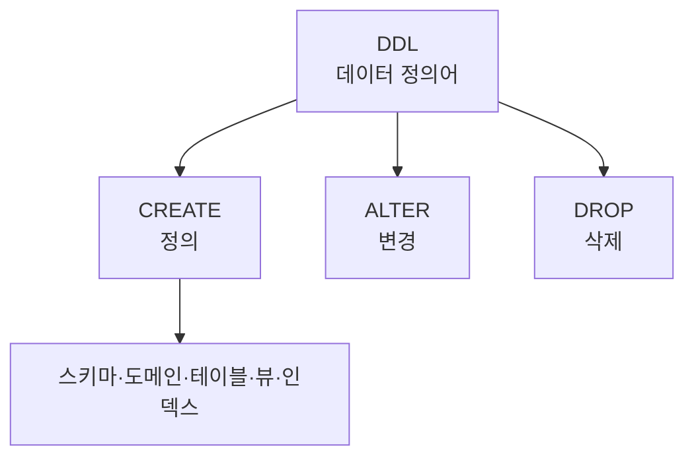

# 143 DDL(데이터 정의어)

작성 기준일: 2026-06-01
검색/보강일: 2026-06-01
PDF 확인 위치: 21페이지, 3과목 데이터베이스 구축, 143 DDL(데이터 정의어)

## 한 줄 요약

- DDL은 스키마, 도메인, 테이블, 뷰, 인덱스 같은 데이터베이스 객체를 정의, 변경, 삭제할 때 사용하는 언어이다.

## 한눈에 보는 구조

| 명령 | 역할 | 시험 단서 |
|---|---|---|
| CREATE | 객체 정의 | 만들기 |
| ALTER | TABLE 정의 변경 | 수정 |
| DROP | 객체 삭제 | 제거 |

## PDF 기준 핵심

- DDL은 스키마, 도메인, 테이블, 뷰, 인덱스를 정의하거나 변경 또는 삭제할 때 사용하는 언어이다.
- `CREATE`: 스키마, 도메인, 테이블, 뷰, 인덱스를 정의한다.
- `ALTER`: TABLE에 대한 정의를 변경하는 데 사용한다.
- `DROP`: 스키마, 도메인, 테이블, 뷰, 인덱스를 삭제한다.

## 개념 설명

### DDL의 의미

- DDL은 Data Definition Language이다.
- 데이터 자체의 행을 다루기보다 데이터베이스 구조와 객체 정의를 다룬다.
- PostgreSQL 공식 문서의 Data Definition 장도 테이블, 기본값, 제약, 시스템 컬럼, 스키마 등 데이터 구조 정의를 다룬다.

### DML, DCL과의 위치

- DDL은 구조를 만든다.
- DML은 데이터를 조회·삽입·삭제·변경한다.
- DCL은 권한, 트랜잭션, 보안과 제어를 다룬다.

## 시험 포인트

- DDL은 데이터 정의어이다.
- CREATE, ALTER, DROP을 외운다.
- CREATE는 정의, ALTER는 변경, DROP은 삭제이다.
- SELECT, INSERT, DELETE, UPDATE는 DML이다.
- COMMIT, ROLLBACK, GRANT, REVOKE는 DCL로 묶인다.

## 헷갈리는 비교

| 구분 | DDL | DML | DCL |
|---|---|---|---|
| 대상 | 구조와 객체 | 실제 데이터 | 권한·제어 |
| 대표 명령 | CREATE, ALTER, DROP | SELECT, INSERT, DELETE, UPDATE | COMMIT, ROLLBACK, GRANT, REVOKE |

## 예시 또는 암기 포인트

- 테이블을 만드는 명령은 CREATE TABLE이므로 DDL이다.
- 테이블 구조를 바꾸는 명령은 ALTER TABLE이므로 DDL이다.
- 테이블을 제거하는 명령은 DROP TABLE이므로 DDL이다.

## 빠른 복습

- DDL은 Data Definition Language이다.
- 스키마, 도메인, 테이블, 뷰, 인덱스를 정의·변경·삭제한다.
- CREATE, ALTER, DROP이 핵심 명령이다.
- 데이터 행 조작은 DML이다.

## 참고 링크

- [PostgreSQL Documentation - Data Definition](https://www.postgresql.org/docs/current/ddl.html)
- [PostgreSQL Documentation - CREATE TABLE](https://www.postgresql.org/docs/current/sql-createtable.html)
- [PostgreSQL Documentation - ALTER TABLE](https://www.postgresql.org/docs/current/sql-altertable.html)
- [PostgreSQL Documentation - DROP TABLE](https://www.postgresql.org/docs/current/sql-droptable.html)

