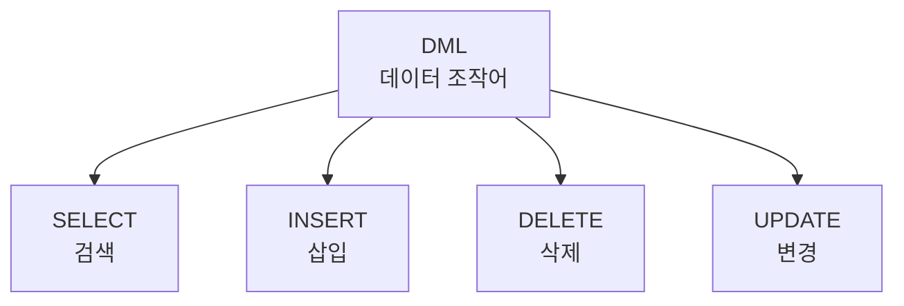

# 144 DML(데이터 조작어)

작성 기준일: 2026-06-01
검색/보강일: 2026-06-01
PDF 확인 위치: 21페이지, 3과목 데이터베이스 구축, 144 DML(데이터 조작어)

## 한 줄 요약

- DML은 데이터베이스 사용자가 응용 프로그램이나 질의어를 통해 저장된 데이터를 실제로 검색, 삽입, 삭제, 변경할 때 사용하는 언어이다.

## 한눈에 보는 구조

| 명령 | 기능 | 기본 형태 |
|---|---|---|
| SELECT | 검색 | SELECT ~ FROM ~ WHERE |
| INSERT | 삽입 | INSERT INTO ~ VALUES |
| DELETE | 삭제 | DELETE FROM ~ WHERE |
| UPDATE | 변경 | UPDATE ~ SET ~ WHERE |

## PDF 기준 핵심

- DML은 데이터베이스 사용자가 응용 프로그램이나 질의어를 통하여 저장된 데이터를 실질적으로 처리하는 데 사용되는 언어이다.
- `SELECT`: 테이블에서 조건에 맞는 튜플을 검색한다.
- `INSERT`: 테이블에 새로운 튜플을 삽입한다.
- `DELETE`: 테이블에서 조건에 맞는 튜플을 삭제한다.
- `UPDATE`: 테이블에서 조건에 맞는 튜플의 내용을 변경한다.

## 개념 설명

### DML의 의미

- DML은 Data Manipulation Language이다.
- PostgreSQL 공식 문서의 Data Manipulation 장은 삽입, 갱신, 삭제, 반환 데이터 등을 다룬다.
- DML은 테이블 구조가 아니라 저장된 데이터 자체를 조작한다.

### WHERE의 중요성

- SELECT, DELETE, UPDATE는 조건 없이 수행하면 많은 행이 대상이 될 수 있다.
- 시험에서는 기본 명령 기능이 중요하지만, 실무에서는 WHERE 조건이 매우 중요하다.

## 시험 포인트

- DML은 데이터 조작어이다.
- SELECT, INSERT, DELETE, UPDATE를 묶어 기억한다.
- SELECT는 검색이다.
- INSERT는 삽입이다.
- DELETE는 삭제이다.
- UPDATE는 변경이다.

## 헷갈리는 비교

| 작업 | SQL | 분류 |
|---|---|---|
| 테이블 생성 | CREATE TABLE | DDL |
| 행 검색 | SELECT | DML |
| 행 삽입 | INSERT | DML |
| 권한 부여 | GRANT | DCL |

## 예시 또는 암기 포인트

- 암기 문장: DML = `셀인딜업`
- SELECT, INSERT, DELETE, UPDATE 순서로 기본 기능을 외운다.

## 빠른 복습

- DML은 Data Manipulation Language이다.
- 저장된 데이터를 실질적으로 처리한다.
- SELECT는 검색, INSERT는 삽입이다.
- DELETE는 삭제, UPDATE는 변경이다.
- 구조 정의는 DDL과 구분한다.

## 참고 링크

- [PostgreSQL Documentation - Data Manipulation](https://www.postgresql.org/docs/current/dml.html)

