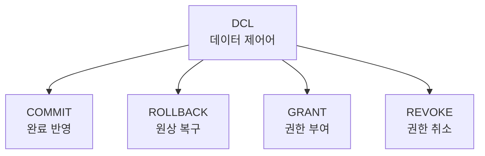

# 145 DCL(데이터 제어어)

작성 기준일: 2026-06-01
검색/보강일: 2026-06-01
PDF 확인 위치: 21페이지, 3과목 데이터베이스 구축, 145 DCL(데이터 제어어)

## 한 줄 요약

- DCL은 데이터의 보안, 무결성, 회복, 병행 수행 제어 등을 정의하는 언어로, 시험에서는 COMMIT, ROLLBACK, GRANT, REVOKE를 함께 묶어 기억한다.

## 한눈에 보는 구조

| 명령 | 기능 | 시험 단서 |
|---|---|---|
| COMMIT | 수행 결과를 실제 저장하고 작업 완료 알림 | 트랜잭션 확정 |
| ROLLBACK | 비정상 종료 시 원래 상태로 복구 | 트랜잭션 취소 |
| GRANT | 사용자에게 권한 부여 | 권한 부여 |
| REVOKE | 사용자 권한 취소 | 권한 회수 |

## PDF 기준 핵심

- DCL은 데이터의 보안, 무결성, 회복, 병행 수행 제어 등을 정의하는 데 사용되는 언어이다.
- `COMMIT`: 명령에 의해 수행된 결과를 실제 물리적 디스크로 저장하고, 데이터베이스 조작 작업이 정상적으로 완료되었음을 관리자에게 알려준다.
- `ROLLBACK`: 데이터베이스 조작 작업이 비정상적으로 종료되었을 때 원래의 상태로 복구한다.
- `GRANT`: 데이터베이스 사용자에게 사용 권한을 부여한다.
- `REVOKE`: 데이터베이스 사용자의 사용 권한을 취소한다.

## 개념 설명

### DCL의 의미

- DCL은 Data Control Language이다.
- 시험에서는 넓게 트랜잭션 제어와 권한 제어 명령을 DCL로 묶는다.
- PostgreSQL 공식 문서는 COMMIT이 현재 트랜잭션을 확정하고 변경 내용을 durable하게 보장한다고 설명한다.
- ROLLBACK은 현재 트랜잭션을 되돌리고 트랜잭션의 갱신 내용을 폐기한다.

### 권한 제어

- GRANT는 권한을 준다.
- REVOKE는 권한을 회수한다.
- PostgreSQL 공식 문서도 GRANT는 접근 권한 부여, REVOKE는 접근 권한 제거로 설명한다.

## 시험 포인트

- DCL은 데이터 제어어이다.
- 보안, 무결성, 회복, 병행 수행 제어와 연결된다.
- COMMIT은 정상 완료 확정이다.
- ROLLBACK은 원래 상태 복구이다.
- GRANT는 권한 부여, REVOKE는 권한 취소이다.

## 헷갈리는 비교

| 구분 | DDL | DML | DCL |
|---|---|---|---|
| 대표 | CREATE, ALTER, DROP | SELECT, INSERT, DELETE, UPDATE | COMMIT, ROLLBACK, GRANT, REVOKE |
| 목적 | 구조 정의 | 데이터 조작 | 제어와 권한 |

## 예시 또는 암기 포인트

- `COMMIT`은 저장 확정이다.
- `ROLLBACK`은 되돌리기이다.
- `GRANT`는 준다.
- `REVOKE`는 뺏는다.

## 빠른 복습

- DCL은 Data Control Language이다.
- 보안, 무결성, 회복, 병행 수행 제어를 다룬다.
- COMMIT과 ROLLBACK은 트랜잭션 제어이다.
- GRANT와 REVOKE는 권한 제어이다.

## 참고 링크

- [PostgreSQL Documentation - COMMIT](https://www.postgresql.org/docs/current/sql-commit.html)
- [PostgreSQL Documentation - ROLLBACK](https://www.postgresql.org/docs/current/sql-rollback.html)
- [PostgreSQL Documentation - GRANT](https://www.postgresql.org/docs/current/sql-grant.html)
- [PostgreSQL Documentation - REVOKE](https://www.postgresql.org/docs/current/sql-revoke.html)

