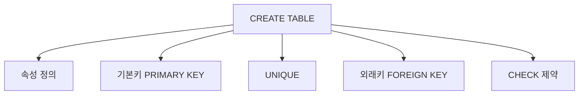

# 146 CREATE TABLE

작성 기준일: 2026-06-01
검색/보강일: 2026-06-01
PDF 확인 위치: 21페이지, 3과목 데이터베이스 구축, 146 CREATE TABLE

## 한 줄 요약

- CREATE TABLE은 새 테이블을 정의하는 DDL 명령으로, 속성명과 데이터 타입, 기본값, NOT NULL, 기본키, 대체키, 외래키, CHECK 제약 등을 지정할 수 있다.



## 한눈에 보는 구조

| 구성 | 의미 |
|---|---|
| 테이블명 | 만들 테이블 이름 |
| 속성명 데이터_타입 | 컬럼 이름과 타입 |
| DEFAULT | 기본값 |
| NOT NULL | NULL 금지 |
| PRIMARY KEY | 기본키 |
| UNIQUE | 대체키 후보 제약 |
| FOREIGN KEY | 외래키 |
| CHECK | 조건 제약 |

## PDF 기준 핵심

- CREATE TABLE은 테이블을 정의하는 명령문이다.
- PDF 표기 형식:

```sql
CREATE TABLE 테이블명
 (속성명 데이터_타입 [DEFAULT 기본값] [NOT NULL], ...
 [, PRIMARY KEY(기본키_속성명, ...)]
 [, UNIQUE(대체키_속성명, ...)]
 [, FOREIGN KEY(외래키_속성명, ...)]
  [ REFERENCES 참조테이블(기본키_속성명, ...)]
  [ ON DELETE 옵션]
  [ ON UPDATE 옵션]
 [, CONSTRAINT 제약조건명] [CHECK (조건식)]);
```

## 개념 설명

### CREATE TABLE의 의미

- PostgreSQL 공식 문서는 CREATE TABLE이 새 테이블을 정의한다고 설명한다.
- CREATE TABLE은 DDL에 속한다.
- 테이블 구조뿐 아니라 주요 무결성 제약을 함께 선언할 수 있다.

### 제약 조건

- PRIMARY KEY:
  - 기본키를 지정한다.
- UNIQUE:
  - 중복을 허용하지 않는 속성 또는 속성 집합을 지정한다.
- FOREIGN KEY:
  - 다른 테이블의 키를 참조한다.
- CHECK:
  - 특정 조건을 만족하는 값만 허용한다.

## 시험 포인트

- CREATE TABLE은 테이블 정의 명령이다.
- 속성명과 데이터 타입을 함께 쓴다.
- DEFAULT와 NOT NULL은 컬럼 제약으로 출제될 수 있다.
- PRIMARY KEY, UNIQUE, FOREIGN KEY, CHECK를 구분한다.
- REFERENCES는 외래키가 참조하는 테이블과 키를 지정한다.

## 헷갈리는 비교

| 구문 | 역할 |
|---|---|
| PRIMARY KEY | 기본키 지정 |
| UNIQUE | 중복 금지 |
| FOREIGN KEY ... REFERENCES | 외래키와 참조 대상 지정 |
| CHECK | 값 조건 제한 |
| DEFAULT | 값 생략 시 기본값 |

## 예시 또는 암기 포인트

```sql
CREATE TABLE 학생 (
  학번 CHAR(8) NOT NULL,
  이름 VARCHAR(20) NOT NULL,
  학과코드 CHAR(4),
  PRIMARY KEY (학번)
);
```

- 암기 문장: CREATE TABLE = `테이블 구조와 제약을 처음 정의`

## 빠른 복습

- CREATE TABLE은 테이블 정의 명령문이다.
- DDL에 속한다.
- 속성명, 데이터 타입, DEFAULT, NOT NULL을 지정할 수 있다.
- PRIMARY KEY, UNIQUE, FOREIGN KEY, CHECK 제약을 선언할 수 있다.
- 외래키는 REFERENCES와 연결된다.

## 참고 링크

- [PostgreSQL Documentation - CREATE TABLE](https://www.postgresql.org/docs/current/sql-createtable.html)

