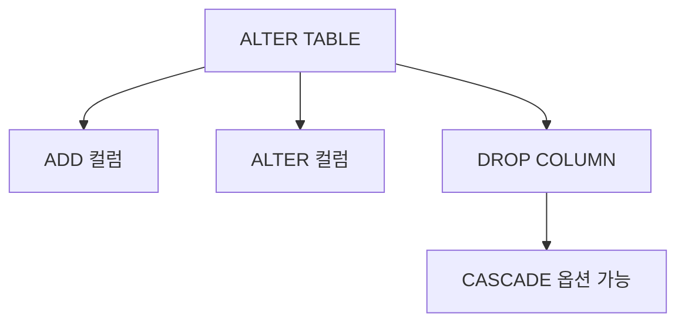

# 147 ALTER TABLE

작성 기준일: 2026-06-01
검색/보강일: 2026-06-01
PDF 확인 위치: 21페이지, 3과목 데이터베이스 구축, 147 ALTER TABLE

## 한 줄 요약

- ALTER TABLE은 기존 테이블의 정의를 변경하는 DDL 명령으로, 컬럼 추가, 기본값 변경, 컬럼 삭제 같은 작업에 사용된다.



## 한눈에 보는 구조

| 작업 | PDF 표기 | 의미 |
|---|---|---|
| 컬럼 추가 | ADD 속성명 데이터_타입 | 새 속성 추가 |
| 컬럼 속성 변경 | ALTER 속성명 SET DEFAULT | 기본값 등 변경 |
| 컬럼 삭제 | DROP COLUMN 속성명 | 기존 속성 제거 |
| 연쇄 처리 | CASCADE | 의존 객체까지 함께 처리 |

## PDF 기준 핵심

- ALTER TABLE은 테이블에 대한 정의를 변경하는 명령문이다.
- PDF 표기 형식:

```sql
ALTER TABLE 테이블명 ADD 속성명 데이터_타입 [DEFAULT '기본값'];
ALTER TABLE 테이블명 ALTER 속성명 [SET DEFAULT '기본값'];
ALTER TABLE 테이블명 DROP COLUMN 속성명 [CASCADE];
```

## 개념 설명

### ALTER TABLE의 의미

- PostgreSQL 공식 문서는 ALTER TABLE이 테이블 정의를 변경한다고 설명한다.
- 이미 만들어진 테이블에 컬럼을 추가하거나, 컬럼의 기본값을 바꾸거나, 컬럼을 삭제하는 데 사용한다.
- CREATE TABLE이 처음 만드는 명령이라면 ALTER TABLE은 나중에 구조를 바꾸는 명령이다.

### CASCADE 주의

- DROP COLUMN에서 CASCADE를 사용하면 해당 컬럼에 의존하는 객체도 함께 영향을 받을 수 있다.
- PostgreSQL 문서도 테이블 밖의 객체가 컬럼에 의존하면 CASCADE가 필요할 수 있다고 설명한다.
- 시험에서는 CASCADE가 `연쇄적으로 함께 처리`한다는 단서로 나온다.

## 시험 포인트

- ALTER TABLE은 테이블 정의 변경 명령이다.
- ADD는 속성 추가이다.
- ALTER는 속성 정의 변경이다.
- DROP COLUMN은 속성 삭제이다.
- CASCADE는 의존 객체까지 함께 처리하는 옵션으로 이해한다.

## 헷갈리는 비교

| 명령 | 역할 |
|---|---|
| CREATE TABLE | 새 테이블 정의 |
| ALTER TABLE | 기존 테이블 정의 변경 |
| DROP TABLE | 테이블 자체 제거 |
| DROP COLUMN | 테이블 안의 컬럼 제거 |

## 예시 또는 암기 포인트

```sql
ALTER TABLE 학생 ADD 이메일 VARCHAR(100);
ALTER TABLE 학생 ALTER 이메일 SET DEFAULT 'none';
ALTER TABLE 학생 DROP COLUMN 이메일 CASCADE;
```

- 암기 문장: ALTER TABLE = `이미 있는 테이블 구조 고치기`

## 빠른 복습

- ALTER TABLE은 DDL이다.
- 테이블 정의를 변경한다.
- ADD, ALTER, DROP COLUMN이 PDF 핵심 표기이다.
- DEFAULT 변경과 CASCADE 옵션을 함께 기억한다.

## 참고 링크

- [PostgreSQL Documentation - ALTER TABLE](https://www.postgresql.org/docs/current/sql-altertable.html)

