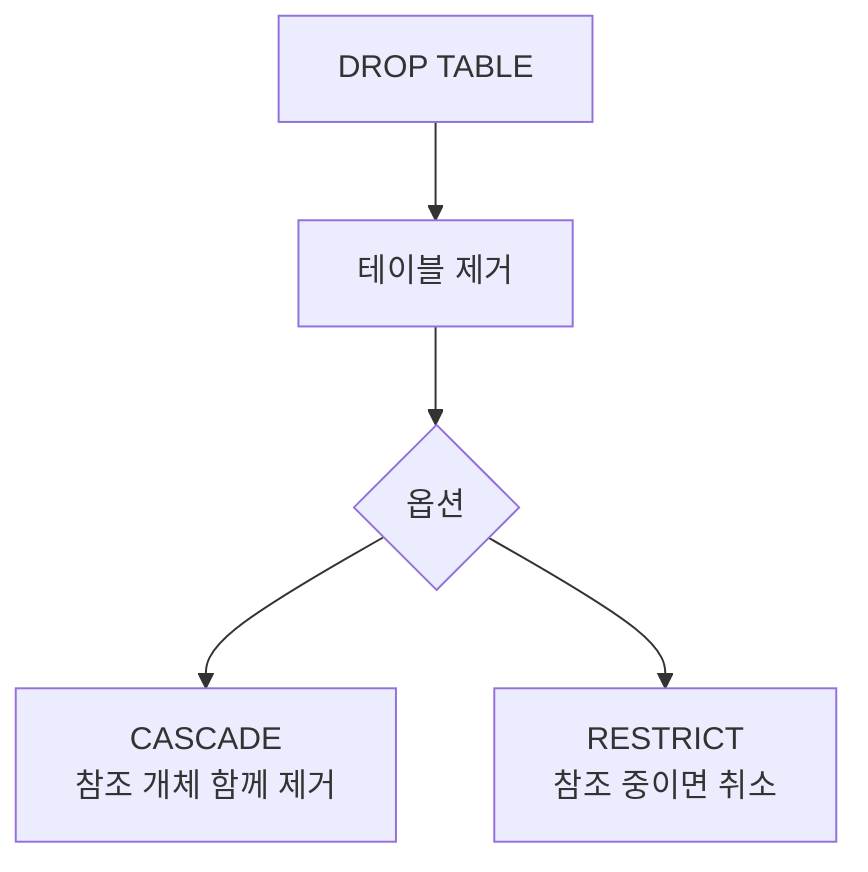

# 148 DROP TABLE

작성 기준일: 2026-06-01
검색/보강일: 2026-06-01
PDF 확인 위치: 21페이지, 3과목 데이터베이스 구축, 148 DROP TABLE

## 한 줄 요약

- DROP TABLE은 기본 테이블을 제거하는 DDL 명령이며, CASCADE는 참조하는 다른 개체까지 함께 제거하고 RESTRICT는 참조 중이면 제거를 취소한다.



## 한눈에 보는 구조

| 옵션 | 의미 | 시험 단서 |
|---|---|---|
| CASCADE | 제거할 요소를 참조하는 다른 모든 개체를 함께 제거 | 연쇄 삭제 |
| RESTRICT | 다른 개체가 참조 중이면 제거 취소 | 제한, 보호 |

## PDF 기준 핵심

- DROP TABLE은 기본 테이블을 제거하는 명령문이다.
- PDF 표기 형식:

```sql
DROP TABLE 테이블명 [CASCADE | RESTRICT];
```

- `CASCADE`: 제거할 요소를 참조하는 다른 모든 개체를 함께 제거한다.
- `RESTRICT`: 다른 개체가 제거할 요소를 참조 중일 때는 제거를 취소한다.

## 개념 설명

### DROP TABLE의 의미

- PostgreSQL 공식 문서는 DROP TABLE이 데이터베이스에서 테이블을 제거한다고 설명한다.
- CREATE TABLE이 생성, ALTER TABLE이 변경이라면 DROP TABLE은 제거이다.
- 데이터와 구조 자체가 사라지는 명령이므로 DELETE와 구분해야 한다.

### CASCADE와 RESTRICT

- CASCADE는 의존 객체를 함께 처리한다.
- RESTRICT는 의존 객체가 있으면 제거하지 않는다.
- 시험에서는 두 옵션의 방향을 바꿔 내기 쉽다.

## 시험 포인트

- DROP TABLE은 테이블 제거 명령이다.
- CASCADE는 참조하는 다른 개체도 함께 제거한다.
- RESTRICT는 참조 중이면 제거를 취소한다.
- DROP은 DDL이고 DELETE는 DML이다.
- DROP TABLE은 행 일부 삭제가 아니라 테이블 자체 제거이다.

## 헷갈리는 비교

| 비교 | DROP TABLE | DELETE |
|---|---|---|
| 분류 | DDL | DML |
| 대상 | 테이블 자체 | 튜플, 행 |
| 결과 | 구조 제거 | 데이터 일부 또는 전체 삭제 |
| WHERE | 사용하지 않음 | 조건 지정 가능 |

## 예시 또는 암기 포인트

```sql
DROP TABLE 학생 RESTRICT;
DROP TABLE 학생 CASCADE;
```

- `CASCADE`는 폭포처럼 연쇄 처리한다.
- `RESTRICT`는 참조가 있으면 막는다.

## 빠른 복습

- DROP TABLE은 기본 테이블을 제거한다.
- CASCADE는 참조 개체를 함께 제거한다.
- RESTRICT는 참조 중이면 제거를 취소한다.
- DROP은 DDL, DELETE는 DML이다.

## 참고 링크

- [PostgreSQL Documentation - DROP TABLE](https://www.postgresql.org/docs/current/sql-droptable.html)
- [PostgreSQL Documentation - ALTER TABLE](https://www.postgresql.org/docs/current/sql-altertable.html)

