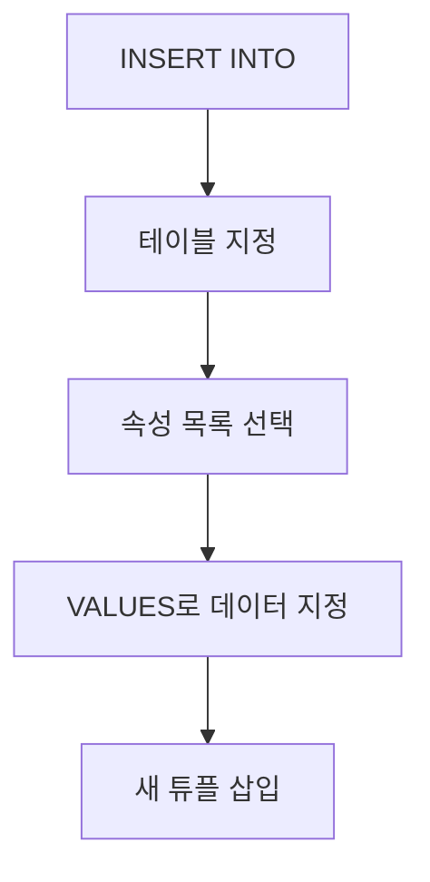

# 149 삽입문(INSERT INTO~)

작성 기준일: 2026-06-01
검색/보강일: 2026-06-01
PDF 확인 위치: 22페이지, 3과목 데이터베이스 구축, 149 삽입문(INSERT INTO~)

## 한 줄 요약

- INSERT INTO는 기본 테이블에 새로운 튜플을 삽입할 때 사용하는 DML 명령이다.



## 한눈에 보는 구조

| 구분 | 내용 |
|---|---|
| 명령 | INSERT INTO |
| 분류 | DML |
| 목적 | 새로운 튜플 삽입 |
| 대상 | 기본 테이블 |
| 핵심 구문 | INSERT INTO 테이블명(...) VALUES (...) |

## PDF 기준 핵심

- 삽입문은 기본 테이블에 새로운 튜플을 삽입할 때 사용한다.
- PDF 표기 형식:

```sql
INSERT INTO 테이블명([속성명1, 속성명2, ...])
VALUES (데이터1, 데이터2, ...);
```

## 개념 설명

### INSERT의 의미

- PostgreSQL 공식 문서는 INSERT가 테이블에 새 행을 생성한다고 설명한다.
- 속성 목록을 명시하면 그 순서에 맞춰 VALUES의 값이 들어간다.
- 속성 목록을 생략하면 테이블 정의 순서에 맞춰 값을 제공해야 하므로 실수 위험이 커진다.

### 기본 사용 흐름

- 테이블 이름을 정한다.
- 값을 넣을 속성 목록을 정한다.
- VALUES에 실제 값을 지정한다.
- 제약 조건을 만족하면 새 튜플이 삽입된다.

## 시험 포인트

- INSERT는 삽입이다.
- INSERT INTO와 VALUES를 함께 기억한다.
- DML에 속한다.
- 새 튜플을 기본 테이블에 추가한다.
- UPDATE는 기존 튜플 변경, DELETE는 기존 튜플 삭제이다.

## 헷갈리는 비교

| 명령 | 역할 |
|---|---|
| INSERT | 새 튜플 삽입 |
| UPDATE | 기존 튜플 내용 변경 |
| DELETE | 기존 튜플 삭제 |
| CREATE TABLE | 테이블 구조 생성 |

## 예시 또는 암기 포인트

```sql
INSERT INTO 학생(학번, 이름, 학과)
VALUES ('2026001', '김정보', '컴퓨터공학');
```

- 암기 문장: INSERT = `새 행 넣기`

## 빠른 복습

- INSERT INTO는 삽입문이다.
- 기본 테이블에 새로운 튜플을 삽입한다.
- VALUES로 실제 데이터를 지정한다.
- DML의 네 가지 유형 중 하나이다.

## 참고 링크

- [PostgreSQL Documentation - INSERT](https://www.postgresql.org/docs/current/sql-insert.html)
- [PostgreSQL Documentation - Data Manipulation](https://www.postgresql.org/docs/current/dml.html)

