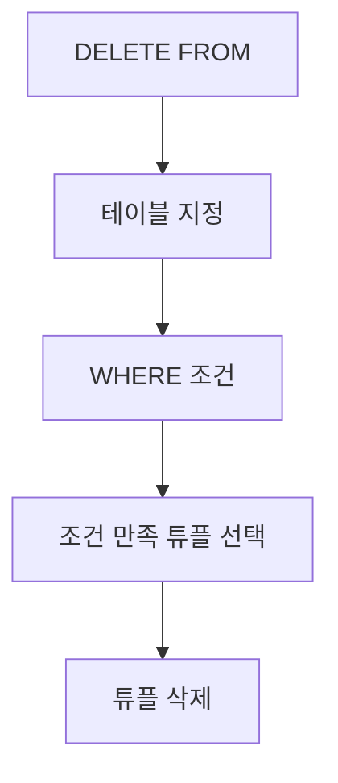

# 150 삭제문(DELETE FROM~)

작성 기준일: 2026-06-01
검색/보강일: 2026-06-01
PDF 확인 위치: 22페이지, 3과목 데이터베이스 구축, 150 삭제문(DELETE FROM~)

## 한 줄 요약

- DELETE FROM은 기본 테이블의 튜플 중 조건에 맞는 특정 행을 삭제할 때 사용하는 DML 명령이다.



## 한눈에 보는 구조

| 구분 | 내용 |
|---|---|
| 명령 | DELETE FROM |
| 분류 | DML |
| 목적 | 특정 튜플 삭제 |
| 조건 | WHERE로 삭제 대상 제한 |
| 주의 | WHERE 생략 시 많은 행이 삭제될 수 있음 |

## PDF 기준 핵심

- 삭제문은 기본 테이블에 있는 튜플들 중에서 특정 튜플, 즉 행을 삭제할 때 사용한다.
- PDF 표기 형식:

```sql
DELETE
FROM 테이블명
[WHERE 조건];
```

## 개념 설명

### DELETE의 의미

- PostgreSQL 공식 문서는 DELETE가 테이블에서 조건을 만족하는 행을 삭제한다고 설명한다.
- DELETE는 테이블 구조를 제거하지 않는다.
- 테이블 자체를 제거하는 명령은 DROP TABLE이다.

### WHERE 조건

- WHERE는 삭제할 행을 제한한다.
- 조건을 생략하면 DBMS 문법과 설정에 따라 테이블의 모든 행이 삭제 대상이 될 수 있으므로 매우 주의해야 한다.

## 시험 포인트

- DELETE는 튜플 삭제이다.
- DELETE FROM과 WHERE를 함께 기억한다.
- DROP TABLE은 테이블 자체 삭제이므로 DELETE와 구분한다.
- DML에 속한다.
- 행 삭제이지 컬럼 삭제가 아니다.

## 헷갈리는 비교

| 비교 | DELETE | DROP TABLE |
|---|---|---|
| 분류 | DML | DDL |
| 대상 | 튜플, 행 | 테이블 자체 |
| WHERE | 사용 가능 | 사용하지 않음 |
| 구조 | 남음 | 제거됨 |

## 예시 또는 암기 포인트

```sql
DELETE
FROM 학생
WHERE 학번 = '2026001';
```

- 암기 문장: DELETE = `행 지우기`, DROP = `테이블 없애기`

## 빠른 복습

- DELETE FROM은 삭제문이다.
- 기본 테이블의 특정 튜플을 삭제한다.
- WHERE 조건으로 삭제 대상을 제한한다.
- DML에 속한다.
- DROP TABLE과 구분한다.

## 참고 링크

- [PostgreSQL Documentation - DELETE](https://www.postgresql.org/docs/current/sql-delete.html)

